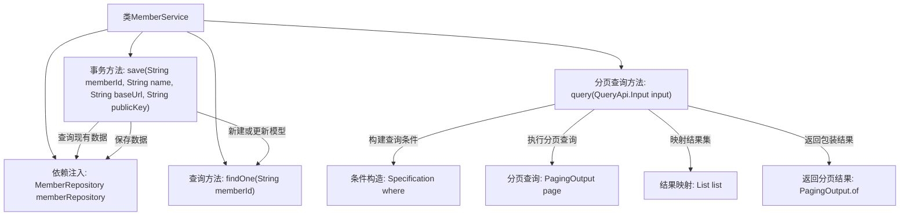

# 基础信息

|      |      |
|------|------|
| 名称 | MemberService |
| 编码语言 | .java |
| 代码路径 | WeFe/serving/serving-service/src/main/java/com/welab/wefe/serving/service/service/MemberService.java |
| 包名 | com.welab.wefe.serving.service.service |
| 依赖项 | ['com.welab.wefe.common.data.mysql.Where', 'com.welab.wefe.common.web.util.ModelMapper', 'com.welab.wefe.serving.service.api.member.QueryApi', 'com.welab.wefe.serving.service.database.entity.MemberMySqlModel', 'com.welab.wefe.serving.service.database.repository.MemberRepository', 'com.welab.wefe.serving.service.dto.PagingOutput', 'org.apache.commons.lang3.StringUtils', 'org.springframework.beans.factory.annotation.Autowired', 'org.springframework.data.jpa.domain.Specification', 'org.springframework.stereotype.Service', 'org.springframework.transaction.annotation.Transactional', 'java.util.List', 'java.util.stream.Collectors'] |
| 概述说明 | MemberService类提供会员数据操作：保存会员信息（存在则更新）、按ID查询、分页查询（支持条件筛选）。使用事务确保数据一致性，自动注入MemberRepository进行数据库交互。 |

# 说明

该代码定义了一个名为MemberService的Spring服务类，主要提供会员数据的增删改查功能。类中通过自动注入的MemberRepository与数据库交互。核心方法包括：save方法用于保存会员信息，支持根据memberId判断新增或更新，并过滤包含特定字符的publicKey；findOne方法通过memberId查询单个会员；query方法实现分页查询，支持按memberId精确匹配和name模糊查询，结果通过ModelMapper映射为输出对象并分页返回。所有数据库操作均通过JPA规范实现，save方法添加了事务注解确保异常回滚。

# 类列表 Class Summary

| 名称   | 类型  | 说明 |
|-------|------|-------------|
| MemberService | class | MemberService类提供会员数据操作：保存会员信息（存在则更新）、按ID查询、分页查询（支持ID和名称筛选）。使用事务确保数据一致性，自动注入MemberRepository进行数据库交互。 |


## 类 MemberService

|      |      |
|------|------|
| 访问范围 | @Service;public |
| 类型 | class |
| 名称 | MemberService |
| 说明 | MemberService类提供会员数据操作：保存会员信息（存在则更新）、按ID查询、分页查询（支持ID和名称筛选）。使用事务确保数据一致性，自动注入MemberRepository进行数据库交互。 |


### UML类图

```mermaid
classDiagram
    class MemberService {
        -MemberRepository memberRepository
        +save(String memberId, String name, String baseUrl, String publicKey) void
        +findOne(String memberId) MemberMySqlModel
        +query(QueryApi$Input input) PagingOutput~QueryApi$Output~
    }

    class MemberRepository {
        <<Interface>>
        +findOne(String field, String value, Class~T~ clazz) T
        +save(MemberMySqlModel model) void
        +paging(Specification~MemberMySqlModel~ where, QueryApi$Input input) PagingOutput~MemberMySqlModel~
    }

    class MemberMySqlModel {
        -String memberId
        -String name
        -String api
        -String publicKey
        +setMemberId(String memberId) void
        +setName(String name) void
        +setApi(String api) void
        +setPublicKey(String publicKey) void
    }

    class QueryApi {
        class Input {
            +getMemberId() String
            +getName() String
        }
        class Output
    }

    class PagingOutput~T~ {
        +getList() List~T~
        +getTotal() long
        +of(long total, List~T~ list) PagingOutput~T~
    }

    class Specification~T~ {
        <<Interface>>
    }

    class Where {
        +create() WhereBuilder
    }

    class WhereBuilder {
        +equal(String field, String value) WhereBuilder
        +contains(String field, String value) WhereBuilder
        +build(Class~T~ clazz) Specification~T~
    }

    class ModelMapper {
        +map(Object source, Class~D~ destinationClass) D
    }

    MemberService --> MemberRepository : 依赖
    MemberService --> MemberMySqlModel : 操作
    MemberService --> QueryApi : 使用
    MemberService --> PagingOutput : 返回
    MemberRepository --> MemberMySqlModel : 操作
    QueryApi --> Input
    QueryApi --> Output
    Where --> WhereBuilder : 创建
    WhereBuilder --> Specification : 生成
    MemberService --> ModelMapper : 转换
```

该代码展示了一个会员服务系统，核心是MemberService类，通过MemberRepository进行数据持久化操作。主要功能包括会员信息保存（带事务管理）、单条查询和分页查询。分页查询使用Where构建动态查询条件，通过ModelMapper进行模型转换。类图中清晰展示了服务层与持久层的关系，以及DTO、模型类和工具类之间的协作关系，体现了Spring Data JPA的典型应用模式。


### 内部方法调用关系图



流程图描述了MemberService类的核心功能流程。save方法通过memberRepository查询并更新会员数据，包含空值检查和敏感信息过滤；findOne提供简单查询；query方法实现复杂分页查询，通过Where构建动态条件，执行分页后映射结果类型。所有数据库操作均通过注入的memberRepository完成，体现了清晰的职责分离。

### 字段列表 Field List

| 名称  | 类型  | 说明 |
|-------|-------|------|
| memberRepository | MemberRepository | 自动注入MemberRepository成员仓库实例。 |

### 方法列表

| 名称  | 类型  | 说明 |
|-------|-------|------|
| save | void | 方法save用于保存会员信息，若会员不存在则新建，存在则更新。包含会员ID、名称、API地址和公钥（非隐藏时更新）字段。事务出错回滚。 |
| findOne | MemberMySqlModel | 查找指定ID的会员数据，调用repository的findOne方法返回MemberMySqlModel对象。 |
| query | PagingOutput<QueryApi.Output> | 该方法根据输入条件查询成员数据，返回分页结果。通过构建查询条件（memberId相等、name包含），从数据库分页获取数据，并转换为指定输出格式后返回。 |


