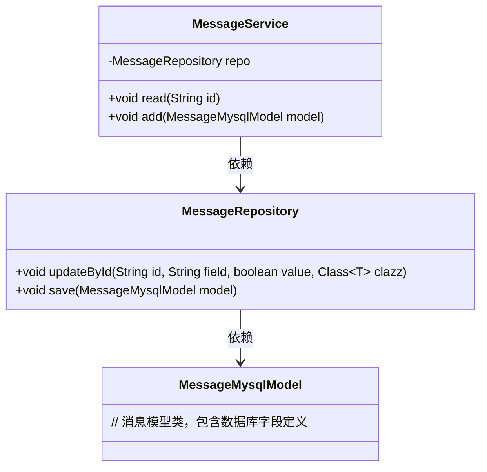
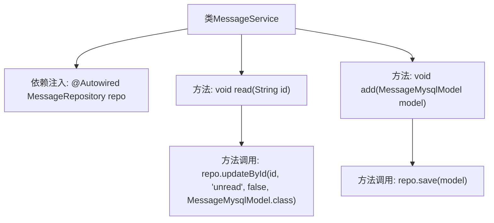

# 基础信息

|      |      |
|------|------|
| 名称 | MessageService |
| 编码语言 | .java |
| 代码路径 | WeFe/serving/serving-service/src/main/java/com/welab/wefe/serving/service/service/MessageService.java |
| 包名 | com.welab.wefe.serving.service.service |
| 依赖项 | ['org.springframework.beans.factory.annotation.Autowired', 'org.springframework.stereotype.Service', 'com.welab.wefe.serving.service.database.entity.MessageMysqlModel', 'com.welab.wefe.serving.service.database.repository.MessageRepository'] |
| 概述说明 | 消息服务类，包含读取和添加消息功能。读取消息通过ID更新状态为已读，添加消息直接保存模型到数据库。依赖消息存储库操作数据。 |

# 说明

该内容描述了一个名为MessageService的服务类，使用@Service注解标识为Spring服务组件。类中通过@Autowired自动注入MessageRepository依赖。提供了两个核心方法：read方法接收字符串id参数，调用repository的updateById方法将指定id的消息状态更新为已读；add方法接收MessageMysqlModel对象参数，调用repository的save方法存储消息数据。整个类专注于消息的读取和新增操作，与数据库交互通过注入的repository实现。

# 类列表 Class Summary

| 名称   | 类型  | 说明 |
|-------|------|-------------|
| MessageService | class | 消息服务类，包含读取和添加消息功能，使用存储库操作数据库。 |

## 类 MessageService

|      |      |
|------|------|
| 访问范围 | @Service;public |
| 类型 | class |
| 名称 | MessageService |
| 说明 | 消息服务类，包含读取和添加消息功能，使用存储库操作数据库。 |

### UML类图

该类图展示了消息服务模块的核心结构。MessageService作为服务层，依赖MessageRepository进行数据库操作，提供消息的读取(read)和添加(add)功能。MessageRepository封装了更新(updateById)和保存(save)方法，操作MessageMysqlModel实体类。整体采用经典的三层架构设计，符合Spring的依赖注入规范。

### 内部方法调用关系图

这段流程图描述了MessageService类的结构及其方法调用关系。该类通过@Autowired注入MessageRepository实例，提供read()和add()两个核心方法：read()调用repository的updateById()方法将指定ID消息标记为已读，add()调用repository的save()方法存储消息模型。图中清晰展示了从类到属性、再到方法调用的层级关系，体现了Spring服务层与数据层的交互逻辑。

### 字段列表 Field List

| 名称  | 类型  | 说明 |
|-------|-------|------|
| repo | MessageRepository | 自动注入MessageRepository实例到repo变量。 |

### 方法列表

| 名称  | 类型  | 说明 |
|-------|-------|------|
| read | void | 方法read接收字符串id，调用repo的updateById方法，将指定id的MessageMysqlModel记录unread字段更新为false。 |
| add | void | 方法`add`接收`MessageMysqlModel`参数，调用`repo.save`保存数据。 |

