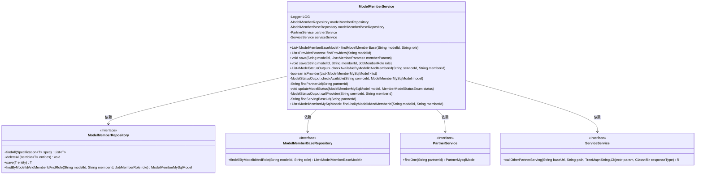
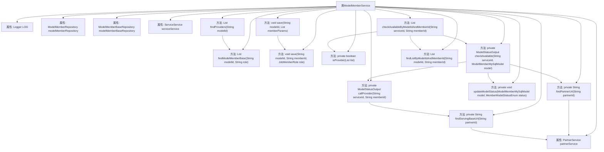

# 基础信息

|      |      |
|------|------|
| 名称 | ModelMemberService |
| 编码语言 | .java |
| 代码路径 | WeFe/serving/serving-service/src/main/java/com/welab/wefe/serving/service/service/ModelMemberService.java |
| 包名 | com.welab.wefe.serving.service.service |
| 依赖项 | ['com.google.common.collect.Lists', 'com.welab.wefe.common.data.mysql.Where', 'com.welab.wefe.common.exception.StatusCodeWithException', 'com.welab.wefe.common.web.util.ModelMapper', 'com.welab.wefe.common.wefe.enums.JobMemberRole', 'com.welab.wefe.serving.sdk.dto.ProviderParams', 'com.welab.wefe.serving.service.database.entity.ModelMemberBaseModel', 'com.welab.wefe.serving.service.database.entity.ModelMemberMySqlModel', 'com.welab.wefe.serving.service.database.entity.PartnerMysqlModel', 'com.welab.wefe.serving.service.database.repository.ModelMemberBaseRepository', 'com.welab.wefe.serving.service.database.repository.ModelMemberRepository', 'com.welab.wefe.serving.service.dto.MemberParams', 'com.welab.wefe.serving.service.dto.ModelStatusOutput', 'com.welab.wefe.serving.service.enums.MemberModelStatusEnum', 'org.slf4j.Logger', 'org.slf4j.LoggerFactory', 'org.springframework.beans.factory.annotation.Autowired', 'org.springframework.data.jpa.domain.Specification', 'org.springframework.stereotype.Service', 'java.util.Date', 'java.util.List', 'java.util.TreeMap', 'java.util.stream.Collectors'] |
| 概述说明 | ModelMemberService类提供模型成员管理功能，包括查询、保存成员信息，检查服务可用性，调用合作方服务等操作。依赖ModelMemberRepository和PartnerService等组件实现核心业务逻辑。 |

# 说明

该代码描述了一个名为ModelMemberService的Spring服务类，主要用于管理模型成员相关操作。该类包含以下核心功能：通过modelId和role查询模型成员基本信息；获取合作伙伴信息；保存模型成员数据；根据modelId和memberId检查成员可用性状态。服务依赖ModelMemberRepository和ModelMemberBaseRepository进行数据持久化，并整合PartnerService和ServiceService完成合作伙伴相关操作。关键方法包括保存成员信息时的数据更新逻辑，以及检查成员状态时通过HTTP调用合作伙伴服务的流程。异常处理会记录合作伙伴服务失联情况并返回离线状态。

# 类列表 Class Summary

| 名称   | 类型  | 说明 |
|-------|------|-------------|
| ModelMemberService | class | ModelMemberService类提供模型成员管理功能，包括查询、保存成员信息，检查服务可用性，调用合作方服务接口等操作。依赖ModelMemberRepository和PartnerService等组件实现核心业务逻辑。 |

## 类 ModelMemberService

|      |      |
|------|------|
| 访问范围 | @Service;public |
| 类型 | class |
| 名称 | ModelMemberService |
| 说明 | ModelMemberService类提供模型成员管理功能，包括查询、保存成员信息，检查服务可用性，调用合作方服务接口等操作。依赖ModelMemberRepository和PartnerService等组件实现核心业务逻辑。 |

### UML类图

这段类图描述了ModelMemberService的核心结构和依赖关系。该服务主要负责模型成员的管理，包括查询、保存和状态检查等功能。它依赖于四个主要接口：ModelMemberRepository（模型成员数据库操作）、ModelMemberBaseRepository（基础成员查询）、PartnerService（合作伙伴服务）和ServiceService（远程服务调用）。服务内部包含12个方法，分为公开API（如findProviders/save）和私有辅助方法（如isProvider/callProvider），通过组合这些依赖组件实现了完整的业务逻辑。类图清晰地展示了Spring服务层的典型结构，其中服务类通过依赖注入使用多个Repository和Service接口。

### 内部方法调用关系图

这段代码展示了一个Spring服务类ModelMemberService，主要用于处理模型成员相关的业务逻辑。类中包含多个方法，涉及成员查询、保存、状态检查等功能。核心流程包括：通过repository查询数据、调用外部服务检查状态、更新成员状态等。方法间存在多层调用关系，例如checkAvailableByModelIdAndMemberId会调用多个私有方法完成状态检查和更新。整体设计体现了分层架构思想，将数据访问、业务逻辑和外部服务调用分离。

### 字段列表 Field List

| 名称  | 类型  | 说明 |
|-------|-------|------|
| modelMemberBaseRepository | ModelMemberBaseRepository | 代码片段使用@Autowired自动注入ModelMemberBaseRepository实例。 |
| LOG = LoggerFactory.getLogger(getClass()) | Logger | 类中定义受保护静态日志对象LOG，用于记录当前类日志。 |
| modelMemberRepository | ModelMemberRepository | 自动注入ModelMemberRepository实例。 |
| serviceService | ServiceService | 使用@Autowired自动注入ServiceService实例。 |
| partnerService | PartnerService | 使用@Autowired自动注入PartnerService实例。 |

### 方法列表

| 名称  | 类型  | 说明 |
|-------|-------|------|
| findProviders | List<ProviderParams> | 该方法通过模型ID查找提供者成员列表，并将其映射为ProviderParams对象列表返回。 |
| isProvider | boolean | 检查列表中是否存在当前用户且角色为provider的成员。 |
| findModelMemberBase | List<ModelMemberBaseModel> | 方法findModelMemberBase根据modelId和role查询ModelMemberBaseModel列表，调用repository的findAllByModelIdAndRole方法返回结果。 |
| save | void | 该方法根据modelId删除所有关联成员，然后保存新成员列表。 |
| checkAvailable | ModelStatusOutput | 检查服务可用性并更新状态：调用服务商接口获取状态，设置合作方URL，更新模型状态后返回结果。 |
| updateModelStatus | void | 更新模型状态方法：设置状态、更新时间并保存到数据库。 |
| findPartnerUrl | String | 根据partnerId查询合作方URL，若无则返回空字符串。 |
| save | void | 该方法保存模型成员信息，若不存在则新建并设置ID和角色，最后存储到数据库。 |
| checkAvailableByModelIdAndMemberId | List<ModelStatusOutput> | 该方法根据模型ID和成员ID检查可用性。若列表为提供者则返回空，否则过滤非当前成员且非推荐者角色，检查可用性后返回结果列表。 |
| callProvider | ModelStatusOutput | 调用合作方服务检查模型状态，失败时返回离线状态。 |
| findServingBaseUrl | String | 该方法通过partnerId查询合作方信息并返回其服务基础URL。 |
| findListByModelIdAndMemberId | List<ModelMemberMySqlModel> | 根据模型ID和成员ID查询模型成员列表的方法。使用条件构造器创建查询条件，返回匹配结果。 |

