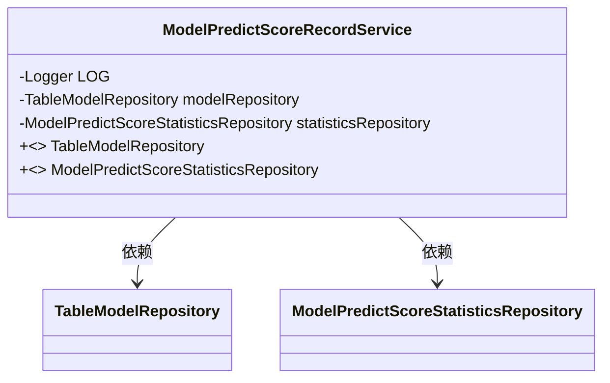
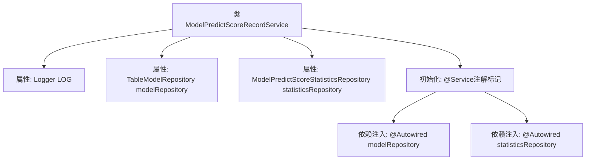

# 基础信息

|      |      |
|------|------|
| 名称 | ModelPredictScoreRecordService |
| 编码语言 | .java |
| 代码路径 | WeFe/serving/serving-service/src/main/java/com/welab/wefe/serving/service/service/ModelPredictScoreRecordService.java |
| 包名 | com.welab.wefe.serving.service.service |
| 依赖项 | ['com.welab.wefe.serving.service.database.repository.ModelPredictScoreStatisticsRepository', 'com.welab.wefe.serving.service.database.repository.TableModelRepository', 'org.slf4j.Logger', 'org.slf4j.LoggerFactory', 'org.springframework.beans.factory.annotation.Autowired', 'org.springframework.stereotype.Service'] |
| 概述说明 | 服务类ModelPredictScoreRecordService，包含日志记录器，自动注入模型存储库和预测分数统计存储库。 |

# 说明

这是一个名为ModelPredictScoreRecordService的Spring服务类，包含两个自动注入的仓库组件：TableModelRepository和ModelPredictScoreStatisticsRepository。类中定义了一个受保护的日志记录器LOG，用于记录日志信息。该类使用了@Service注解标识为Spring服务组件，但没有展示具体业务方法实现。

# 类列表 Class Summary

| 名称   | 类型  | 说明 |
|-------|------|-------------|
| ModelPredictScoreRecordService | class | 服务类包含日志记录和两个自动注入的模型及统计仓库。 |

## 类 ModelPredictScoreRecordService

|      |      |
|------|------|
| 访问范围 | @Service;public |
| 类型 | class |
| 名称 | ModelPredictScoreRecordService |
| 说明 | 服务类包含日志记录和两个自动注入的模型及统计仓库。 |

### UML类图

这段类图描述了一个Spring服务类ModelPredictScoreRecordService，该类包含两个私有依赖注入的仓库接口(TableModelRepository和ModelPredictScoreStatisticsRepository)以及一个日志记录器。通过@Service注解表明这是一个Spring服务组件，@Autowired注解实现了对两个仓库接口的依赖注入。类图中清晰地展示了服务类与两个仓库接口之间的依赖关系，符合Spring框架的依赖注入设计模式。

### 内部方法调用关系图

该流程图展示了Spring服务类ModelPredictScoreRecordService的核心结构。类通过@Service注解被Spring容器管理，包含一个Logger属性和两个通过@Autowired自动注入的JPA仓库接口（TableModelRepository和ModelPredictScoreStatisticsRepository）。图中清晰呈现了类成员与Spring依赖注入的关系，未包含业务方法说明当前代码片段仅完成基础依赖配置。

### 字段列表 Field List

| 名称  | 类型  | 说明 |
|-------|-------|------|
| modelRepository | TableModelRepository | 代码片段使用@Autowired自动注入TableModelRepository实例。 |
| LOG = LoggerFactory.getLogger(getClass()) | Logger | 声明一个受保护的final日志对象LOG，使用当前类名初始化。 |
| statisticsRepository | ModelPredictScoreStatisticsRepository | 使用@Autowired自动注入ModelPredictScoreStatisticsRepository实例。 |

### 方法列表

| 名称  | 类型  | 说明 |
|-------|-------|------|

