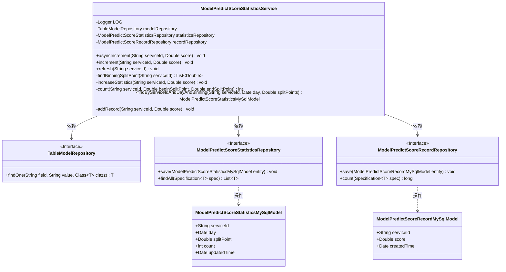
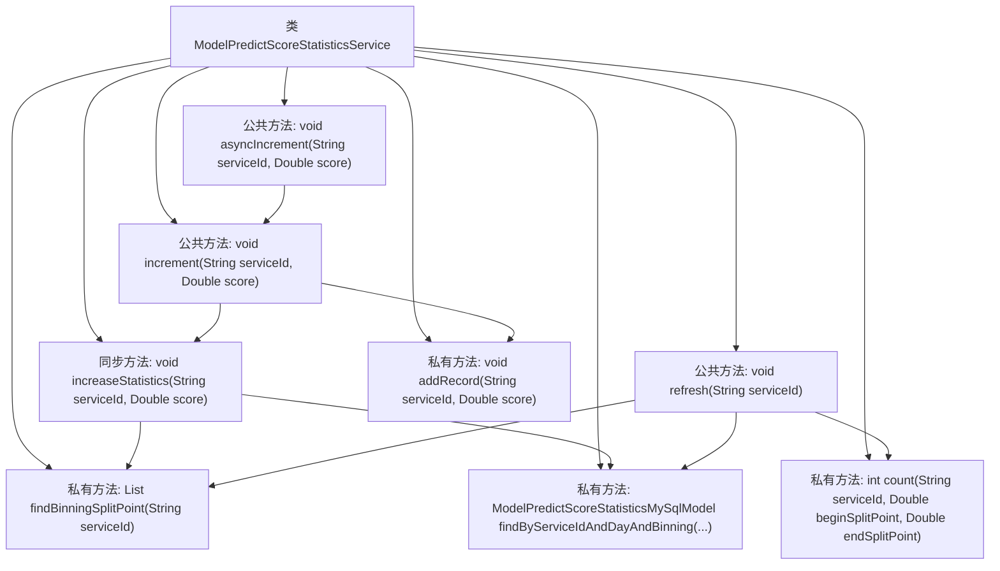
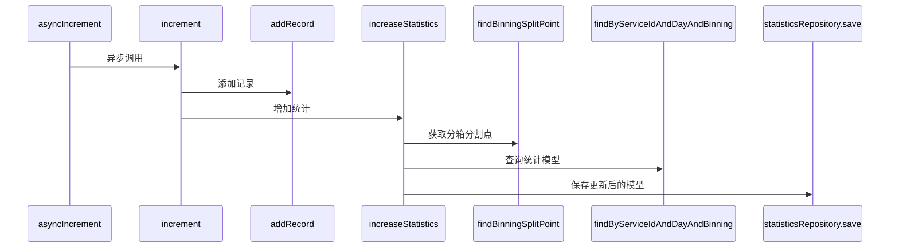

# 基础信息

|      |      |
|------|------|
| 名称 | ModelPredictScoreStatisticsService |
| 编码语言 | .java |
| 代码路径 | WeFe/serving/serving-service/src/main/java/com/welab/wefe/serving/service/service/ModelPredictScoreStatisticsService.java |
| 包名 | com.welab.wefe.serving.service.service |
| 依赖项 | ['com.welab.wefe.common.CommonThreadPool', 'com.welab.wefe.common.data.mysql.Where', 'com.welab.wefe.common.util.DateUtil', 'com.welab.wefe.common.util.JObject', 'com.welab.wefe.serving.service.database.entity.ModelPredictScoreRecordMySqlModel', 'com.welab.wefe.serving.service.database.entity.ModelPredictScoreStatisticsMySqlModel', 'com.welab.wefe.serving.service.database.entity.TableModelMySqlModel', 'com.welab.wefe.serving.service.database.repository.ModelPredictScoreRecordRepository', 'com.welab.wefe.serving.service.database.repository.ModelPredictScoreStatisticsRepository', 'com.welab.wefe.serving.service.database.repository.TableModelRepository', 'org.slf4j.Logger', 'org.slf4j.LoggerFactory', 'org.springframework.beans.factory.annotation.Autowired', 'org.springframework.data.jpa.domain.Specification', 'org.springframework.stereotype.Service', 'java.util.Date', 'java.util.List', 'java.util.stream.Collectors'] |
| 概述说明 | 该服务类用于模型预测分数统计，包含异步增量更新、分数记录和按分箱点统计功能，通过多仓库操作实现数据持久化。 |

# 说明

该服务类用于管理模型预测分数的统计和记录。主要功能包括：通过findBinningSplitPoint方法获取分数分箱分割点；asyncIncrement和increment方法异步或同步增加分数记录并更新统计；increaseStatistics方法根据分数值更新对应分箱的计数；refresh方法重新计算并刷新所有分箱的统计计数；count方法统计指定分箱范围内的记录数；findByServiceIdAndDayAndBinning方法查询特定分箱的统计信息；addRecord方法保存分数记录。涉及三个仓库类分别处理模型、统计和记录数据。

# 类列表 Class Summary

| 名称   | 类型  | 说明 |
|-------|------|-------------|
| ModelPredictScoreStatisticsService | class | 该服务类用于模型预测分数统计，包含异步增加分数记录、同步更新统计信息及刷新统计功能，通过分箱点对分数进行分类计数，并记录每日分数分布情况。 |

## 类 ModelPredictScoreStatisticsService

|      |      |
|------|------|
| 访问范围 | @Service;public |
| 类型 | class |
| 名称 | ModelPredictScoreStatisticsService |
| 说明 | 该服务类用于模型预测分数统计，包含异步增加分数记录、同步更新统计信息及刷新统计功能，通过分箱点对分数进行分类计数，并记录每日分数分布情况。 |

### UML类图

该代码实现了一个模型预测分数统计服务，主要功能包括异步增量更新分数统计、刷新统计数据和记录预测分数。服务通过三个仓库接口（TableModelRepository、ModelPredictScoreStatisticsRepository、ModelPredictScoreRecordRepository）与数据库交互，操作两种实体类（ModelPredictScoreStatisticsMySqlModel和ModelPredictScoreRecordMySqlModel）。核心逻辑涉及分数分箱处理、统计计数和记录保存，采用线程池实现异步操作，并通过同步方法保证统计数据的线程安全。

### 内部方法调用关系图

这段代码是一个统计服务类，主要用于处理模型预测得分的分箱统计。核心功能包括异步增量更新统计数据、刷新统计数据、记录单次得分等。通过findBinningSplitPoint方法获取分箱分割点，使用increaseStatistics方法进行线程安全的统计更新，并通过多个Repository与数据库交互。流程图展示了类方法间的调用关系，时序图则详细描述了asyncIncrement方法的执行流程。

### 字段列表 Field List

| 名称  | 类型  | 说明 |
|-------|-------|------|
| statisticsRepository | ModelPredictScoreStatisticsRepository | 自动注入模型预测分数统计仓库实例。 |
| LOG = LoggerFactory.getLogger(getClass()) | Logger | 定义一个受保护的final日志对象LOG，使用当前类名初始化。 |
| recordRepository | ModelPredictScoreRecordRepository | 使用@Autowired自动注入ModelPredictScoreRecordRepository实例。 |
| modelRepository | TableModelRepository | 使用@Autowired自动注入TableModelRepository实例。 |

### 方法列表

| 名称  | 类型  | 说明 |
|-------|-------|------|
| increaseStatistics | void | 私有同步方法increaseStatistics根据分数区间更新统计：查找serviceId的分段点，匹配分数所在区间，创建或更新对应统计模型，计数加1并保存。 |
| refresh | void | 该方法根据服务ID刷新统计信息，计算分箱分割点，遍历每个分割点，查询或创建模型实例，设置服务ID、分割点和当前日期，统计指定范围内的计数并保存。 |
| increment | void | 方法increment接收服务ID和分数，调用addRecord记录数据，并调用increaseStatistics更新统计。 |
| asyncIncrement | void | 异步执行增量操作，通过线程池调用increment方法，参数为serviceId和score。 |
| findBinningSplitPoint | List<Double> | 该方法通过服务ID查询模型数据，提取分数分布的分箱结果，将分箱键转为双精度列表并排序返回。 |
| count | int | 该方法统计指定服务ID在当天内分数介于beginSplitPoint和endSplitPoint之间的记录数量。 |
| findByServiceIdAndDayAndBinning | ModelPredictScoreStatisticsMySqlModel | 该方法通过服务ID、日期和分箱点查询数据库，返回匹配的首条记录，若无结果则返回null。 |
| addRecord | void | 私有方法addRecord接收服务ID和分数，创建数据库记录并保存。 |

