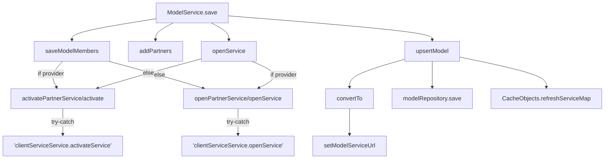
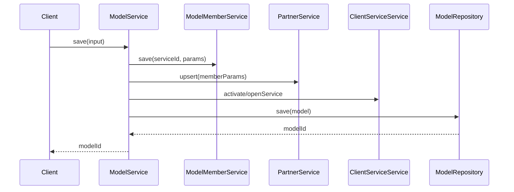

# 基础信息

|      |      |
|------|------|
| 名称 | ModelService |
| 编码语言 | .java |
| 代码路径 | WeFe/serving/serving-service/src/main/java/com/welab/wefe/serving/service/service/ModelService.java |
| 包名 | com.welab.wefe.serving.service.service |
| 依赖项 | ['com.welab.wefe.common.StatusCode', 'com.welab.wefe.common.data.mysql.Where', 'com.welab.wefe.common.exception.StatusCodeWithException', 'com.welab.wefe.common.web.util.CurrentAccountUtil', 'com.welab.wefe.common.web.util.ModelMapper', 'com.welab.wefe.common.wefe.enums.JobMemberRole', 'com.welab.wefe.common.wefe.enums.PredictFeatureDataSource', 'com.welab.wefe.serving.service.api.model.EnableApi', 'com.welab.wefe.serving.service.api.model.QueryApi', 'com.welab.wefe.serving.service.api.model.SaveModelApi', 'com.welab.wefe.serving.service.database.entity.ModelMemberMySqlModel', 'com.welab.wefe.serving.service.database.entity.TableModelMySqlModel', 'com.welab.wefe.serving.service.database.repository.ModelMemberRepository', 'com.welab.wefe.serving.service.database.repository.TableModelRepository', 'com.welab.wefe.serving.service.dto.MemberParams', 'com.welab.wefe.serving.service.dto.ModelStatusOutput', 'com.welab.wefe.serving.service.dto.PagingOutput', 'com.welab.wefe.serving.service.enums.MemberModelStatusEnum', 'com.welab.wefe.serving.service.enums.ServiceTypeEnum', 'com.welab.wefe.serving.service.manager.ModelManager', 'org.slf4j.Logger', 'org.slf4j.LoggerFactory', 'org.springframework.beans.BeanUtils', 'org.springframework.beans.factory.annotation.Autowired', 'org.springframework.data.jpa.domain.Specification', 'org.springframework.stereotype.Service', 'org.springframework.transaction.annotation.Transactional', 'java.util.Date', 'java.util.List', 'java.util.stream.Collectors'] |
| 概述说明 | ModelService类提供模型管理功能，包括保存、查询、启用/禁用模型，处理成员和合作伙伴关系，支持机器学习服务类型，包含事务管理和错误处理。 |

# 说明

该代码描述了一个名为ModelService的Spring服务类，主要用于管理机器学习模型服务。它包含保存模型、更新配置、查询模型、启用/禁用模型等功能。服务通过注入多个依赖组件（如ModelMemberService、PartnerService等）实现业务逻辑，支持事务处理与异常回滚。关键操作包括保存模型成员信息、添加合作伙伴、激活或开通服务、更新模型配置等。查询功能支持分页和条件筛选，并提供了模型可用性检查接口。代码还涉及URL拼接、角色权限判断、数据源配置等细节处理。

# 类列表 Class Summary

| 名称   | 类型  | 说明 |
|-------|------|-------------|
| ModelService | class | ModelService类提供模型管理功能，包括保存模型、更新配置、查询模型、启用/禁用模型及检查模型可用性。支持合作伙伴管理和成员角色处理，涉及数据库操作和API调用。 |


## 类 ModelService

|      |      |
|------|------|
| 访问范围 | @Service;public |
| 类型 | class |
| 名称 | ModelService |
| 说明 | ModelService类提供模型管理功能，包括保存模型、更新配置、查询模型、启用/禁用模型及检查模型可用性。支持合作伙伴管理和成员角色处理，涉及数据库操作和API调用。 |


### UML类图

```mermaid
classDiagram
    class ModelService {
        -Logger LOG
        -String API_PREFIX_2
        -String API_PREFIX_1
        -TableModelRepository modelRepository
        -ModelMemberService modelMemberService
        -PartnerService partnerService
        -ClientServiceService clientServiceService
        -ModelMemberRepository modelMemberRepository
        +String save(SaveModelApi$Input input)
        +TableModelMySqlModel findOne(String serviceId)
        +List~ModelMemberMySqlModel~ findByModelIdAndMemberId(String modelId, String memberId)
        +ModelMemberMySqlModel findByModelIdAndMemberIdAndRole(String modelId, String memberId, JobMemberRole myRole)
        +PagingOutput~QueryApi$Output~ query(QueryApi$Input input)
        +void enable(EnableApi$Input input)
        +ModelStatusOutput checkAvailable(String modelId)
        +void updateConfig(String serviceId, String serviceName, PredictFeatureDataSource featureSource, String dataSourceId, String sqlScript, String sqlConditionField)
        -void addPartners(SaveModelApi$Input input)
        -void saveModelMembers(SaveModelApi$Input input)
        -String upsertModel(SaveModelApi$Input input)
        -TableModelMySqlModel convertTo(SaveModelApi$Input input, TableModelMySqlModel model)
        -void openService(SaveModelApi$Input input)
        -void activatePartnerService(String serviceId, String modelName, List~MemberParams~ memberParams)
        -void activate(String serviceId, String name, MemberParams x)
        -String setModelServiceUrl(String serviceId)
        -void openPartnerService(String modelId, String modelName, List~MemberParams~ memberParams)
        -void openService(String modelId, String name, MemberParams x)
        -List~QueryApi$Output~ bulidOutputs(PagingOutput~TableModelMySqlModel~ page, PagingOutput~ModelMemberMySqlModel~ memberPage)
        -QueryApi$Output setRole(PagingOutput~ModelMemberMySqlModel~ memberPage, TableModelMySqlModel TableModelMySqlModel)
        -PagingOutput~ModelMemberMySqlModel~ queryModelMembers(QueryApi$Input input)
        -Specification~ModelMemberMySqlModel~ buildQueryMemberParam()
        -PagingOutput~TableModelMySqlModel~ queryModels(QueryApi$Input input)
        -Specification~TableModelMySqlModel~ buildQueryModelParam(QueryApi$Input input)
        -MemberModelStatusEnum getAvailableStatus(String modelId)
    }

    class TableModelRepository {
        +TableModelMySqlModel findOne(String field, String value, Class~TableModelMySqlModel~ clazz)
        +void save(TableModelMySqlModel model)
        +PagingOutput~TableModelMySqlModel~ paging(Specification~TableModelMySqlModel~ where, QueryApi$Input input)
        +void updateById(String id, String field, boolean value, Class~TableModelMySqlModel~ clazz)
    }

    class ModelMemberService {
        +void save(String serviceId, String memberId, JobMemberRole role)
        +void save(String serviceId, List~MemberParams~ memberParams)
    }

    class PartnerService {
        +void upsert(List~MemberParams~ memberParams)
    }

    class ClientServiceService {
        +void activateService(String serviceId, String name, String memberId, String privateKey, String publicKey, String secretKeyType, String url, ServiceTypeEnum serviceType)
        +void openService(String modelId, String name, String url, String memberId, String publicKey, ServiceTypeEnum serviceType, String secretKeyType)
        +void updateAllByServiceId(String serviceId, String name, String url, String serviceType)
    }

    class ModelMemberRepository {
        +List~ModelMemberMySqlModel~ findByModelIdAndMemberId(String modelId, String memberId)
        +ModelMemberMySqlModel findByModelIdAndMemberIdAndRole(String modelId, String memberId, JobMemberRole role)
        +PagingOutput~ModelMemberMySqlModel~ paging(Specification~ModelMemberMySqlModel~ where, QueryApi$Input input)
    }

    class SaveModelApi {
        class Input {
            -String serviceId
            -JobMemberRole myRole
            -List~MemberParams~ memberParams
            // ...其他字段
        }
    }

    class QueryApi {
        class Input {
            -String modelId
            -String name
            -String algorithm
            -String flType
            -String creator
            // ...其他字段
        }
        class Output {
            -JobMemberRole myRole
            // ...其他字段
        }
    }

    class EnableApi {
        class Input {
            -String id
            -boolean enable
        }
    }

    class ModelStatusOutput {
        +static ModelStatusOutput of(String memberId, String memberName, MemberModelStatusEnum status)
    }

    class MemberParams {
        -String memberId
        -JobMemberRole role
        -String publicKey
        -String secretKeyType
    }

    class TableModelMySqlModel {
        -String serviceId
        -String name
        -String url
        -String serviceType
        -String createdBy
        -Date updatedTime
        -String updatedBy
        -PredictFeatureDataSource featureSource
        -String dataSourceId
        -String sqlScript
        -String sqlConditionField
        // ...其他字段
    }

    class ModelMemberMySqlModel {
        -String modelId
        -String memberId
        -JobMemberRole role
        // ...其他字段
    }

    ModelService --> TableModelRepository : 依赖
    ModelService --> ModelMemberService : 依赖
    ModelService --> PartnerService : 依赖
    ModelService --> ClientServiceService : 依赖
    ModelService --> ModelMemberRepository : 依赖
    ModelService --> SaveModelApi$Input : 使用
    ModelService --> QueryApi$Input : 使用
    ModelService --> QueryApi$Output : 生成
    ModelService --> EnableApi$Input : 使用
    ModelService --> ModelStatusOutput : 生成
    ModelService --> MemberParams : 使用
    ModelService --> TableModelMySqlModel : 操作
    ModelService --> ModelMemberMySqlModel : 操作
```

这段代码展示了一个模型服务类`ModelService`，它负责管理机器学习模型的创建、查询、更新和状态检查等核心功能。该类通过依赖注入的方式整合了多个Repository和Service组件，包括模型存储库、成员服务、合作伙伴服务和客户端服务等。主要功能包括保存模型数据、管理模型成员关系、处理合作伙伴服务、查询模型信息以及更新模型配置等。类图中清晰地展示了`ModelService`与各个依赖组件之间的关系，以及它处理的各种输入输出数据类型。


### 内部方法调用关系图





流程图描述了ModelService.save()方法的完整执行流程，包含成员保存、合作伙伴处理、服务开通/激活和模型持久化等关键步骤，通过条件分支处理不同角色(provider/promoter)的逻辑差异，最终完成模型服务的全生命周期管理。时序图则展示了跨服务调用的交互过程，突出核心组件间的协作关系。

### 字段列表 Field List

| 名称  | 类型  | 说明 |
|-------|-------|------|
| clientServiceService | ClientServiceService | 使用@Autowired自动注入ClientServiceService实例。 |
| LOG = LoggerFactory.getLogger(getClass()) | Logger | 创建当前类的日志记录器实例。 |
| API_PREFIX_2 = "predict/" | String | 私有常量API前缀字符串"predict/" |
| partnerService | PartnerService | 自动注入PartnerService实例。 |
| modelRepository | TableModelRepository | 自动注入TableModelRepository实例到modelRepository变量。 |
| modelMemberRepository | ModelMemberRepository | 自动注入ModelMemberRepository实例。 |
| API_PREFIX_1 = "/api/" | String | 私有常量字符串API_PREFIX_1，值为"/api/" |
| modelMemberService | ModelMemberService | 使用@Autowired自动注入ModelMemberService实例。 |

### 方法列表

| 名称  | 类型  | 说明 |
|-------|-------|------|
| openService | void | 方法openService调用clientServiceService.openService开通模型服务，参数包括modelId、name、API前缀、memberId、公钥、服务类型和密钥类型。失败时记录错误日志。 |
| openService | void | 根据角色调用不同服务方法：提供者调用openPartnerService，否则调用activatePartnerService。 |
| setModelServiceUrl | String | 该方法根据服务ID生成模型服务URL，格式为API前缀加服务ID。 |
| setRole | QueryApi.Output | 方法setRole将成员页和表模型作为输入，通过流处理筛选匹配的模型ID，设置输出角色并返回。 |
| findOne | TableModelMySqlModel | 该方法通过serviceId查询并返回对应的TableModelMySqlModel对象，调用modelRepository的findOne方法实现。 |
| findByModelIdAndMemberId | List<ModelMemberMySqlModel> | 根据模型ID和成员ID查询成员列表的方法，调用仓库层实现。 |
| convertTo | TableModelMySqlModel | 将输入对象属性复制到模型，设置URL和服务类型后返回模型。 |
| addPartners | void | 方法addPartners接收输入参数，调用partnerService的upsert方法处理成员参数。 |
| queryModelMembers | PagingOutput<ModelMemberMySqlModel> | 查询模型成员方法：构建查询条件后，调用分页接口返回成员数据。 |
| activatePartnerService | void | 该方法激活合作伙伴服务，筛选提供者角色的成员参数并逐一激活。参数包括服务ID、模型名称和成员参数列表。 |
| openPartnerService | void | 该方法根据角色筛选成员参数，对符合条件的成员调用openService方法。 |
| upsertModel | String | 方法upsertModel根据输入创建或更新模型。若模型不存在则新建并设置创建者，否则更新模型信息并设置修改者和时间。保存后刷新缓存并返回模型ID。 |
| activate | void | 私有方法激活服务，调用clientServiceService.activateService，传入服务ID、名称、成员ID、密钥等参数，捕获异常记录日志。 |
| save | String | 事务方法保存模型数据，包括成员、合作伙伴和服务，最终更新或插入模型。异常时回滚。 |
| findByModelIdAndMemberIdAndRole | ModelMemberMySqlModel | 根据模型ID、成员ID和角色查询成员信息的方法，调用仓库接口返回结果。 |
| query | PagingOutput<QueryApi.Output> | 该方法接收输入参数，查询模型和成员数据，合并结果后返回分页输出，包含总数和结果列表。 |
| bulidOutputs | List<QueryApi.Output> | 该方法将两个分页数据合并处理，通过流式操作将表模型数据与成员模型关联，生成输出列表并返回。 |
| buildQueryMemberParam | Specification<ModelMemberMySqlModel> | 构建查询成员参数的私有方法，使用Specification创建包含memberId的条件查询，返回查询对象。 |
| saveModelMembers | void | 方法根据角色保存模型成员：提供者角色时保存服务ID、成员ID和角色；否则保存服务ID和成员参数。 |
| queryModels | PagingOutput<TableModelMySqlModel> | 私有方法queryModels根据输入参数构建查询条件，通过modelRepository分页查询并返回结果。 |
| buildQueryModelParam | Specification<TableModelMySqlModel> | 构建查询模型参数的Specification，包含modelId、name模糊匹配，algorithm、flType、createdBy精确匹配。 |
| enable | void | 方法enable根据输入参数更新模型状态，先通过ID修改数据库记录，再查询模型并刷新服务中的启用状态。 |
| checkAvailable | ModelStatusOutput | 检查模型可用性，返回包含成员ID、名称及模型状态的输出对象。 |
| getAvailableStatus | MemberModelStatusEnum | 获取模型可用状态的方法：根据modelId查询ModelManager，返回available或unavailable状态，异常时默认返回unavailable。 |
| updateConfig | void | 使用事务更新配置，根据数据源类型设置模型属性，保存并同步更新相关服务信息。若模型不存在则抛出异常。 |


