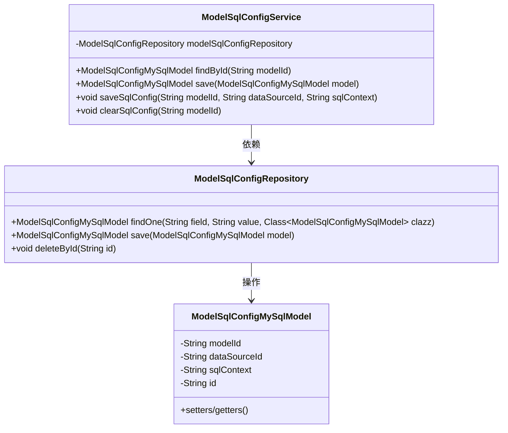
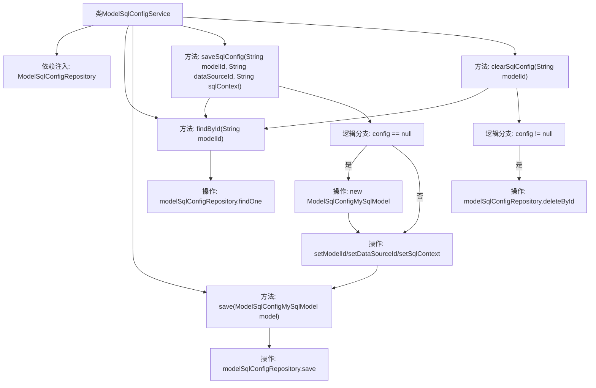

# 基础信息

|      |      |
|------|------|
| 名称 | ModelSqlConfigService |
| 编码语言 | .java |
| 代码路径 | WeFe/serving/serving-service/src/main/java/com/welab/wefe/serving/service/service/ModelSqlConfigService.java |
| 包名 | com.welab.wefe.serving.service.service |
| 依赖项 | ['com.welab.wefe.serving.service.database.entity.ModelSqlConfigMySqlModel', 'com.welab.wefe.serving.service.database.repository.ModelSqlConfigRepository', 'org.springframework.beans.factory.annotation.Autowired', 'org.springframework.stereotype.Service'] |
| 概述说明 | ModelSqlConfigService类提供模型SQL配置的增删改查功能，包括根据ID查询、保存配置、更新或创建配置及清除配置。依赖ModelSqlConfigRepository操作数据库。 |

# 说明

该代码定义了一个名为ModelSqlConfigService的服务类，用于管理模型SQL配置。它通过ModelSqlConfigRepository与数据库交互，提供四个核心功能：根据modelId查询配置、保存配置对象、更新或创建指定modelId的SQL配置（包括数据源ID和SQL内容）、以及清除指定modelId的配置。服务通过自动装配依赖的仓库实现数据持久化操作。

# 类列表 Class Summary

| 名称   | 类型  | 说明 |
|-------|------|-------------|
| ModelSqlConfigService | class | ModelSqlConfigService类提供模型SQL配置的增删改查功能，包括按ID查询、保存配置、更新或创建配置、清除配置。依赖ModelSqlConfigRepository操作数据库。 |

## 类 ModelSqlConfigService

|      |      |
|------|------|
| 访问范围 | @Service;public |
| 类型 | class |
| 名称 | ModelSqlConfigService |
| 说明 | ModelSqlConfigService类提供模型SQL配置的增删改查功能，包括按ID查询、保存配置、更新或创建配置、清除配置。依赖ModelSqlConfigRepository操作数据库。 |

### UML类图

该类图展示了ModelSqlConfigService与ModelSqlConfigRepository及ModelSqlConfigMySqlModel之间的关系。ModelSqlConfigService作为服务类，通过依赖注入使用ModelSqlConfigRepository来执行数据库操作，包括查找、保存和删除ModelSqlConfigMySqlModel实例。ModelSqlConfigMySqlModel是数据实体类，包含模型ID、数据源ID、SQL内容和主键ID等属性。整体结构体现了典型的Spring服务层与持久层的交互模式。

### 内部方法调用关系图

流程图描述了ModelSqlConfigService类的核心逻辑流程。该类通过Repository操作MySQL配置数据，包含配置查询、保存、更新和清除功能。主要流程包括：通过modelId查找配置，若不存在则新建配置对象；更新配置属性后保存；清除配置时先查询再删除。所有操作均围绕ModelSqlConfigMySqlModel实体展开，通过Repository与数据库交互。

### 字段列表 Field List

| 名称  | 类型  | 说明 |
|-------|-------|------|
| modelSqlConfigRepository | ModelSqlConfigRepository | 自动注入ModelSqlConfigRepository实例。 |

### 方法列表

| 名称  | 类型  | 说明 |
|-------|-------|------|
| findById | ModelSqlConfigMySqlModel | 该方法通过modelId查询数据库，返回匹配的ModelSqlConfigMySqlModel对象。 |
| saveSqlConfig | void | 保存SQL配置：根据modelId查找配置，不存在则新建，设置参数后保存。 |
| clearSqlConfig | void | 该方法用于清除指定modelId的SQL配置。先查询配置是否存在，存在则通过repository删除。 |
| save | ModelSqlConfigMySqlModel | 保存MySQL配置模型到数据库。 |

