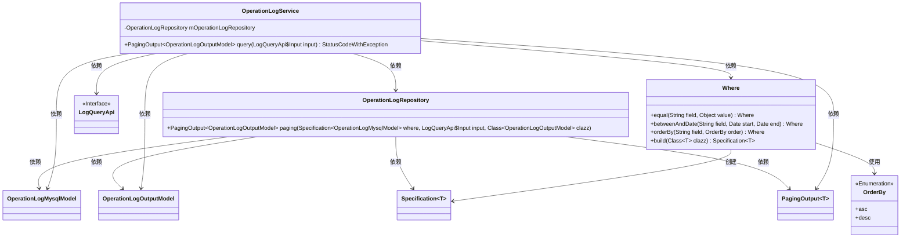
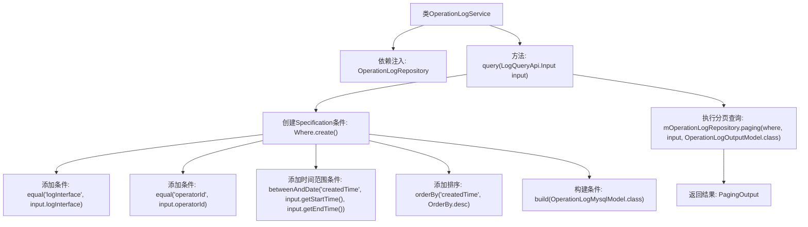

# 基础信息

|      |      |
|------|------|
| 名称 | OperationLogService |
| 编码语言 | .java |
| 代码路径 | WeFe/serving/serving-service/src/main/java/com/welab/wefe/serving/service/service/OperationLogService.java |
| 包名 | com.welab.wefe.serving.service.service |
| 依赖项 | ['com.welab.wefe.common.data.mysql.Where', 'com.welab.wefe.common.data.mysql.enums.OrderBy', 'com.welab.wefe.common.exception.StatusCodeWithException', 'com.welab.wefe.serving.service.api.operation.LogQueryApi', 'com.welab.wefe.serving.service.database.entity.OperationLogMysqlModel', 'com.welab.wefe.serving.service.database.repository.OperationLogRepository', 'com.welab.wefe.serving.service.dto.OperationLogOutputModel', 'com.welab.wefe.serving.service.dto.PagingOutput', 'org.springframework.beans.factory.annotation.Autowired', 'org.springframework.data.jpa.domain.Specification', 'org.springframework.stereotype.Service'] |
| 概述说明 | 操作日志服务类，通过输入条件查询日志，支持分页、接口、操作者ID和时间范围筛选，结果按时间降序排列。 |

# 说明

OperationLogService是一个服务类，用于查询操作日志。它依赖OperationLogRepository进行数据库操作。query方法接收LogQueryApi.Input参数，构建查询条件，包括按接口名称、操作者ID筛选，以及按时间范围排序。查询结果以分页形式返回OperationLogOutputModel对象。方法可能抛出StatusCodeWithException异常。

# 类列表 Class Summary

| 名称   | 类型  | 说明 |
|-------|------|-------------|
| OperationLogService | class | OperationLogService提供查询操作日志功能，支持按接口、操作者ID和时间范围筛选，结果分页并按创建时间降序返回。 |

## 类 OperationLogService

|      |      |
|------|------|
| 访问范围 | @Service;public |
| 类型 | class |
| 名称 | OperationLogService |
| 说明 | OperationLogService提供查询操作日志功能，支持按接口、操作者ID和时间范围筛选，结果分页并按创建时间降序返回。 |

### UML类图

这段代码展示了一个操作日志查询服务，核心是OperationLogService类，它通过OperationLogRepository进行分页查询，使用Where构建器创建查询条件。类图清晰地展示了各组件间的关系：服务层依赖仓储层和查询条件构建器，仓储层处理具体的数据查询和分页操作，Where类负责构建复杂的查询条件规范。整个设计体现了分层架构和规范模式的应用。

### 内部方法调用关系图

这段代码流程图展示了OperationLogService类的核心查询流程。该服务通过依赖注入获得日志仓库实例，在query方法中构建包含接口名称、操作者ID和时间范围的多条件查询规范，最后通过仓库的分页方法获取结果。整个过程体现了从条件组装到数据库查询的完整链路，其中Where构建器模式清晰展现了动态条件组合的逻辑层次。

### 字段列表 Field List

| 名称  | 类型  | 说明 |
|-------|-------|------|
| mOperationLogRepository | OperationLogRepository | 使用@Autowired自动注入OperationLogRepository实例。 |

### 方法列表

| 名称  | 类型  | 说明 |
|-------|-------|------|
| query | PagingOutput<OperationLogOutputModel> | 查询操作日志方法，根据输入条件筛选日志，包括接口、操作者ID和时间范围，按创建时间降序分页返回结果。 |

