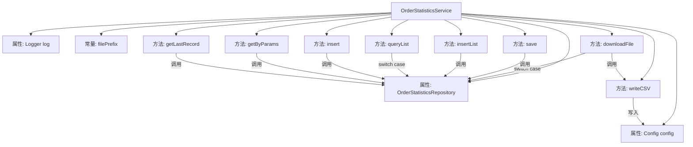

# 基础信息

|      |      |
|------|------|
| 名称 | OrderStatisticsService |
| 编码语言 | .java |
| 代码路径 | WeFe/serving/serving-service/src/main/java/com/welab/wefe/serving/service/service/OrderStatisticsService.java |
| 包名 | com.welab.wefe.serving.service.service |
| 依赖项 | ['com.alibaba.fastjson.JSON', 'com.welab.wefe.common.data.mysql.Where', 'com.welab.wefe.common.util.DateUtil', 'com.welab.wefe.common.util.StringUtil', 'com.welab.wefe.common.web.util.ModelMapper', 'com.welab.wefe.serving.service.api.orderstatistics.DownloadApi', 'com.welab.wefe.serving.service.api.orderstatistics.QueryListApi', 'com.welab.wefe.serving.service.api.orderstatistics.SaveApi', 'com.welab.wefe.serving.service.config.Config', 'com.welab.wefe.serving.service.database.entity.OrderStatisticsMysqlModel', 'com.welab.wefe.serving.service.database.repository.OrderStatisticsRepository', 'com.welab.wefe.serving.service.dto.OrderStatisticsInput', 'com.welab.wefe.serving.service.dto.PagingOutput', 'com.welab.wefe.serving.service.enums.DateTypeEnum', 'de.siegmar.fastcsv.writer.CsvWriter', 'de.siegmar.fastcsv.writer.LineDelimiter', 'de.siegmar.fastcsv.writer.QuoteStrategy', 'org.slf4j.Logger', 'org.slf4j.LoggerFactory', 'org.springframework.beans.factory.annotation.Autowired', 'org.springframework.data.jpa.domain.Specification', 'org.springframework.stereotype.Service', 'org.springframework.transaction.annotation.Transactional', 'java.io', 'java.nio.charset.StandardCharsets', 'java.util.ArrayList', 'java.util.Date', 'java.util.List', 'java.util.Map'] |
| 概述说明 | 订单统计服务类，提供按不同时间粒度（月、日、时、分）分组查询订单数据并导出CSV功能，支持数据增删改查及批量操作。包含数据持久化和文件处理逻辑。 |

# 说明

OrderStatisticsService是一个处理订单统计数据的服务类，包含数据查询、导出、保存等功能。主要方法包括：根据时间粒度（月、日、小时、分钟）分组查询统计数据并导出CSV文件；保存和批量插入统计记录；分页查询统计列表；按条件查询统计记录；获取最后一条记录。服务使用Repository操作数据库，支持事务处理，并包含日志记录功能。

# 类列表 Class Summary

| 名称   | 类型  | 说明 |
|-------|------|-------------|
| OrderStatisticsService | class | 订单统计服务类，提供按不同时间粒度分组查询、保存、导出CSV功能，支持事务操作和分页查询。 |


## 类 OrderStatisticsService

|      |      |
|------|------|
| 访问范围 | @Service;public |
| 类型 | class |
| 名称 | OrderStatisticsService |
| 说明 | 订单统计服务类，提供按不同时间粒度分组查询、保存、导出CSV功能，支持事务操作和分页查询。 |


### UML类图

```mermaid
classDiagram
    class OrderStatisticsService {
        -Logger log
        -OrderStatisticsRepository orderStatisticsRepository
        -Config config
        -String filePrefix
        +File downloadFile(DownloadApi~Input~ input)
        +File writeCSV(List~QueryListApi~Output~~ dataList, String fileName) throws IOException
        +void save(SaveApi~Input~ input)
        +void insertList(List~OrderStatisticsMysqlModel~ list)
        +PagingOutput~QueryListApi~Output~~ queryList(QueryListApi~Input~ input)
        +void insert(OrderStatisticsMysqlModel model)
        +List~OrderStatisticsMysqlModel~ getByParams(OrderStatisticsInput input)
        +OrderStatisticsMysqlModel getLastRecord()
    }

    class OrderStatisticsRepository {
        <<Interface>>
        +List~Map~String,Object~~ groupByMonth(String serviceId, String serviceName, String requestPartnerId, String requestPartnerName, String responsePartnerId, String responsePartnerName, Date startTime, Date endTime)
        +List~Map~String,Object~~ groupByDay(...)
        +List~Map~String,Object~~ groupByHour(...)
        +List~Map~String,Object~~ groupByMinute(...)
        +OrderStatisticsMysqlModel findOne(String field, Object value, Class~OrderStatisticsMysqlModel~ clazz)
        +void save(OrderStatisticsMysqlModel model)
        +void saveAll(List~OrderStatisticsMysqlModel~ list)
        +List~OrderStatisticsMysqlModel~ findAll(Specification~OrderStatisticsMysqlModel~ spec)
        +OrderStatisticsMysqlModel getLastRecord()
    }

    class Config {
        +String getFileBasePath()
    }

    class DownloadApi {
        <<Interface>>
        class Input {
            +String getStatisticalGranularity()
            +String getServiceId()
            // ...其他getter方法
        }
    }

    class QueryListApi {
        <<Interface>>
        class Input {
            +String getStatisticalGranularity()
            // ...其他getter方法
        }
        class Output {
            +String getServiceId()
            // ...其他getter方法
        }
    }

    class SaveApi {
        <<Interface>>
        class Input {
            +String getId()
            +void setId(String id)
            // ...其他方法
        }
    }

    class OrderStatisticsMysqlModel {
        +String getId()
        +void setUpdatedBy(String updatedBy)
        +void setUpdatedTime(Date date)
        // ...其他属性和方法
    }

    class OrderStatisticsInput {
        +String getServiceId()
        +Date getStartTime()
        // ...其他getter方法
    }

    OrderStatisticsService --> OrderStatisticsRepository : 依赖
    OrderStatisticsService --> Config : 依赖
    OrderStatisticsService --> DownloadApi~Input~ : 使用
    OrderStatisticsService --> QueryListApi~Input~ : 使用
    OrderStatisticsService --> QueryListApi~Output~ : 使用
    OrderStatisticsService --> SaveApi~Input~ : 使用
    OrderStatisticsService --> OrderStatisticsMysqlModel : 操作
    OrderStatisticsService --> OrderStatisticsInput : 使用
```

类图描述：该图展示了订单统计服务(OrderStatisticsService)的核心结构，它通过OrderStatisticsRepository进行数据访问，依赖Config获取配置信息。服务提供多种统计粒度查询(downloadFile)、数据保存(save/insert)、分页查询(queryList)等功能，处理多种输入输出类型(DownloadApi.Input/QueryListApi.Output等)，并与OrderStatisticsMysqlModel实体类交互。整体采用分层设计，通过接口隔离具体实现。


### 内部方法调用关系图



这段代码是一个订单统计服务类，主要功能包括下载统计文件、保存数据、查询列表等。通过流程图可以看到，该类依赖于OrderStatisticsRepository进行数据库操作，并提供了多种统计粒度（月/日/小时/分钟）的数据分组查询。核心方法downloadFile根据输入参数选择不同时间粒度的统计方法，将结果转换为CSV文件；writeCSV方法负责具体文件写入操作；其他方法如save/queryList等则处理数据的增删改查。所有数据库操作都通过OrderStatisticsRepository完成，体现了清晰的分层架构。

### 字段列表 Field List

| 名称  | 类型  | 说明 |
|-------|-------|------|
| orderStatisticsRepository | OrderStatisticsRepository | 自动注入订单统计仓库实例。 |
| log = LoggerFactory.getLogger(OrderStatisticsService.class) | Logger | 定义OrderStatisticsService类的日志记录器实例。 |
| config | Config | 使用@Autowired自动注入Config配置类实例。 |
| filePrefix = "order_statistics/" | String | 订单统计文件路径前缀 |

### 方法列表

| 名称  | 类型  | 说明 |
|-------|-------|------|
| queryList | PagingOutput<QueryListApi.Output> | 方法queryList根据输入的时间粒度（月/日/时/分）调用不同分组查询，返回分页统计结果。默认按分钟分组，无匹配时记录日志。结果转为JSON后返回分页输出。 |
| downloadFile | File | 方法根据输入参数按不同时间粒度统计订单数据，生成CSV文件返回。支持月、日、时、分钟四种统计方式，异常时返回空。 |
| writeCSV | File | 方法将数据列表写入CSV文件，包含服务、请求方、响应方信息及统计，支持自定义文件名，确保UTF-8编码和目录存在。 |
| insertList | void | 使用Spring的@Transactional注解确保方法事务性，异常时回滚，批量插入订单统计数据到数据库。 |
| save | void | 方法save接收输入参数，查询或创建订单统计模型，映射并更新字段后保存。 |
| insert | void | Java方法：使用事务注解保存订单统计模型，异常时回滚。 |
| getByParams | List<OrderStatisticsMysqlModel> | 该方法根据输入参数查询订单统计信息，条件包括服务ID、请求方ID、响应方ID、分钟数和创建时间范围，返回匹配的统计结果列表。 |
| getLastRecord | OrderStatisticsMysqlModel | 获取订单统计的最后一条记录。 |


