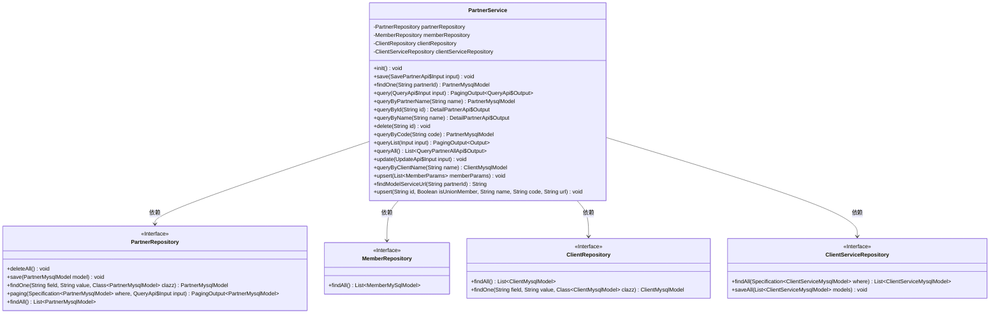

# 基础信息

|      |      |
|------|------|
| 名称 | PartnerService |
| 编码语言 | .java |
| 代码路径 | WeFe/serving/serving-service/src/main/java/com/welab/wefe/serving/service/service/PartnerService.java |
| 包名 | com.welab.wefe.serving.service.service |
| 依赖项 | ['java.util.Date', 'java.util.List', 'java.util.UUID', 'java.util.stream.Collectors', 'org.apache.commons.collections.CollectionUtils', 'org.apache.commons.lang3.StringUtils', 'org.springframework.beans.factory.annotation.Autowired', 'org.springframework.data.jpa.domain.Specification', 'org.springframework.stereotype.Service', 'org.springframework.transaction.annotation.Transactional', 'com.welab.wefe.common.StatusCode', 'com.welab.wefe.common.data.mysql.Where', 'com.welab.wefe.common.exception.StatusCodeWithException', 'com.welab.wefe.common.web.util.CurrentAccountUtil', 'com.welab.wefe.common.web.util.ModelMapper', 'com.welab.wefe.serving.service.api.member.QueryApi', 'com.welab.wefe.serving.service.api.partner.DetailPartnerApi', 'com.welab.wefe.serving.service.api.partner.QueryPartnerAllApi', 'com.welab.wefe.serving.service.api.partner.QueryPartnerListApi', 'com.welab.wefe.serving.service.api.partner.QueryPartnerListApi.Input', 'com.welab.wefe.serving.service.api.partner.QueryPartnerListApi.Output', 'com.welab.wefe.serving.service.api.partner.SavePartnerApi', 'com.welab.wefe.serving.service.database.entity.ClientMysqlModel', 'com.welab.wefe.serving.service.database.entity.ClientServiceMysqlModel', 'com.welab.wefe.serving.service.database.entity.MemberMySqlModel', 'com.welab.wefe.serving.service.database.entity.PartnerMysqlModel', 'com.welab.wefe.serving.service.database.repository.ClientRepository', 'com.welab.wefe.serving.service.database.repository.ClientServiceRepository', 'com.welab.wefe.serving.service.database.repository.MemberRepository', 'com.welab.wefe.serving.service.database.repository.PartnerRepository', 'com.welab.wefe.serving.service.dto.MemberParams', 'com.welab.wefe.serving.service.dto.PagingOutput', 'com.welab.wefe.serving.service.enums.ClientStatusEnum'] |
| 概述说明 | PartnerService类提供合作伙伴管理功能，包括初始化数据、增删改查、分页查询、批量操作等。主要方法：init初始化数据，save保存合作伙伴，query分页查询，update更新信息，delete逻辑删除，upsert批量插入或更新。支持事务处理和异常状态码返回。 |

# 说明

PartnerService是一个服务类，负责管理与合作伙伴相关的数据操作。它通过依赖注入引入了PartnerRepository、MemberRepository、ClientRepository和ClientServiceRepository等数据访问组件。主要功能包括初始化合作伙伴数据、保存合作伙伴信息、查询合作伙伴详情、分页查询合作伙伴列表、更新和删除合作伙伴信息等。服务方法使用了事务管理确保数据一致性，并处理了各种业务逻辑，如唯一性校验和状态更新。此外，它还提供了与客户服务表联动的更新机制，确保数据同步。服务支持多种查询方式，包括按名称、代码或ID查询，并提供了批量插入和更新功能。

# 类列表 Class Summary

| 名称   | 类型  | 说明 |
|-------|------|-------------|
| PartnerService | class | PartnerService类提供合作伙伴管理功能，包括初始化数据、保存、查询、更新和删除操作。支持分页查询、批量处理和状态管理，涉及成员和客户数据映射。 |

## 类 PartnerService

|      |      |
|------|------|
| 访问范围 | @Service;public |
| 类型 | class |
| 名称 | PartnerService |
| 说明 | PartnerService类提供合作伙伴管理功能，包括初始化数据、保存、查询、更新和删除操作。支持分页查询、批量处理和状态管理，涉及成员和客户数据映射。 |

### UML类图

该代码展示了一个PartnerService类，它通过依赖注入四个不同的Repository接口来管理合作伙伴数据。主要功能包括初始化数据、保存、查询、更新和删除合作伙伴信息，以及与客户服务相关的操作。类图中清晰地展示了服务类与各个Repository之间的依赖关系，以及每个Repository接口定义的关键方法。

### 内部方法调用关系图

```mermaid
graph TD
    A["PartnerService类"]
    B["属性: PartnerRepository"]
    C["属性: MemberRepository"]
    D["属性: ClientRepository"]
    E["属性: ClientServiceRepository"]
    F["方法: init()"]
    G["方法: save()"]
    H["方法: findOne()"]
    I["方法: query()"]
    J["方法: queryByPartnerName()"]
    K["方法: queryById()"]
    L["方法: queryByName()"]
    M["方法: delete()"]
    N["方法: queryByCode()"]
    O["方法: queryList()"]
    P["方法: queryAll()"]
    Q["方法: update()"]
    R["方法: queryByClientName()"]
    S["方法: upsert()"]
    T["方法: findModelServiceUrl()"]

    A --> B
    A --> C
    A --> D
    A --> E
    A --> F
    A --> G
    A --> H
    A --> I
    A --> J
    A --> K
    A --> L
    A --> M
    A --> N
    A --> O
    A --> P
    A --> Q
    A --> R
    A --> S
    A --> T
```

这段代码定义了一个名为PartnerService的Spring服务类，主要用于管理合作伙伴数据。该类通过多个Repository与数据库交互，提供了初始化数据、保存、查询、更新和删除合作伙伴信息的功能。其中包含事务处理、数据映射和分页查询等复杂操作，同时处理各种业务逻辑和异常情况。核心方法如init()用于初始化数据，save()用于保存合作伙伴信息，query()系列方法用于查询数据，update()用于更新信息。

### 字段列表 Field List

| 名称  | 类型  | 说明 |
|-------|-------|------|
| partnerRepository | PartnerRepository | 使用@Autowired自动注入PartnerRepository实例。 |
| clientServiceRepository | ClientServiceRepository | 使用@Autowired自动注入ClientServiceRepository实例。 |
| memberRepository | MemberRepository | 自动注入MemberRepository实例。 |
| clientRepository | ClientRepository | 自动注入ClientRepository实例。 |

### 方法列表

| 名称  | 类型  | 说明 |
|-------|-------|------|
| findModelServiceUrl | String | 该方法通过partnerId查询PartnerMysqlModel对象，若存在则返回其servingBaseUrl，否则返回空字符串。 |
| queryList | PagingOutput<Output> | 该方法根据输入条件查询合作伙伴列表，使用模糊匹配名称，分页返回映射后的结果数据。 |
| queryByCode | PartnerMysqlModel | 该方法通过code查询PartnerMysqlModel，使用Where构建查询条件，返回匹配结果或null。 |
| delete | void | 删除指定ID的合作伙伴数据，将其状态设为已删除并更新修改时间。 |
| queryAll | List<QueryPartnerAllApi.Output> | 查询所有合作伙伴数据并转换为输出列表。 |
| upsert | void | 该方法批量更新或插入成员数据，遍历参数列表，对每个成员调用upsert方法，处理可能出现的异常。 |
| queryByName | DetailPartnerApi.Output | 方法queryByName通过名称查询合作伙伴，返回映射后的输出对象。 |
| save | void | 方法save用于保存合作伙伴信息。检查code和name是否已存在，存在则抛出异常。若id为空则生成UUID，否则更新现有记录。最后保存合作伙伴数据到数据库。 |
| upsert | void | 该方法用于插入或更新合作伙伴数据。根据ID判断是新增还是更新记录，设置各项属性后保存到数据库。包含名称、代码、URL等字段，并处理创建者信息。 |
| findOne | PartnerMysqlModel | 该方法通过partnerId查询并返回PartnerMysqlModel对象，调用partnerRepository的findOne方法实现。 |
| queryByPartnerName | PartnerMysqlModel | 方法queryByPartnerName根据名称查询合作伙伴，返回PartnerMysqlModel对象。调用partnerRepository的findOne方法，参数为字段名、名称和模型类。 |
| init | void | 该方法使用事务初始化合作伙伴数据，先清空现有数据，然后从成员和客户表获取数据并转换为合作伙伴模型，分别设置属性后保存。 |
| query | PagingOutput<QueryApi.Output> | 该方法根据输入条件查询合作伙伴数据，返回分页结果。首先构建查询条件，然后从数据库分页获取数据，最后将结果映射为输出类型并返回。 |
| queryById | DetailPartnerApi.Output | 该方法通过ID查询合作伙伴信息，从数据库获取数据后映射为API输出格式并返回。 |
| queryByClientName | ClientMysqlModel | 方法queryByClientName通过name参数查询ClientMysqlModel，调用clientRepository的findOne方法返回结果。 |
| update | void | 更新合作伙伴信息，包括名称、邮箱等字段，并同步更新关联客户服务表。若数据不存在则抛出异常。 |

