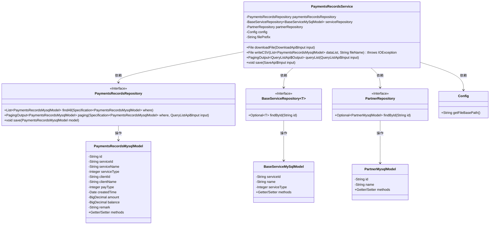

# 基础信息

|      |      |
|------|------|
| 名称 | PaymentsRecordsService |
| 编码语言 | .java |
| 代码路径 | WeFe/serving/serving-service/src/main/java/com/welab/wefe/serving/service/service/PaymentsRecordsService.java |
| 包名 | com.welab.wefe.serving.service.service |
| 依赖项 | ['com.welab.wefe.common.data.mysql.Where', 'com.welab.wefe.common.data.mysql.enums.OrderBy', 'com.welab.wefe.common.util.DateUtil', 'com.welab.wefe.common.util.StringUtil', 'com.welab.wefe.common.web.util.ModelMapper', 'com.welab.wefe.serving.service.api.paymentsrecords.DownloadApi', 'com.welab.wefe.serving.service.api.paymentsrecords.QueryListApi', 'com.welab.wefe.serving.service.api.paymentsrecords.SaveApi', 'com.welab.wefe.serving.service.config.Config', 'com.welab.wefe.serving.service.database.entity.BaseServiceMySqlModel', 'com.welab.wefe.serving.service.database.entity.PartnerMysqlModel', 'com.welab.wefe.serving.service.database.entity.PaymentsRecordsMysqlModel', 'com.welab.wefe.serving.service.database.repository.BaseServiceRepository', 'com.welab.wefe.serving.service.database.repository.PartnerRepository', 'com.welab.wefe.serving.service.database.repository.PaymentsRecordsRepository', 'com.welab.wefe.serving.service.dto.PagingOutput', 'com.welab.wefe.serving.service.enums.PaymentsTypeEnum', 'com.welab.wefe.serving.service.enums.ServiceTypeEnum', 'de.siegmar.fastcsv.writer.CsvWriter', 'de.siegmar.fastcsv.writer.LineDelimiter', 'de.siegmar.fastcsv.writer.QuoteStrategy', 'org.springframework.beans.factory.annotation.Autowired', 'org.springframework.data.jpa.domain.Specification', 'org.springframework.stereotype.Service', 'java.io', 'java.math.BigDecimal', 'java.nio.charset.StandardCharsets', 'java.util.ArrayList', 'java.util.List', 'java.util.Optional'] |
| 概述说明 | 支付记录服务类，包含下载CSV文件、查询列表和保存记录功能，涉及服务、客户和金额操作。 |

# 说明

PaymentsRecordsService是一个处理支付记录的服务类，包含四个主要功能。downloadFile方法根据输入条件筛选支付记录并生成CSV文件，文件包含ID、服务信息、客户信息、收支类型、时间、金额等字段。queryList方法分页查询支付记录列表，并转换输出格式。save方法保存新的支付记录，根据收支类型更新余额，充值增加余额，支出减少余额。服务依赖PaymentsRecordsRepository、BaseServiceRepository、PartnerRepository和Config进行数据操作和配置管理。

# 类列表 Class Summary

| 名称   | 类型  | 说明 |
|-------|------|-------------|
| PaymentsRecordsService | class | 支付记录服务类，包含下载CSV文件、查询列表和保存记录功能，涉及服务、客户和支付类型处理，支持余额计算。 |

## 类 PaymentsRecordsService

|      |      |
|------|------|
| 访问范围 | @Service;public |
| 类型 | class |
| 名称 | PaymentsRecordsService |
| 说明 | 支付记录服务类，包含下载CSV文件、查询列表和保存记录功能，涉及服务、客户和支付类型处理，支持余额计算。 |

### UML类图

这段代码展示了一个支付记录服务类(PaymentsRecordsService)及其相关依赖关系。该类主要提供三个核心功能：1)下载支付记录CSV文件(downloadFile) 2)查询支付记录列表(queryList) 3)保存支付记录(save)。它依赖于四个外部组件：支付记录仓库(PaymentsRecordsRepository)、基础服务仓库(BaseServiceRepository)、合作伙伴仓库(PartnerRepository)和配置类(Config)。服务类通过仓库接口操作三个主要数据模型：支付记录模型(PaymentsRecordsMysqlModel)、基础服务模型(BaseServiceMySqlModel)和合作伙伴模型(PartnerMysqlModel)。整个设计遵循了依赖注入和接口隔离原则。

### 内部方法调用关系图

```mermaid
graph TD
    A["类PaymentsRecordsService"]
    B["属性: PaymentsRecordsRepository paymentsRecordsRepository"]
    C["属性: BaseServiceRepository<BaseServiceMySqlModel> serviceRepository"]
    D["属性: PartnerRepository partnerRepository"]
    E["属性: Config config"]
    F["常量: String filePrefix = 'payments_records/'"]
    G["方法: File downloadFile(DownloadApi.Input input)"]
    H["方法: File writeCSV(List<PaymentsRecordsMysqlModel> dataList, String fileName)"]
    I["方法: PagingOutput<QueryListApi.Output> queryList(QueryListApi.Input input)"]
    J["方法: void save(SaveApi.Input input)"]

    A --> B
    A --> C
    A --> D
    A --> E
    A --> F
    A --> G
    A --> H
    A --> I
    A --> J

    G --> H1["构建查询条件Specification"]
    G --> H2["调用paymentsRecordsRepository.findAll"]
    G --> H3["调用writeCSV生成CSV文件"]
    H --> H4["创建CsvWriter写入表头"]
    H --> H5["遍历数据写入CSV内容"]
    H --> H6["创建文件目录并写入BOM头"]
    I --> I1["构建分页查询条件"]
    I --> I2["调用paymentsRecordsRepository.paging"]
    I --> I3["映射结果到Output对象"]
    J --> J1["创建PaymentsRecordsMysqlModel"]
    J --> J2["查询服务信息并设置属性"]
    J --> J3["查询客户信息并设置属性"]
    J --> J4["计算余额逻辑处理"]
    J --> J5["调用paymentsRecordsRepository.save"]
```

该流程图展示了PaymentsRecordsService类的完整结构，包含4个核心方法：文件下载(downloadFile)、CSV写入(writeCSV)、分页查询(queryList)和记录保存(save)。每个方法详细展示了内部处理流程，特别是save方法包含复杂的余额计算逻辑，queryList方法包含结果映射处理，downloadFile和writeCSV共同完成CSV文件生成流程。类通过多个Repository与数据库交互，体现了完整的支付记录管理功能。

### 字段列表 Field List

| 名称  | 类型  | 说明 |
|-------|-------|------|
| partnerRepository | PartnerRepository | 使用@Autowired自动注入PartnerRepository实例。 |
| serviceRepository | BaseServiceRepository<BaseServiceMySqlModel> | 使用@Autowired自动注入BaseServiceRepository实例，泛型类型为BaseServiceMySqlModel。 |
| config | Config | 自动注入Config配置对象。 |
| filePrefix = "payments_records/" | String | 定义私有静态常量filePrefix，值为"payments_records/"。 |
| paymentsRecordsRepository | PaymentsRecordsRepository | 自动注入支付记录仓库实例。 |

### 方法列表

| 名称  | 类型  | 说明 |
|-------|-------|------|
| save | void | 方法save接收输入参数，创建支付记录模型并设置备注、金额和支付类型。根据服务ID和客户ID查询关联信息并设置到模型中。检查是否存在历史记录，更新余额（充值增加，支出减少），最后保存模型。 |
| writeCSV | File | 方法将支付记录列表写入CSV文件，包含标题行和数据行，支持中文和UTF-8编码，自动创建目录并返回文件对象。 |
| downloadFile | File | 方法根据输入条件查询支付记录，生成CSV文件并返回。查询条件包括服务名、客户名、时间范围、支付类型和服务类型，按创建时间降序排序。若生成失败返回null。 |
| queryList | PagingOutput<QueryListApi.Output> | 该方法根据输入条件查询支付记录列表，包括时间范围、客户名称、服务名称、支付类型和服务类型，并按创建时间降序排序。查询结果转换为输出格式后返回分页数据。 |

