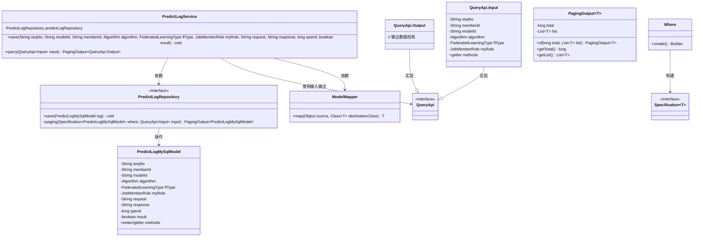

# 基础信息

|      |      |
|------|------|
| 名称 | PredictLogService |
| 编码语言 | .java |
| 代码路径 | WeFe/serving/serving-service/src/main/java/com/welab/wefe/serving/service/service/PredictLogService.java |
| 包名 | com.welab.wefe.serving.service.service |
| 依赖项 | ['com.welab.wefe.common.data.mysql.Where', 'com.welab.wefe.common.web.util.ModelMapper', 'com.welab.wefe.common.wefe.enums.Algorithm', 'com.welab.wefe.common.wefe.enums.FederatedLearningType', 'com.welab.wefe.common.wefe.enums.JobMemberRole', 'com.welab.wefe.serving.service.api.logger.QueryApi', 'com.welab.wefe.serving.service.database.entity.PredictLogMySqlModel', 'com.welab.wefe.serving.service.database.repository.PredictLogRepository', 'com.welab.wefe.serving.service.dto.PagingOutput', 'org.springframework.beans.factory.annotation.Autowired', 'org.springframework.data.jpa.domain.Specification', 'org.springframework.stereotype.Service', 'org.springframework.transaction.annotation.Transactional', 'java.util.List', 'java.util.stream.Collectors'] |
| 概述说明 | PredictLogService类提供保存预测日志和分页查询功能。保存方法接收多个参数并存入数据库，查询方法支持多条件筛选并返回分页结果。 |

# 说明

PredictLogService是一个服务类，包含保存预测日志和分页查询日志的功能。保存方法接收序列号、模型ID、成员ID、算法类型、联邦学习类型、角色、请求、响应、耗时和结果等参数，构建日志对象并存储到数据库。查询方法根据输入条件构建查询规范，执行分页查询并将结果映射为输出对象列表返回。整个服务类使用事务管理确保数据一致性。

# 类列表 Class Summary

| 名称   | 类型  | 说明 |
|-------|------|-------------|
| PredictLogService | class | PredictLogService类提供保存预测日志和分页查询功能，支持事务回滚和条件筛选。 |

## 类 PredictLogService

|      |      |
|------|------|
| 访问范围 | @Service;public |
| 类型 | class |
| 名称 | PredictLogService |
| 说明 | PredictLogService类提供保存预测日志和分页查询功能，支持事务回滚和条件筛选。 |

### UML类图

这段代码展示了一个预测日志服务系统，核心是`PredictLogService`类，它通过`PredictLogRepository`接口实现数据持久化，支持日志的保存和分页查询功能。服务类使用Spring的`@Service`和事务注解，通过`ModelMapper`进行对象转换，查询功能采用规范模式(Specification)构建动态查询条件，返回分页结果。系统设计体现了分层架构思想，各组件职责明确，通过接口和泛型实现松耦合。

### 内部方法调用关系图

流程图描述：该流程图展示了PredictLogService类的核心功能，包含两个主要方法：1) save方法通过创建PredictLogMySqlModel对象并设置字段后调用仓储层保存；2) query方法通过构建动态查询条件，调用分页查询后将结果映射为DTO对象返回。时序图则详细描述了客户端调用这两个方法时，服务层与仓储层、模型对象之间的交互过程。

### 字段列表 Field List

| 名称  | 类型  | 说明 |
|-------|-------|------|
| predictLogRepository | PredictLogRepository | 代码片段使用@Autowired自动注入PredictLogRepository实例。 |

### 方法列表

| 名称  | 类型  | 说明 |
|-------|-------|------|
| save | void | 带事务回滚的保存方法，记录预测日志信息到数据库，包括序列号、成员ID、模型ID、算法类型、联邦学习类型、角色、请求、响应、耗时和结果。 |
| query | PagingOutput<QueryApi.Output> | 该方法根据输入条件查询预测日志，返回分页结果。通过构建查询条件，从数据库获取数据后映射为输出格式，并保留分页信息。 |

