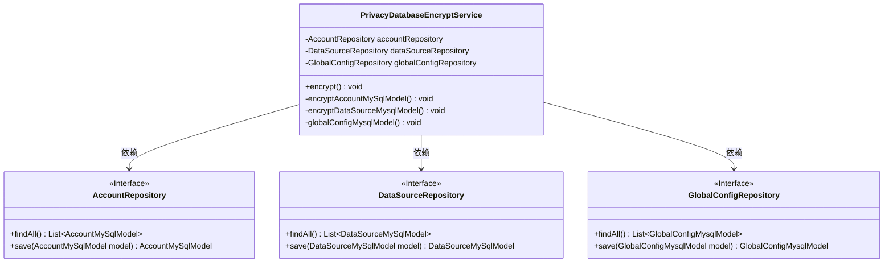
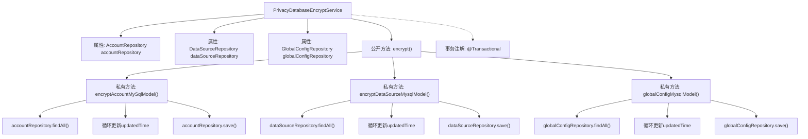

# 基础信息

|      |      |
|------|------|
| 名称 | PrivacyDatabaseEncryptService |
| 编码语言 | .java |
| 代码路径 | WeFe/serving/serving-service/src/main/java/com/welab/wefe/serving/service/service/PrivacyDatabaseEncryptService.java |
| 包名 | com.welab.wefe.serving.service.service |
| 依赖项 | ['com.welab.wefe.serving.service.database.entity.AccountMySqlModel', 'com.welab.wefe.serving.service.database.entity.DataSourceMySqlModel', 'com.welab.wefe.serving.service.database.entity.GlobalConfigMysqlModel', 'com.welab.wefe.serving.service.database.repository.AccountRepository', 'com.welab.wefe.serving.service.database.repository.DataSourceRepository', 'com.welab.wefe.serving.service.database.repository.GlobalConfigRepository', 'org.springframework.beans.factory.annotation.Autowired', 'org.springframework.stereotype.Service', 'org.springframework.transaction.annotation.Transactional', 'org.springframework.util.CollectionUtils', 'java.util.Date', 'java.util.List'] |
| 概述说明 | PrivacyDatabaseEncryptService类用于加密数据库隐私数据，通过更新Account、DataSource和GlobalConfig模型的更新时间并保存。使用事务确保操作完整性。 |

# 说明

PrivacyDatabaseEncryptService是一个Spring服务类，用于对数据库中的隐私数据进行加密处理。它通过依赖注入获取了AccountRepository、DataSourceRepository和GlobalConfigRepository三个仓库实例。该服务提供了encrypt方法，通过@Transactional注解确保事务性，并在异常时回滚。该方法依次调用三个私有方法：encryptAccountMySqlModel、encryptDataSourceMysqlModel和globalConfigMysqlModel。每个方法都从相应仓库获取所有记录，如果记录不为空，则更新每条记录的updatedTime字段为当前时间并保存。整个过程实现了对账户、数据源和全局配置数据的批量更新时间戳操作。

# 类列表 Class Summary

| 名称   | 类型  | 说明 |
|-------|------|-------------|
| PrivacyDatabaseEncryptService | class | 服务类PrivacyDatabaseEncryptService，通过事务处理加密账户、数据源和全局配置数据，更新各模型时间戳并保存。 |

## 类 PrivacyDatabaseEncryptService

|      |      |
|------|------|
| 访问范围 | @Service;public |
| 类型 | class |
| 名称 | PrivacyDatabaseEncryptService |
| 说明 | 服务类PrivacyDatabaseEncryptService，通过事务处理加密账户、数据源和全局配置数据，更新各模型时间戳并保存。 |

### UML类图

这段代码展示了一个Spring服务类`PrivacyDatabaseEncryptService`，它通过三个私有方法分别处理不同类型的数据库模型加密操作。该类依赖三个JPA仓库接口（`AccountRepository`、`DataSourceRepository`和`GlobalConfigRepository`）来获取和保存数据。主要功能是批量更新这些模型的`updatedTime`字段，所有操作在一个事务中执行，出现异常时会回滚。类图中清晰地展示了服务类与仓库接口之间的依赖关系，以及各个接口的方法签名。

### 内部方法调用关系图

这段代码流程图展示了PrivacyDatabaseEncryptService类的结构和主要方法调用关系。该类通过@Transactional注解实现事务管理，包含三个私有方法分别处理不同实体的加密操作：encryptAccountMySqlModel()更新账户数据、encryptDataSourceMysqlModel()更新数据源数据、globalConfigMysqlModel()更新全局配置数据。每个方法都遵循相同的模式：从对应仓库获取数据列表，遍历更新最后修改时间，然后保存回数据库。公开方法encrypt()作为入口统一调用这三个私有方法。

### 字段列表 Field List

| 名称  | 类型  | 说明 |
|-------|-------|------|
| globalConfigRepository | GlobalConfigRepository | 使用@Autowired自动注入GlobalConfigRepository实例。 |
| dataSourceRepository | DataSourceRepository | 自动注入DataSourceRepository实例。 |
| accountRepository | AccountRepository | 使用@Autowired自动注入AccountRepository实例。 |

### 方法列表

| 名称  | 类型  | 说明 |
|-------|-------|------|
| encryptDataSourceMysqlModel | void | 该方法用于加密MySQL数据源模型，遍历所有数据源并更新时间为当前日期，然后保存到数据库。 |
| globalConfigMysqlModel | void | 该方法从数据库获取全局配置列表，若为空则返回；否则遍历列表，更新每条记录的修改时间为当前时间并保存。 |
| encryptAccountMySqlModel | void | 加密MySQL账户模型数据，更新时间为当前日期并保存。 |
| encrypt | void | 使用事务注解的方法，包含三个加密操作：账户、数据源和全局配置模型，异常时回滚。 |

