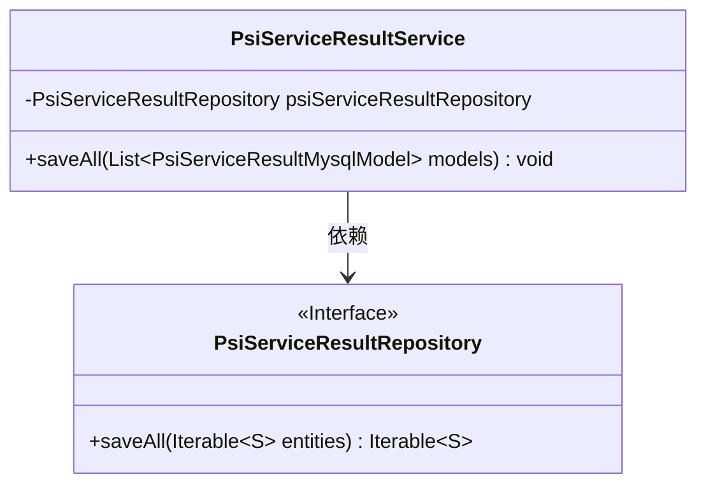
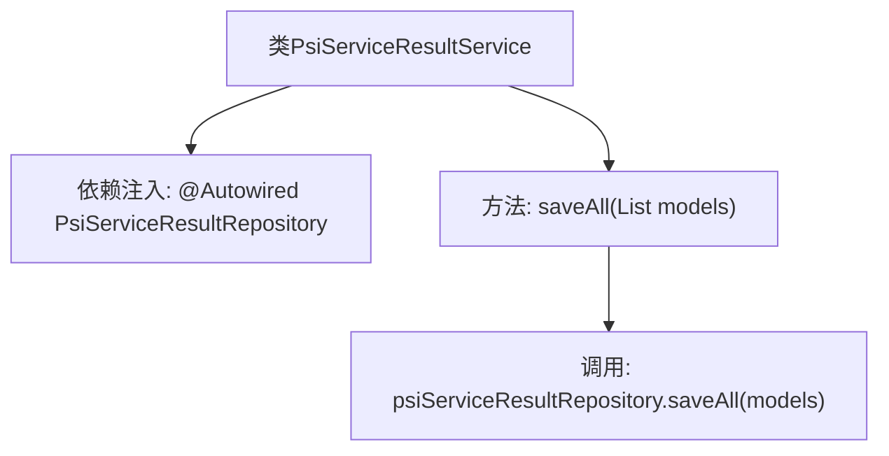

# 基础信息

|      |      |
|------|------|
| 名称 | PsiServiceResultService |
| 编码语言 | .java |
| 代码路径 | WeFe/serving/serving-service/src/main/java/com/welab/wefe/serving/service/service/PsiServiceResultService.java |
| 包名 | com.welab.wefe.serving.service.service |
| 依赖项 | ['java.util.List', 'org.springframework.beans.factory.annotation.Autowired', 'org.springframework.stereotype.Service', 'com.welab.wefe.serving.service.database.entity.PsiServiceResultMysqlModel', 'com.welab.wefe.serving.service.database.repository.PsiServiceResultRepository'] |
| 概述说明 | PsiServiceResultService类通过自动注入的PsiServiceResultRepository批量保存PsiServiceResultMysqlModel列表数据。 |

# 说明

该内容描述了一个名为PsiServiceResultService的Spring服务类。该类通过@Autowired注解自动注入了一个PsiServiceResultRepository依赖项。它提供了一个saveAll方法，用于接收一个PsiServiceResultMysqlModel对象列表，并通过注入的repository将这些模型数据批量保存到数据库中。整个类专注于处理与PSI服务结果相关的数据持久化操作。

# 类列表 Class Summary

| 名称   | 类型  | 说明 |
|-------|------|-------------|
| PsiServiceResultService | class | 这是一个Spring服务类，用于批量保存PSI服务结果数据到数据库，通过自动注入的仓库接口实现存储功能。 |

## 类 PsiServiceResultService

|      |      |
|------|------|
| 访问范围 | @Service;public |
| 类型 | class |
| 名称 | PsiServiceResultService |
| 说明 | 这是一个Spring服务类，用于批量保存PSI服务结果数据到数据库，通过自动注入的仓库接口实现存储功能。 |

### UML类图

类图描述：该图展示了PsiServiceResultService服务类与PsiServiceResultRepository接口的依赖关系。服务类通过自动注入的仓库接口实现数据批量保存功能，其中PsiServiceResultRepository作为Spring Data JPA接口，提供了标准的saveAll方法用于持久化实体集合。这种设计符合分层架构模式，实现了业务逻辑与数据访问的解耦。

### 内部方法调用关系图

这段流程图展示了PsiServiceResultService类的结构和主要方法调用关系。该类通过@Autowired自动注入PsiServiceResultRepository依赖，核心方法saveAll接收模型列表后直接调用repository的批量保存方法。图形清晰地呈现了从服务层到持久层的单向调用链路，体现了Spring Boot服务组件的典型分层架构模式。

### 字段列表 Field List

| 名称  | 类型  | 说明 |
|-------|-------|------|
| psiServiceResultRepository | PsiServiceResultRepository | 自动注入PsiServiceResultRepository实例。 |

### 方法列表

| 名称  | 类型  | 说明 |
|-------|-------|------|
| saveAll | void | 保存所有PSI服务结果模型到数据库。 |

