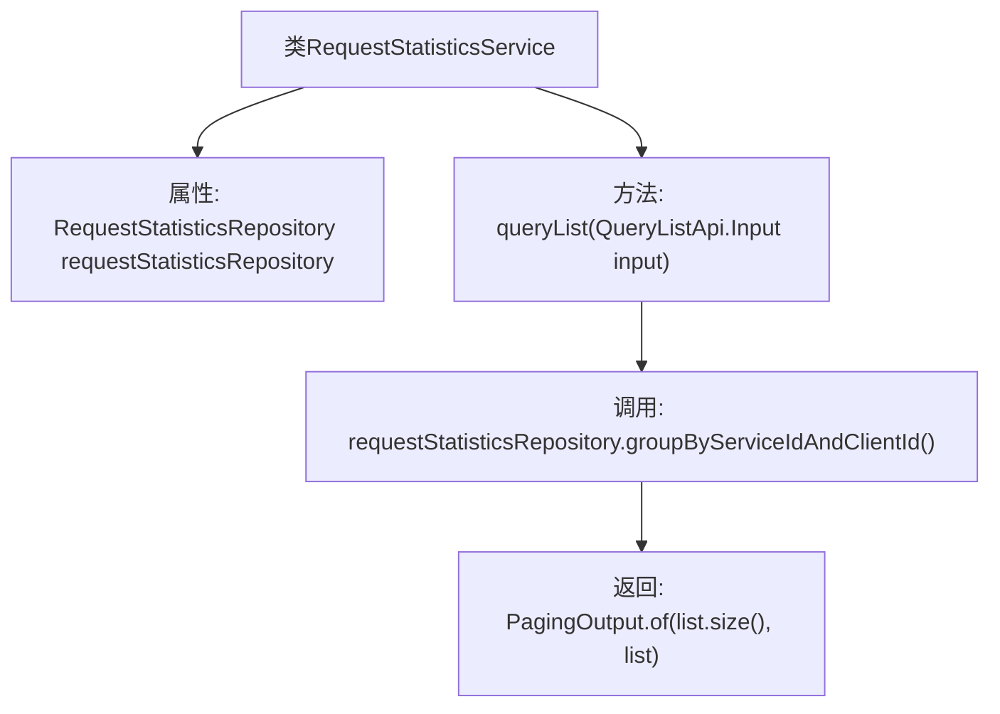

# 基础信息

|      |      |
|------|------|
| 名称 | RequestStatisticsService |
| 编码语言 | .java |
| 代码路径 | WeFe/serving/serving-service/src/main/java/com/welab/wefe/serving/service/service/RequestStatisticsService.java |
| 包名 | com.welab.wefe.serving.service.service |
| 依赖项 | ['com.welab.wefe.serving.service.api.requeststatistics.QueryListApi', 'com.welab.wefe.serving.service.database.entity.RequestStatisticsMysqlModel', 'com.welab.wefe.serving.service.database.repository.RequestStatisticsRepository', 'com.welab.wefe.serving.service.dto.PagingOutput', 'org.springframework.beans.factory.annotation.Autowired', 'org.springframework.stereotype.Service', 'java.util.List'] |
| 概述说明 | RequestStatisticsService类通过RequestStatisticsRepository按服务ID和客户端ID分组查询请求统计列表，并返回分页结果。 |

# 说明

该代码片段定义了一个名为RequestStatisticsService的服务类，用于处理请求统计数据的查询功能。该类通过自动注入的RequestStatisticsRepository与数据库交互。主要提供了一个queryList方法，该方法接收包含服务ID、客户端ID、起始时间和结束时间的输入参数，通过调用repository的groupByServiceIdAndClientId方法，按服务ID和客户端ID分组查询指定时间范围内的统计数据，并以分页形式返回结果。返回类型为PagingOutput，包含查询结果列表和总数。

# 类列表 Class Summary

| 名称   | 类型  | 说明 |
|-------|------|-------------|
| RequestStatisticsService | class | RequestStatisticsService类通过RequestStatisticsRepository按服务ID和客户端ID分组查询请求统计列表，并返回分页结果。 |


## 类 RequestStatisticsService

|      |      |
|------|------|
| 访问范围 | @Service;public |
| 类型 | class |
| 名称 | RequestStatisticsService |
| 说明 | RequestStatisticsService类通过RequestStatisticsRepository按服务ID和客户端ID分组查询请求统计列表，并返回分页结果。 |


### UML类图

```mermaid
classDiagram
    class RequestStatisticsService {
        -RequestStatisticsRepository requestStatisticsRepository
        +PagingOutput~RequestStatisticsMysqlModel~ queryList(QueryListApi$Input input)
    }

    class RequestStatisticsRepository {
        <<Interface>>
        +List~RequestStatisticsMysqlModel~ groupByServiceIdAndClientId(String serviceId, String clientId, Date startTime, Date endTime)
    }

    class PagingOutput~T~ {
        +int total
        +List~T~ data
        +static PagingOutput~T~ of(int total, List~T~ data)
    }

    class RequestStatisticsMysqlModel {
        // 数据模型类，存储请求统计信息
    }

    class QueryListApi {
        // 包含Input内部类
    }

    class QueryListApi$Input {
        +String serviceId
        +String clientId
        +Date startTime
        +Date endTime
    }

    RequestStatisticsService --> RequestStatisticsRepository : 依赖
    RequestStatisticsService --> PagingOutput : 依赖
    RequestStatisticsService --> RequestStatisticsMysqlModel : 依赖
    RequestStatisticsService --> QueryListApi$Input : 依赖
    RequestStatisticsRepository --> RequestStatisticsMysqlModel : 依赖
    PagingOutput --> RequestStatisticsMysqlModel : 泛型关联
```

这段代码展示了一个请求统计服务系统，核心是RequestStatisticsService类，它通过RequestStatisticsRepository接口获取数据，并返回分页格式的统计结果。类图中包含5个主要组件：服务类依赖仓库接口处理数据查询，使用PagingOutput泛型类包装分页结果，数据模型RequestStatisticsMysqlModel存储统计信息，QueryListApi.Input作为查询参数封装类。各组件通过清晰的依赖关系形成完整的数据查询链路，体现了分层架构和接口隔离的设计原则。


### 内部方法调用关系图



这段代码流程图展示了RequestStatisticsService类的结构和主要方法调用关系。该类通过@Autowired注入RequestStatisticsRepository依赖，核心方法queryList接收输入参数后，调用repository的分组查询方法获取数据列表，最后将结果封装为分页输出对象返回。流程清晰展现了从参数输入到结果返回的数据处理链路，体现了Spring服务层典型的数据查询模式。

### 字段列表 Field List

| 名称  | 类型  | 说明 |
|-------|-------|------|
| requestStatisticsRepository | RequestStatisticsRepository | 使用@Autowired自动注入RequestStatisticsRepository实例。 |

### 方法列表

| 名称  | 类型  | 说明 |
|-------|-------|------|
| queryList | PagingOutput<RequestStatisticsMysqlModel> | 方法queryList根据输入参数查询请求统计列表，按服务ID和客户端ID分组，返回分页结果。 |


