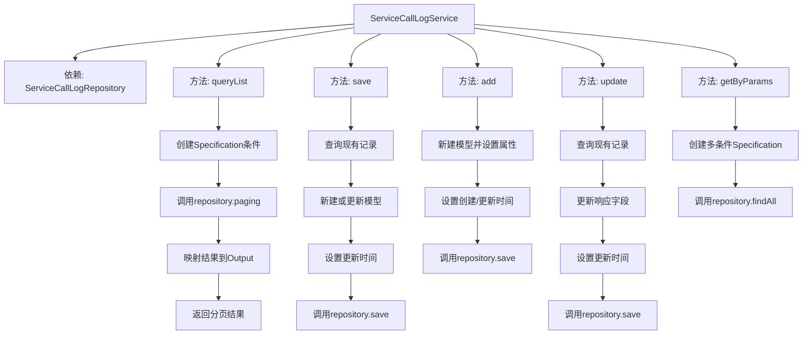

# 基础信息

|      |      |
|------|------|
| 名称 | ServiceCallLogService |
| 编码语言 | .java |
| 代码路径 | WeFe/serving/serving-service/src/main/java/com/welab/wefe/serving/service/service/ServiceCallLogService.java |
| 包名 | com.welab.wefe.serving.service.service |
| 依赖项 | ['com.alibaba.fastjson.JSON', 'com.welab.wefe.common.data.mysql.Where', 'com.welab.wefe.common.data.mysql.enums.OrderBy', 'com.welab.wefe.common.web.util.ModelMapper', 'com.welab.wefe.serving.service.api.servicecalllog.QueryListApi', 'com.welab.wefe.serving.service.database.entity.ServiceCallLogMysqlModel', 'com.welab.wefe.serving.service.database.repository.ServiceCallLogRepository', 'com.welab.wefe.serving.service.dto.PagingOutput', 'com.welab.wefe.serving.service.dto.ServiceCallLogInput', 'com.welab.wefe.serving.service.utils.ServiceUtil', 'org.springframework.beans.factory.annotation.Autowired', 'org.springframework.data.jpa.domain.Specification', 'org.springframework.stereotype.Service', 'java.util.ArrayList', 'java.util.Date', 'java.util.List'] |
| 概述说明 | ServiceCallLogService提供日志查询、保存、新增、更新功能，支持按条件分页查询，兼容新增/更新操作，并可根据参数获取日志列表。 |

# 说明

ServiceCallLogService是一个服务类，负责处理服务调用日志的相关操作。主要功能包括：查询日志列表并分页返回，通过条件构建Specification实现灵活查询；保存日志记录，支持新增和更新操作；添加新日志记录，设置各项请求参数；更新日志记录，补充响应信息；根据多种参数组合查询日志列表，支持时间范围筛选。所有操作均通过ServiceCallLogRepository与数据库交互，并处理模型映射与字段截断等逻辑。

# 类列表 Class Summary

| 名称   | 类型  | 说明 |
|-------|------|-------------|
| ServiceCallLogService | class | ServiceCallLogService提供日志查询、保存、新增、更新功能，支持分页查询和条件筛选，处理服务调用记录。 |


## 类 ServiceCallLogService

|      |      |
|------|------|
| 访问范围 | @Service;public |
| 类型 | class |
| 名称 | ServiceCallLogService |
| 说明 | ServiceCallLogService提供日志查询、保存、新增、更新功能，支持分页查询和条件筛选，处理服务调用记录。 |


### UML类图

```mermaid
classDiagram
    class ServiceCallLogService {
        -ServiceCallLogRepository serviceCallLogRepository
        +PagingOutput~QueryListApi.Output~ queryList(QueryListApi.Input input)
        +void save(ServiceCallLogMysqlModel input)
        +ServiceCallLogMysqlModel add(String orderId, int callByMe, String requestPartnerId, String requestPartnerName, String serviceId, String serviceName, Integer serviceType, String requestId, String requestData, String requestIp)
        +ServiceCallLogMysqlModel update(String callLogId, String responsePartnerId, String responsePartnerName, String responseId, String responseData, int responseCode, String responseStatus, Long spendTime)
        +List~ServiceCallLogMysqlModel~ getByParams(ServiceCallLogInput input)
    }

    class ServiceCallLogRepository {
        <<Interface>>
        +PagingOutput~ServiceCallLogMysqlModel~ paging(Specification~ServiceCallLogMysqlModel~ where, QueryListApi.Input input)
        +ServiceCallLogMysqlModel findOne(String field, String value, Class~ServiceCallLogMysqlModel~ clazz)
        +ServiceCallLogMysqlModel save(ServiceCallLogMysqlModel model)
        +List~ServiceCallLogMysqlModel~ findAll(Specification~ServiceCallLogMysqlModel~ where)
    }

    class ServiceCallLogMysqlModel {
        // 数据模型类，包含日志相关字段
    }

    class QueryListApi {
        class Input {
            // 查询输入参数
        }
        class Output {
            // 查询输出结果
        }
    }

    class ServiceCallLogInput {
        // 日志查询参数类
    }

    class Where {
        <<Interface>>
        +static Builder create()
    }

    class ModelMapper {
        <<Interface>>
        +static ~T~ map(Object source, Class~T~ targetClass)
    }

    ServiceCallLogService --> ServiceCallLogRepository : 依赖
    ServiceCallLogService --> ModelMapper : 依赖
    ServiceCallLogService --> Where : 依赖
    QueryListApi.Output <-- ServiceCallLogService : 返回
    ServiceCallLogInput <-- ServiceCallLogService : 参数
    ServiceCallLogMysqlModel <-- ServiceCallLogService : 操作
```

该类图展示了服务调用日志系统的核心结构。ServiceCallLogService作为核心服务类，通过ServiceCallLogRepository进行数据持久化操作，使用ModelMapper进行对象映射，借助Where构建查询条件。主要功能包括分页查询日志、保存/更新日志记录、按条件获取日志等，涉及ServiceCallLogMysqlModel、QueryListApi.Input/Output等多个数据传输对象，形成完整的日志管理模块。


### 内部方法调用关系图



这段代码是一个服务调用日志的服务类，主要包含五个核心方法：queryList用于分页查询日志记录，save用于保存或更新日志，add用于新增日志，update用于更新响应信息，getByParams用于多条件查询日志。所有方法都通过ServiceCallLogRepository与数据库交互，包含完整的创建时间、更新时间等审计字段处理，并使用了Specification构建动态查询条件。其中update方法会对响应数据做截断处理，防止超长数据存入数据库。

### 字段列表 Field List

| 名称  | 类型  | 说明 |
|-------|-------|------|
| serviceCallLogRepository | ServiceCallLogRepository | 自动注入服务调用日志存储库实例。 |

### 方法列表

| 名称  | 类型  | 说明 |
|-------|-------|------|
| queryList | PagingOutput<QueryListApi.Output> | 方法queryList根据输入参数查询服务调用日志列表，支持按serviceId和orderId筛选，按创建时间升序排序，返回分页结果。 |
| update | ServiceCallLogMysqlModel | 更新服务调用日志：根据ID查询日志，更新响应信息（合作方ID、名称、响应ID、数据、状态码、耗时等）并保存，返回更新后的日志对象。 |
| add | ServiceCallLogMysqlModel | 该方法创建并保存服务调用日志记录，包含订单ID、调用方、请求方信息、服务信息、请求数据及IP等字段，并自动设置响应方信息和时间戳。 |
| save | void | 该方法根据输入参数保存或更新服务调用日志。若日志不存在则新建，存在则更新，最后设置更新人和时间并保存。 |
| getByParams | List<ServiceCallLogMysqlModel> | 方法根据输入参数查询服务调用日志，条件包括订单ID、调用方、请求响应方ID、服务ID、请求响应ID及时间范围，返回匹配结果列表。 |


