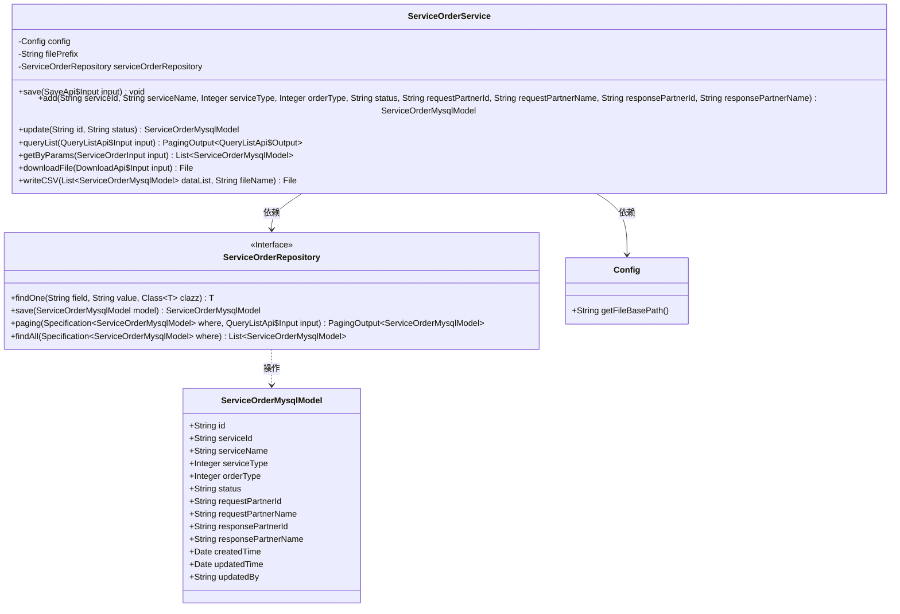
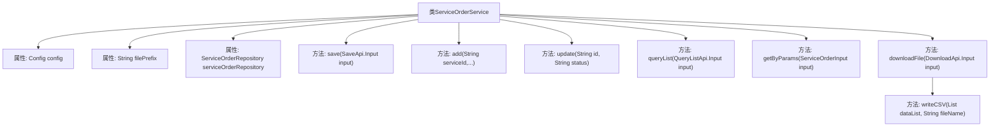
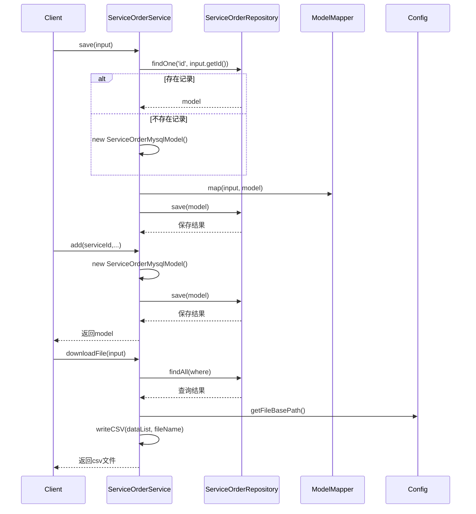

# 基础信息

|      |      |
|------|------|
| 名称 | ServiceOrderService |
| 编码语言 | .java |
| 代码路径 | WeFe/serving/serving-service/src/main/java/com/welab/wefe/serving/service/service/ServiceOrderService.java |
| 包名 | com.welab.wefe.serving.service.service |
| 依赖项 | ['com.welab.wefe.common.data.mysql.Where', 'com.welab.wefe.common.data.mysql.enums.OrderBy', 'com.welab.wefe.common.util.DateUtil', 'com.welab.wefe.common.web.util.ModelMapper', 'com.welab.wefe.serving.service.api.serviceorder.DownloadApi', 'com.welab.wefe.serving.service.api.serviceorder.QueryListApi', 'com.welab.wefe.serving.service.api.serviceorder.SaveApi', 'com.welab.wefe.serving.service.config.Config', 'com.welab.wefe.serving.service.database.entity.ServiceCallLogMysqlModel', 'com.welab.wefe.serving.service.database.entity.ServiceOrderMysqlModel', 'com.welab.wefe.serving.service.database.repository.ServiceOrderRepository', 'com.welab.wefe.serving.service.dto.PagingOutput', 'com.welab.wefe.serving.service.dto.ServiceOrderInput', 'com.welab.wefe.serving.service.enums.CallByMeEnum', 'com.welab.wefe.serving.service.enums.ServiceOrderEnum', 'com.welab.wefe.serving.service.enums.ServiceTypeEnum', 'de.siegmar.fastcsv.writer.CsvWriter', 'de.siegmar.fastcsv.writer.LineDelimiter', 'de.siegmar.fastcsv.writer.QuoteStrategy', 'org.apache.commons.lang3.StringUtils', 'org.springframework.beans.factory.annotation.Autowired', 'org.springframework.data.jpa.domain.Specification', 'org.springframework.stereotype.Service', 'java.io', 'java.nio.charset.StandardCharsets', 'java.util.ArrayList', 'java.util.Date', 'java.util.List'] |
| 概述说明 | ServiceOrderService类提供订单管理功能，包括保存、新增、更新、查询列表及导出CSV文件。支持按条件筛选订单，处理订单状态变更，并将数据映射为CSV格式下载。 |

# 说明

ServiceOrderService是一个服务类，提供订单的增删改查及文件导出功能。包含保存订单、新增订单、更新订单状态、查询订单列表、根据参数获取订单列表及导出CSV文件等方法。查询支持多条件筛选，如服务ID、名称、类型、状态、合作方信息及时间范围等。导出CSV文件时，会生成包含订单详细信息的CSV文件，并保存到指定路径。

# 类列表 Class Summary

| 名称   | 类型  | 说明 |
|-------|------|-------------|
| ServiceOrderService | class | 服务订单服务类，包含保存、新增、更新订单方法，支持条件查询列表及导出CSV文件功能。 |

## 类 ServiceOrderService

|      |      |
|------|------|
| 访问范围 | @Service;public |
| 类型 | class |
| 名称 | ServiceOrderService |
| 说明 | 服务订单服务类，包含保存、新增、更新订单方法，支持条件查询列表及导出CSV文件功能。 |

### UML类图

这段代码展示了一个服务订单管理系统的核心服务类，包含订单的增删改查和文件导出功能。ServiceOrderService作为主要业务类，通过ServiceOrderRepository与数据库交互，操作ServiceOrderMysqlModel实体数据。类图中清晰地展示了各组件间的依赖关系：服务类依赖配置类和仓储接口，仓储接口操作实体模型类。系统提供了完整的CRUD操作，支持复杂查询条件构建，并能将查询结果导出为CSV文件。

### 内部方法调用关系图

该流程图展示了ServiceOrderService类的结构及其主要方法调用关系。类包含4个核心方法(save/add/update/queryList)和2个辅助方法(getByParams/downloadFile)，其中writeCSV是下载功能的核心实现。时序图重点展示了save、add和downloadFile三个关键方法的调用流程，涉及与Repository的交互、模型映射和文件操作等核心业务逻辑。所有方法都围绕服务订单的CRUD操作展开，体现了完整的数据处理生命周期。

### 字段列表 Field List

| 名称  | 类型  | 说明 |
|-------|-------|------|
| serviceOrderRepository | ServiceOrderRepository | 自动注入服务订单仓库实例。 |
| filePrefix = "service_order/" | String | 定义字符串常量filePrefix，值为"service_order/" |
| config | Config | 自动注入Config配置实例。 |

### 方法列表

| 名称  | 类型  | 说明 |
|-------|-------|------|
| save | void | 该方法根据输入参数保存或更新服务订单。若订单不存在则新建，存在则更新。映射输入数据到模型，设置更新人和时间，最后保存。 |
| downloadFile | File | 方法根据输入条件查询服务订单数据，生成当前日期的CSV文件并返回。若出错返回null。 |
| queryList | PagingOutput<QueryListApi.Output> | 查询服务订单列表，根据输入条件筛选并分页返回结果。 |
| update | ServiceOrderMysqlModel | 更新服务订单状态的方法：根据ID查找订单，若存在则更新状态和修改时间并保存，最后返回更新后的订单对象。 |
| getByParams | List<ServiceOrderMysqlModel> | 根据输入参数查询服务订单列表，条件包括服务ID、名称、合作伙伴信息、状态、类型及创建更新时间范围。 |
| add | ServiceOrderMysqlModel | 创建并保存服务订单模型，包含服务ID、名称、类型、订单类型、状态、请求和响应伙伴信息，最后返回保存的模型。 |
| writeCSV | File | 将数据列表写入CSV文件，包含订单和服务信息，支持自定义文件名和路径，确保UTF-8编码和目录存在。 |

