# 基础信息

|      |      |
|------|------|
| 名称 | ServiceService |
| 编码语言 | .java |
| 代码路径 | WeFe/serving/serving-service/src/main/java/com/welab/wefe/serving/service/service/ServiceService.java |
| 包名 | com.welab.wefe.serving.service.service |
| 依赖项 | ['java.io.File', 'java.io.FileOutputStream', 'java.io.IOException', 'java.nio.file.Path', 'java.nio.file.Paths', 'java.text.SimpleDateFormat', 'java.util.ArrayList', 'java.util.Arrays', 'java.util.Date', 'java.util.HashMap', 'java.util.HashSet', 'java.util.List', 'java.util.Map', 'java.util.Map.Entry', 'java.util.Optional', 'java.util.Queue', 'java.util.TreeMap', 'java.util.UUID', 'java.util.concurrent.BlockingQueue', 'java.util.concurrent.ConcurrentHashMap', 'java.util.concurrent.ExecutorService', 'java.util.concurrent.Executors', 'java.util.concurrent.LinkedBlockingQueue', 'java.util.concurrent.TimeUnit', 'java.util.stream.Collectors', 'org.apache.commons.collections.CollectionUtils', 'org.apache.commons.collections4.MapUtils', 'org.apache.commons.io.FileUtils', 'org.apache.commons.lang3.SerializationUtils', 'org.apache.commons.lang3.StringUtils', 'org.apache.commons.text.StringSubstitutor', 'org.slf4j.Logger', 'org.slf4j.LoggerFactory', 'org.springframework.beans.factory.annotation.Autowired', 'org.springframework.data.jpa.domain.Specification', 'org.springframework.stereotype.Service', 'org.springframework.transaction.annotation.Transactional', 'com.alibaba.fastjson.JSON', 'com.alibaba.fastjson.JSONArray', 'com.alibaba.fastjson.JSONObject', 'com.google.common.cache.Cache', 'com.google.common.cache.CacheBuilder', 'com.welab.wefe.common.CommonThreadPool', 'com.welab.wefe.common.StatusCode', 'com.welab.wefe.common.data.mysql.Where', 'com.welab.wefe.common.data.mysql.enums.OrderBy', 'com.welab.wefe.common.exception.StatusCodeWithException', 'com.welab.wefe.common.http.HttpRequest', 'com.welab.wefe.common.http.HttpResponse', 'com.welab.wefe.common.jdbc.base.DatabaseType', 'com.welab.wefe.common.util.FileUtil', 'com.welab.wefe.common.util.JObject', 'com.welab.wefe.common.web.util.CurrentAccountUtil', 'com.welab.wefe.common.web.util.ModelMapper', 'com.welab.wefe.common.wefe.enums.Algorithm', 'com.welab.wefe.common.wefe.enums.FederatedLearningType', 'com.welab.wefe.common.wefe.enums.JobMemberRole', 'com.welab.wefe.serving.sdk.model.xgboost.XgboostDecisionTreeModel', 'com.welab.wefe.serving.sdk.model.xgboost.XgboostModel', 'com.welab.wefe.serving.sdk.model.xgboost.XgboostNodeModel', 'com.welab.wefe.serving.service.api.service.AddApi', 'com.welab.wefe.serving.service.api.service.DetailApi', 'com.welab.wefe.serving.service.api.service.QueryApi', 'com.welab.wefe.serving.service.api.service.QueryOneApi', 'com.welab.wefe.serving.service.api.service.RouteApi', 'com.welab.wefe.serving.service.api.service.ServiceSQLTestApi.Output', 'com.welab.wefe.serving.service.api.service.UpdateApi.Input', 'com.welab.wefe.serving.service.config.Config', 'com.welab.wefe.serving.service.database.entity.AccountMySqlModel', 'com.welab.wefe.serving.service.database.entity.BaseServiceMySqlModel', 'com.welab.wefe.serving.service.database.entity.ClientServiceMysqlModel', 'com.welab.wefe.serving.service.database.entity.DataSourceMySqlModel', 'com.welab.wefe.serving.service.database.entity.ModelMemberMySqlModel', 'com.welab.wefe.serving.service.database.entity.PartnerMysqlModel', 'com.welab.wefe.serving.service.database.entity.ServiceCallLogMysqlModel', 'com.welab.wefe.serving.service.database.entity.ServiceOrderMysqlModel', 'com.welab.wefe.serving.service.database.entity.TableModelMySqlModel', 'com.welab.wefe.serving.service.database.entity.TableServiceMySqlModel', 'com.welab.wefe.serving.service.database.repository.AccountRepository', 'com.welab.wefe.serving.service.database.repository.BaseServiceRepository', 'com.welab.wefe.serving.service.database.repository.ModelMemberRepository', 'com.welab.wefe.serving.service.database.repository.TableModelRepository', 'com.welab.wefe.serving.service.database.repository.TableServiceRepository', 'com.welab.wefe.serving.service.dto.ModelSqlConfigOutput', 'com.welab.wefe.serving.service.dto.ModelStatusOutput', 'com.welab.wefe.serving.service.dto.PagingOutput', 'com.welab.wefe.serving.service.dto.ServiceDetailOutput', 'com.welab.wefe.serving.service.dto.TreeNode', 'com.welab.wefe.serving.service.dto.TreeNodeData', 'com.welab.wefe.serving.service.enums.CallByMeEnum', 'com.welab.wefe.serving.service.enums.ServiceOrderEnum', 'com.welab.wefe.serving.service.enums.ServiceResultEnum', 'com.welab.wefe.serving.service.enums.ServiceStatusEnum', 'com.welab.wefe.serving.service.enums.ServiceTypeEnum', 'com.welab.wefe.serving.service.manager.FeatureManager', 'com.welab.wefe.serving.service.manager.ModelManager', 'com.welab.wefe.serving.service.service_processor.AbstractServiceProcessor', 'com.welab.wefe.serving.service.service_processor.ServiceProcessorUtils', 'com.welab.wefe.serving.service.utils.ServiceUtil', 'com.welab.wefe.serving.service.utils.SignUtils', 'com.welab.wefe.serving.service.utils.ZipUtils', 'com.welab.wefe.serving.service.utils.component.ScoreCardComponentUtil'] |
| 概述说明 | ServiceService类是一个服务管理组件，提供服务的增删改查、状态管理、调用执行、SDK导出等功能。主要功能包括：服务详情查询、分页查询、服务创建与更新、上下线操作、服务调用日志记录、SQL测试、IP白名单校验、多线程处理及XGBoost模型解析。通过@Autowired注入多个仓储和服务依赖，支持事务管理和缓存机制。 |

# 说明

该代码是一个名为ServiceService的Java服务类，主要功能包括服务管理、模型管理、数据源操作、服务调用日志记录等。类中定义了多个自动注入的Repository和Service依赖，用于处理数据库操作和业务逻辑。核心方法包括服务详情查询(detail)、服务保存(saveService)、服务更新(updateService)、服务上线/下线(onlineService/offlineService)、SQL测试(sqlTest)、服务调用(executeService)等。还包含分页查询(query)、SDK导出(exportSdk)、合作伙伴服务调用(callOtherPartnerServing)等功能。类中使用了缓存机制(CacheBuilder)来优化性能，并处理了多种服务类型(PSI、PIR等)的不同逻辑。日志记录方面实现了完整的调用链追踪，包括请求参数、响应结果、耗时等信息的记录。

# 类列表 Class Summary

| 名称   | 类型  | 说明 |
|-------|------|-------------|
| ServiceService | class | ServiceService类是一个服务管理组件，主要功能包括：服务详情查询、增删改查、上下线操作、SQL测试、权限校验、日志记录及SDK导出。支持多种服务类型（如PSI、PIR等），集成缓存、多线程和事务管理，依赖多个Repository和服务类实现业务逻辑。 |


## 类 ServiceService

|      |      |
|------|------|
| 访问范围 | @Service;public |
| 类型 | class |
| 名称 | ServiceService |
| 说明 | ServiceService类是一个服务管理组件，主要功能包括：服务详情查询、增删改查、上下线操作、SQL测试、权限校验、日志记录及SDK导出。支持多种服务类型（如PSI、PIR等），集成缓存、多线程和事务管理，依赖多个Repository和服务类实现业务逻辑。 |


### UML类图

```mermaid
classDiagram
    class ServiceService {
        -Cache~String, Object~ caches
        -Logger LOG
        -String SERVICE_PRE_URL
        -int threads
        +detail(DetailApi$Input input) DetailApi$Output
        +saveService(AddApi$Input input) AddApi$Output
        +updateService(Input input) AddApi$Output
        +executeService(RouteApi$Input input) JObject
        // ...其他公有方法...
    }

    class <<Interface>> BaseServiceRepository~T~ {
        <<Interface>>
        +findOne(String field, String value, Class~T~ clazz) T
        +paging(Specification~T~ spec, QueryApi$Input input) PagingOutput~T~
    }

    class TableServiceRepository {
        +findById(String id) Optional~TableServiceMySqlModel~
        +save(TableServiceMySqlModel entity)
    }

    class DataSourceService {
        +getDataSourceById(String id) DataSourceMySqlModel
        +queryList(DataSourceMySqlModel model, String sql, List~String~ fields) List~Map~String,String~~
    }

    class PartnerService {
        +queryByCode(String code) PartnerMysqlModel
    }

    ServiceService --> BaseServiceRepository : <<依赖>>\n使用基础服务仓储
    ServiceService --> TableServiceRepository : <<依赖>>\n使用表服务仓储
    ServiceService --> DataSourceService : <<依赖>>\n数据源操作
    ServiceService --> PartnerService : <<依赖>>\n合作方查询
    BaseServiceRepository <|.. TableServiceRepository : 实现
```

该代码实现了一个复杂的服务管理系统，包含服务详情查询、增删改查、权限校验、日志记录等功能。核心类ServiceService通过依赖多个仓储接口（如BaseServiceRepository）和数据服务（如DataSourceService）完成业务逻辑，采用缓存机制（CacheBuilder）优化性能，并通过事务管理（@Transactional）保证数据一致性。系统支持多种服务类型（PSI/PIR/SA等），包含完整的权限控制链和审计日志体系，同时提供SDK导出功能便于客户端集成。


### 内部方法调用关系图

```mermaid
graph TD
    A["类ServiceService"]
    B["属性: Cache<String, Object> caches"]
    C["属性: Logger LOG"]
    D["属性: String SERVICE_PRE_URL"]
    E["属性: 多个@Autowired仓库和服务"]
    F["方法: detail(DetailApi.Input input)"]
    G["方法: detailModel(Optional<TableModelMySqlModel>)"]
    H["方法: detailService(Optional<TableServiceMySqlModel>)"]
    I["方法: displayServiceQueryParams(TableServiceMySqlModel)"]
    J["方法: findMyRoles(String modelId)"]
    K["方法: checkModelStatus(String modelId)"]
    L["方法: xgboost(JObject, FederatedLearningType)"]
    M["方法: recursive(Map<Integer, TreeNode>, TreeNode)"]
    N["方法: saveService(AddApi.Input)"]
    O["方法: generateIdsTable(TableServiceMySqlModel)"]
    P["方法: generateMySqlIdsTable(DataSourceMySqlModel, JSONObject)"]
    Q["方法: query(QueryApi.Input)"]
    R["方法: updateService(Input)"]
    S["方法: offlineService(String)"]
    T["方法: onlineService(String)"]
    U["方法: sqlTest(ServiceSQLTestApi.Input)"]
    V["方法: showSql(ServiceShowSQLApi.Input)"]
    W["方法: check(RouteApi.Input, BaseServiceMySqlModel)"]
    X["方法: isIpWhiteList(RouteApi.Input, ClientServiceMysqlModel)"]
    Y["方法: executeService(RouteApi.Input)"]
    Z["方法: log(RouteApi.Input, long, BaseServiceMySqlModel, JObject, ServiceResultEnum, String)"]
    AA["方法: createOrder(BaseServiceMySqlModel, RouteApi.Input, ServiceOrderEnum)"]
    AB["方法: callLog(RouteApi.Input, String, String, JObject, Integer, String, long)"]
    AC["方法: exportSdk(String)"]
    AD["方法: modelServiceSdk(String)"]
    AE["方法: mpcServiceSdk(String)"]
    AF["方法: fillReadmeFile(TableServiceMySqlModel, File)"]
    AG["方法: queryById(QueryOneApi.Input)"]
    AH["方法: callOtherPartnerServing(String, String, TreeMap<String, Object>, Class<T>)"]
    AI["方法: getErrorMessage(HttpResponse)"]

    A --> B
    A --> C
    A --> D
    A --> E
    A --> F
    F -->|条件分支| G
    F -->|条件分支| H
    A --> I
    A --> J
    A --> K
    A --> L
    L --> M
    A --> N
    N --> O
    O --> P
    A --> Q
    A --> R
    A --> S
    A --> T
    A --> U
    A --> V
    A --> W
    W --> X
    A --> Y
    Y --> Z
    Z --> AA
    Z --> AB
    A --> AC
    AC --> AD
    AC --> AE
    AE --> AF
    A --> AG
    A --> AH
    AH --> AI
```



这段代码是一个复杂的服务类，主要处理各种服务相关的操作，包括服务详情查询、模型详情处理、服务保存和更新、服务状态管理、SQL测试、服务调用执行、日志记录以及SDK导出等功能。代码中使用了多种设计模式和技术，如缓存、多线程、递归、映射转换等，展现了高度模块化和可扩展的设计理念。

### 字段列表 Field List

| 名称  | 类型  | 说明 |
|-------|-------|------|
| serviceCallLogService | ServiceCallLogService | 代码片段使用@Autowired注解自动注入ServiceCallLogService实例。 |
| threads = Math.max(Runtime.getRuntime().availableProcessors(), 4) | int | 线程数设为CPU核心数与4的最大值。 |
| baseServiceRepository | BaseServiceRepository<BaseServiceMySqlModel> | 自动注入BaseServiceRepository实例，泛型类型为BaseServiceMySqlModel。 |
| caches = CacheBuilder.newBuilder()            .expireAfterAccess(10, TimeUnit.MINUTES).build() | Cache<String, Object> | 使用CacheBuilder创建缓存，设置10分钟未访问自动过期。 |
| unionServiceService | UnionServiceService | 自动注入UnionServiceService服务实例。 |
| accountRepository | AccountRepository | 使用@Autowired自动注入AccountRepository实例。 |
| clientServiceService | ClientServiceService | 使用@Autowired自动注入ClientServiceService实例。 |
| serviceOrderService | ServiceOrderService | 自动注入ServiceOrderService实例。 |
| dataSourceService | DataSourceService | 自动注入DataSourceService实例。 |
| SERVICE_PRE_URL = "api/" | String | 静态常量SERVICE_PRE_URL定义为"api/"，用作服务前缀URL。 |
| LOG = LoggerFactory.getLogger(this.getClass()) | Logger | 类中定义了一个受保护且不可变的日志记录器实例，用于当前类的日志输出。 |
| modelMemberRepository | ModelMemberRepository | 自动注入ModelMemberRepository实例。 |
| config | Config | 自动注入Config配置实例。 |
| modelMemberService | ModelMemberService | 自动注入ModelMemberService实例。 |
| modelRepository | TableModelRepository | 使用@Autowired自动注入TableModelRepository实例。 |
| partnerService | PartnerService | 使用@Autowired自动注入PartnerService实例。 |
| serviceRepository | TableServiceRepository | 自动注入TableServiceRepository实例。 |

### 方法列表

| 名称  | 类型  | 说明 |
|-------|-------|------|
| check | JObject | 检查服务状态、客户权限及IP白名单，返回错误信息或通过验证。 |
| isIpWhiteList | boolean | 检查客户端IP是否在服务白名单中，支持通配符*和逗号分隔。 |
| offlineService | void | 方法offlineService通过ID停用服务：检查数据存在及状态，更新状态为0。若非模型服务则调用unionServiceService.offline2Union，否则刷新模型状态为禁用。 |
| detail | com.welab.wefe.serving.service.api.service.DetailApi.Output | 方法detail根据输入类型处理服务或模型详情查询：若类型小于7，查询服务表并返回详情；否则查询模型表，存在则返回详情，否则抛异常"data not found"。 |
| findById | TableServiceMySqlModel | 通过ID查询服务数据，调用repository的findOne方法，返回TableServiceMySqlModel对象。 |
| exportSdk | File | 方法exportSdk根据serviceId查找服务模型，若未找到则抛出异常。若服务类型为7，调用modelServiceSdk，否则调用mpcServiceSdk返回文件。 |
| executeService | JObject | 方法executeService处理服务请求：检查参数，调用对应处理器执行，返回结果。失败时记录错误，最终记录日志并返回状态码和响应ID。 |
| sqlTest | Output | 方法sqlTest接收输入参数，解析数据源并生成SQL查询，执行后返回结果。处理过程包括数据源解析、SQL生成、查询执行和结果封装。 |
| updateService | com.welab.wefe.serving.service.api.service.AddApi.Output | 更新服务逻辑：检查服务存在性、状态和名称/URL冲突，更新服务信息并处理PSI类型特殊逻辑，最后同步联合服务和客户端服务。 |
| createOrder | String | 创建订单方法：根据输入参数和服务状态生成订单，关联合作伙伴信息并设置调用方标识，返回订单ID。 |
| recursive | void | 递归遍历二叉树，将左右子树设为当前节点的子节点。若节点为叶子节点则返回。使用Map存储节点关系。 |
| showSql | com.welab.wefe.serving.service.api.service.ServiceShowSQLApi.Output | 方法showSql接收输入参数，解析数据源ID，查询数据库模型，生成SQL语句并返回结果。 |
| detailService | com.welab.wefe.serving.service.api.service.DetailApi.Output | 方法detailService将TableServiceMySqlModel转为DetailApi.Output，处理数据源、查询参数、服务配置等字段，并生成预览信息后返回。 |
| getModelStatus | List<ModelStatusOutput> | 该方法根据用户角色和联邦学习类型决定是否检查模型状态。若用户角色为promoter且联邦学习类型非horizontal，则返回模型状态检查结果，否则返回null。 |
| query | PagingOutput<QueryApi.Output> | 方法query根据输入条件筛选服务数据，关联账户信息并转换输出格式。 |
| generateMySqlIdsTable | String | 生成MySQL ID表方法：克隆数据源模型，拼接表名，提取关键字段，检查数据源非空后异步创建表并分批插入计算后的ID，最后返回表名。 |
| generateIdsTable | String | 该方法根据服务类型和数据源类型生成或获取ID表名。若非PSI服务直接返回空；若为MySQL数据源，先删除旧表再生成新表；其他数据源则直接使用原表名。 |
| detailModel | com.welab.wefe.serving.service.api.service.DetailApi.Output | 方法detailModel将TableModelMySqlModel转换为DetailApi.Output，设置模型参数、角色、SQL配置、处理器、XGBoost树、状态、评分卡信息和预览数据后返回。 |
| callLog | void | 记录服务调用日志，包括请求和响应数据、合作伙伴信息、响应状态及耗时，并保存到数据库。 |
| modelServiceSdk | File | 方法生成指定服务ID的SDK压缩包，检查文件存在直接返回，否则查询模型数据，处理文件列表并生成ZIP，最后清理临时文件返回结果。 |
| onlineService | void | 方法onlineService根据ID启用服务。检查数据存在和状态，更新状态为1。非模型服务处理PSI类型数据并加入联合服务，模型服务则刷新启用状态。 |
| saveService | com.welab.wefe.serving.service.api.service.AddApi.Output | 该方法用于保存服务信息，检查名称和URL是否重复，映射输入数据到模型并设置创建/更新时间。对于PSI类型服务生成主键数据，保存后返回包含ID、参数和URL的输出对象。 |
| xgboost | List<TreeNode> | 该方法解析XGBoost模型参数，构建树结构节点列表。遍历每棵树，处理节点数据（特征、叶节点标识、左右子节点等），递归构建完整树结构后返回。 |
| log | void | 该方法记录服务调用日志，包括创建订单状态（成功或失败）、生成订单ID，并调用日志记录功能，传递输入参数、订单ID、响应ID、结果、状态码、消息及开始时间。 |
| checkModelStatus | List<ModelStatusOutput> | 检查指定模型状态的方法，调用服务层接口根据模型ID查询可用性，返回状态列表。 |
| displayServiceQueryParams | String | 方法根据服务类型处理查询参数：PSI类型返回数据源的key_calc_rules，其他类型解析queryParamsConfig或直接返回queryParams，空值返回空字符串。 |
| mpcServiceSdk | File | 根据服务类型返回对应SDK文件包，包含jar和示例代码，最终打包为zip返回。 |
| fillReadmeFile | void | 方法fillReadmeFile根据model生成readme文件内容。若model非空，填充URL、参数等信息到模板并写入文件；否则写入默认内容。 |
| queryById | ServiceDetailOutput | 根据ID查询服务详情，若为模型服务返回模型数据，否则返回服务数据，无数据时抛出异常。 |
| callOtherPartnerServing | T | 调用合作方服务的通用方法，检查URL非空后拼接URI，发送带签名的POST请求，验证响应状态和数据code为0，返回解析后的数据对象，失败抛异常。 |
| getErrorMessage | String | 该方法根据HTTP响应返回错误信息：优先使用响应中的消息，若为空则从JSON响应体中提取"message"字段。 |
| findMyRoles | List<JobMemberRole> | 该方法通过模型ID查询当前用户的角色列表，从数据库获取成员信息后提取角色并返回。 |


