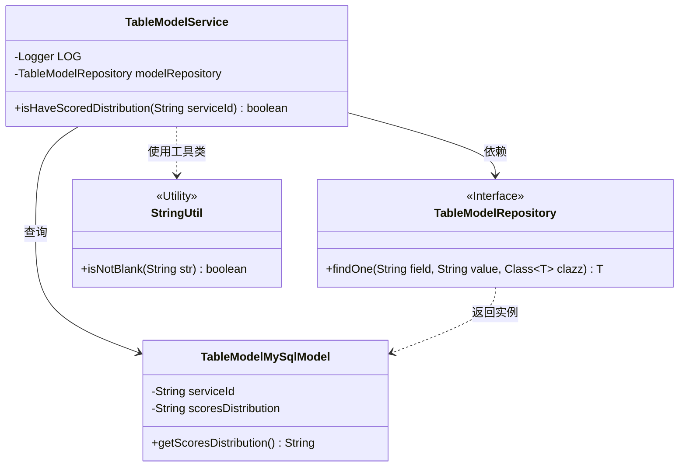
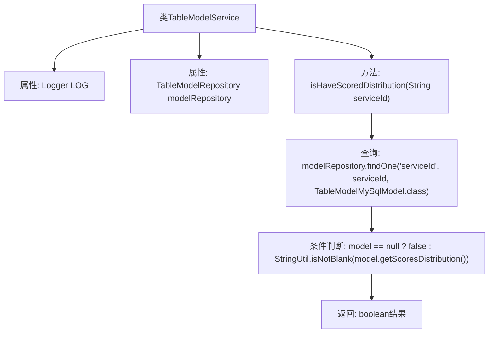

# 基础信息

|      |      |
|------|------|
| 名称 | TableModelService |
| 编码语言 | .java |
| 代码路径 | WeFe/serving/serving-service/src/main/java/com/welab/wefe/serving/service/service/TableModelService.java |
| 包名 | com.welab.wefe.serving.service.service |
| 依赖项 | ['com.welab.wefe.common.util.StringUtil', 'com.welab.wefe.serving.service.database.entity.TableModelMySqlModel', 'com.welab.wefe.serving.service.database.repository.TableModelRepository', 'org.slf4j.Logger', 'org.slf4j.LoggerFactory', 'org.springframework.beans.factory.annotation.Autowired', 'org.springframework.stereotype.Service'] |
| 概述说明 | 这是一个Spring服务类，包含日志记录和数据库查询功能，检查指定服务ID是否有评分分布数据。通过自动注入的仓库类查询数据库，返回布尔结果。 |

# 说明

这是一个名为TableModelService的Spring服务类，包含日志记录器和自动注入的TableModelRepository。主要提供了一个isHaveScoredDistribution方法，该方法通过serviceId查询TableModelMySqlModel，并检查其scoresDistribution字段是否非空。若记录不存在或该字段为空则返回false，否则返回true。

# 类列表 Class Summary

| 名称   | 类型  | 说明 |
|-------|------|-------------|
| TableModelService | class | TableModelService检查指定serviceId的模型是否存在分数分布数据。 |

## 类 TableModelService

|      |      |
|------|------|
| 访问范围 | @Service;public |
| 类型 | class |
| 名称 | TableModelService |
| 说明 | TableModelService检查指定serviceId的模型是否存在分数分布数据。 |

### UML类图

该代码展示了一个Spring服务类TableModelService，通过依赖注入的TableModelRepository接口查询数据库，并检查TableModelMySqlModel对象中的scoresDistribution字段是否为空。类图清晰地呈现了服务层与持久层的关系，以及工具类StringUtil的辅助作用，体现了分层架构中组件间的协作方式。

### 内部方法调用关系图

该流程图展示了Spring服务类TableModelService的核心逻辑。服务通过modelRepository查询数据库模型，判断指定serviceId对应的模型是否存在且包含有效分数分布数据。流程包含依赖注入、数据库查询和空值安全判断三个关键环节，最终返回布尔型验证结果。

### 字段列表 Field List

| 名称  | 类型  | 说明 |
|-------|-------|------|
| modelRepository | TableModelRepository | 自动注入TableModelRepository实例。 |
| LOG = LoggerFactory.getLogger(getClass()) | Logger | 创建当前类的日志记录器实例。 |

### 方法列表

| 名称  | 类型  | 说明 |
|-------|-------|------|
| isHaveScoredDistribution | boolean | 检查指定服务ID是否存在分数分布数据，若模型存在且分数分布非空则返回真，否则返回假。 |

