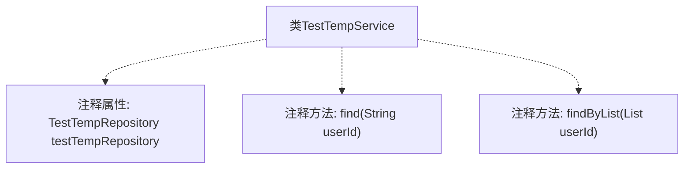

# 基础信息

|      |      |
|------|------|
| 名称 | TestTempService |
| 编码语言 | .java |
| 代码路径 | WeFe/serving/serving-service/src/main/java/com/welab/wefe/serving/service/service/TestTempService.java |
| 包名 | com.welab.wefe.serving.service.service |
| 依赖项 | ['org.springframework.stereotype.Service'] |
| 概述说明 | 这是一个Spring服务类TestTempService，包含注释掉的数据库查询方法，用于按用户ID查找数据或批量查询。 |

# 说明

该代码片段展示了一个名为TestTempService的Spring服务类，当前处于未实现状态。类中包含两个被注释掉的方法：find方法原本用于通过用户ID查询单个TestTempMysqlModel对象，findByList方法设计为通过用户ID列表查询字符串列表。两个方法都依赖TestTempRepository进行数据访问，但相关自动装配注解和方法实现已被注释。整个服务类目前为空实现，保留着可能的数据访问层接口设计思路。

# 类列表 Class Summary

| 名称   | 类型  | 说明 |
|-------|------|-------------|
| TestTempService | class | 这是一个未实现的Java服务类TestTempService，包含两个被注释掉的方法：按用户ID查询和批量查询，依赖的Repository也被注释。 |


## 类 TestTempService

|      |      |
|------|------|
| 访问范围 | @Service;public |
| 类型 | class |
| 名称 | TestTempService |
| 说明 | 这是一个未实现的Java服务类TestTempService，包含两个被注释掉的方法：按用户ID查询和批量查询，依赖的Repository也被注释。 |


### UML类图

```mermaid
classDiagram
    class TestTempService {
        <<Service>>
        // 注释掉的依赖关系:
        // -TestTempRepository testTempRepository
        // +TestTempMysqlModel find(String userId)
        // +List~String~ findByList(List~String~ userId)
    }

    // 被注释的接口依赖关系:
    // TestTempService --> TestTempRepository : 依赖
```

这段类图展示了一个Spring服务类TestTempService的结构，当前类中所有方法都被注释。原始设计显示它依赖TestTempRepository来查询数据，包含通过单个用户ID查询模型和批量查询用户ID列表两个核心方法。类标注了@Service注解表明其Spring服务身份，虽然当前实现为空，但保留了与数据访问层交互的潜在能力。


### 内部方法调用关系图



该流程图展示了TestTempService类的结构，包含一个被注释掉的TestTempRepository属性和两个被注释掉的方法find和findByList。由于所有元素都被注释，实际运行时这些代码不会生效，但保留了原始设计意图。图中用虚线连接表示注释关系，清晰区分了有效代码和无效代码的边界。

### 字段列表 Field List

| 名称  | 类型  | 说明 |
|-------|-------|------|

### 方法列表

| 名称  | 类型  | 说明 |
|-------|-------|------|


