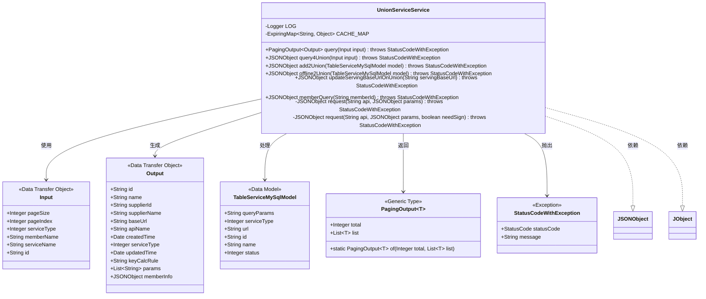
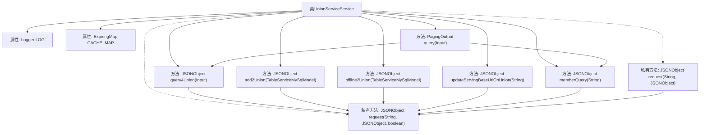
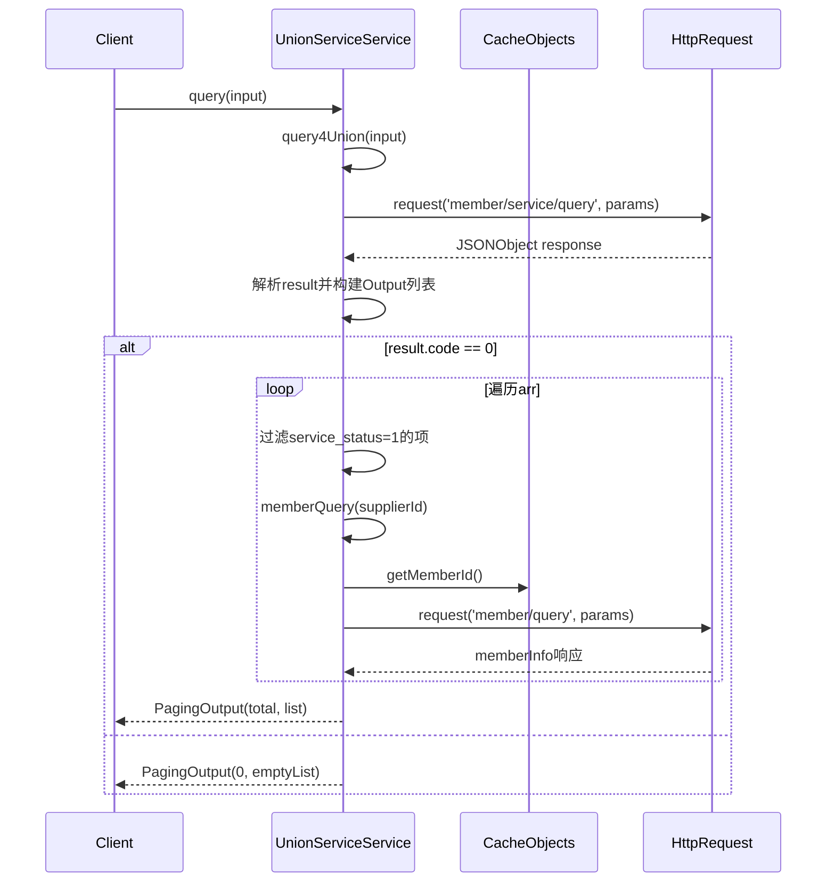

# 基础信息

|      |      |
|------|------|
| 名称 | UnionServiceService |
| 编码语言 | .java |
| 代码路径 | WeFe/serving/serving-service/src/main/java/com/welab/wefe/serving/service/service/UnionServiceService.java |
| 包名 | com.welab.wefe.serving.service.service |
| 依赖项 | ['com.alibaba.fastjson.JSONArray', 'com.alibaba.fastjson.JSONException', 'com.alibaba.fastjson.JSONObject', 'com.welab.wefe.common.StatusCode', 'com.welab.wefe.common.exception.StatusCodeWithException', 'com.welab.wefe.common.http.HttpRequest', 'com.welab.wefe.common.http.HttpResponse', 'com.welab.wefe.common.util.JObject', 'com.welab.wefe.common.util.RSAUtil', 'com.welab.wefe.common.util.SignUtil', 'com.welab.wefe.serving.service.api.service.UnionServiceApi', 'com.welab.wefe.serving.service.api.service.UnionServiceApi.Input', 'com.welab.wefe.serving.service.api.service.UnionServiceApi.Output', 'com.welab.wefe.serving.service.database.entity.TableServiceMySqlModel', 'com.welab.wefe.serving.service.dto.PagingOutput', 'com.welab.wefe.serving.service.enums.ServiceTypeEnum', 'net.jodah.expiringmap.ExpiringMap', 'org.apache.commons.lang3.StringUtils', 'org.slf4j.Logger', 'org.slf4j.LoggerFactory', 'org.springframework.stereotype.Service', 'java.util', 'java.util.concurrent.TimeUnit'] |
| 概述说明 | UnionServiceService类提供联邦服务查询、添加、下线及成员信息查询功能，使用缓存优化性能，支持RSA签名验证，处理分页数据返回。 |

# 说明

UnionServiceService是一个服务类，提供联邦成员服务查询、添加、下线及基础URL更新等功能。它使用ExpiringMap缓存成员信息，有效期60秒，最大容量500。主要方法包括query（分页查询服务列表并过滤状态）、query4Union（构建查询参数）、add2Union（添加服务到联邦）、offline2Union（下线服务）、updateServingBaseUrlOnUnion（更新服务基础URL）和memberQuery（查询成员信息）。所有请求均通过request方法处理，支持RSA签名验证，并统一处理响应错误码和异常。日志记录关键操作参数和结果。

# 类列表 Class Summary

| 名称   | 类型  | 说明 |
|-------|------|-------------|
| UnionServiceService | class | UnionServiceService类提供联合服务查询、添加、下线及成员信息获取功能，使用缓存优化性能，支持RSA签名验证和错误处理。 |

## 类 UnionServiceService

|      |      |
|------|------|
| 访问范围 | @Service;public |
| 类型 | class |
| 名称 | UnionServiceService |
| 说明 | UnionServiceService类提供联合服务查询、添加、下线及成员信息获取功能，使用缓存优化性能，支持RSA签名验证和错误处理。 |

### UML类图

这段代码展示了一个联邦服务类`UnionServiceService`，它提供了查询、添加、下线服务和更新服务URL等功能。该类使用缓存机制优化成员查询，并通过HTTP请求与远程联邦服务交互。主要处理JSON格式的输入输出，包含分页查询结果封装和异常处理机制。类图中清晰地展示了核心数据流转关系和依赖的外部数据结构。

### 内部方法调用关系图

这段代码实现了一个联邦服务管理类，主要功能包括服务查询、添加、下线、URL更新和成员查询。核心流程是通过HTTP请求与联邦服务端交互，使用缓存优化成员查询性能，并对请求参数进行签名验证。流程图展示了类结构和方法调用关系，时序图详细描述了query方法的执行流程，包括参数构建、远程请求、结果处理和缓存机制。

### 字段列表 Field List

| 名称  | 类型  | 说明 |
|-------|-------|------|
| CACHE_MAP = ExpiringMap            .builder()            .expiration(60, TimeUnit.SECONDS)            .maxSize(500)            .build() | ExpiringMap<String, Object> | 定义一个受保护的静态常量CACHE_MAP，使用ExpiringMap实现，设置60秒过期时间，最大容量500。 |
| LOG = LoggerFactory.getLogger(this.getClass()) | Logger | 定义一个当前类的protected final日志记录器实例。 |

### 方法列表

| 名称  | 类型  | 说明 |
|-------|-------|------|
| add2Union | JSONObject | 方法add2Union接收TableServiceMySqlModel参数，构建包含查询参数、服务类型等信息的JSON对象，发送请求到member/service/put接口并返回响应结果。 |
| query4Union | JSONObject | 方法query4Union根据输入参数构建查询条件，包括分页、服务类型、成员名、服务名和ID，并发送请求到member/service/query接口。 |
| updateServingBaseUrlOnUnion | JSONObject | 更新联盟服务基础URL的方法，接收URL参数并发送请求，记录请求和响应日志后返回结果。 |
| query | PagingOutput<Output> | 方法query接收Input参数，返回分页的Output。查询结果解析为UnionServiceApi.Output列表，筛选状态为1的项，填充字段后返回。异常时返回空列表。 |
| memberQuery | JSONObject | 查询会员信息方法：先查缓存，无则请求接口，返回包含姓名、手机、邮箱等信息的JSON对象，并缓存结果。 |
| request | JSONObject | 私有方法`request`：检查基础URL和模型状态，无效时返回空JSON，否则调用带布尔参数的`request`方法。异常可能抛出`StatusCodeWithException`。 |
| offline2Union | JSONObject | 将MySQL模型数据转换为JSON对象，发送请求并返回响应。包含查询参数、服务类型、成员ID等信息。 |
| request | JSONObject | 发送JSON请求并处理响应。若需签名，使用私钥生成签名并封装请求体。检查响应状态和JSON格式，处理错误码，成功返回JSON对象。 |

