# 基础信息

|      |      |
|------|------|
| 名称 | service |
| 编码语言 | .java |
| 代码路径 | WeFe/serving/serving-service/src/main/java/com/welab/wefe/serving/service/service |
| 包名 | docs.serving.serving-service.src.main.java.com.welab.wefe.serving.service.service |
| 概述说明 | 管理系统全局配置初始化和维护，支持多模式初始化和安全更新。包含初始化检查、独立/联合模式初始化及配置更新等方法。关键数据结构涉及AbstractConfigModel基类和加密字段。依赖RSA密钥管理和数据库存储层。 |

# 说明

## 概述  
该模块是面向联邦学习场景的服务治理体系，核心职责包括全局配置管理、模型服务生命周期管理和多方协作数据治理。接口规范涵盖初始化检查(isInitialized)、多模式配置更新(update)等基础操作，以及模型导入/预测、服务调用(executeService)、联邦成员管理(query4Union)等高级功能。关键数据结构涉及带@Secret注解的加密字段、模型分箱统计(ModelPredictScoreStatistics)和服务订单(ServiceOrder)等复合对象。外部依赖包括RSA加密体系、JdbcManager数据库连接池和ExpiringMap缓存组件。例如模型导入需解密AES密钥，联邦服务调用需RSA签名验证。

## 主要业务场景  
模块支撑联邦学习全链路操作，类似微服务治理平台。典型流程包括：系统初始化时加载RSA密钥和运行模式；模型服务通过saveService注册并经由callOtherPartnerServing实现跨节点调用；预测日志通过asyncIncrement异步统计分箱数据。安全场景下，updateRsaKeyByBoard实现密钥轮换，ClientServiceService校验公钥合法性。例如PSI服务结果通过PsiServiceResultService批量存储，OrderStatisticsService按时间粒度分析订单趋势。所有核心操作均通过@Transactional保证原子性，缓存机制(CacheObjects)优化高频访问性能。

### 包内部结构视图

```mermaid
graph TD
    service --> globalconfig
    service --> ClientService.java
    service --> model
    service --> EmailService.java
    service --> TableModelService.java
    service --> ModelPredictScoreRecordService.java
    service --> ModelPredictScoreStatisticsService.java
    service --> PartnerService.java
    service --> ApiRequestRecordService.java
    service --> AccountService.java
    service --> ServiceCallLogService.java
    service --> FeeConfigService.java
    service --> PredictStatisticsService.java
    service --> MessageService.java
    service --> PredictLogService.java
    service --> TestTempService.java
    service --> RequestStatisticsService.java
    service --> PaymentsRecordsService.java
    service --> UnionServiceService.java
    service --> ModelMemberService.java
    service --> ClientServiceService.java
    service --> CacheObjects.java
    service --> PrivacyDatabaseEncryptService.java
    service --> ServiceOrderService.java
    service --> ModelService.java
    service --> DataSourceService.java
    service --> MemberService.java
    service --> ServiceService.java
    service --> OperationLogService.java
    service --> OrderStatisticsService.java
    service --> FeeDetailService.java
    service --> PsiServiceResultService.java
    service --> ModelSqlConfigService.java
    globalconfig --> GlobalConfigService.java
    globalconfig --> BaseGlobalConfigService.java
    model --> ModelImportService.java
```

该流程图展示了WeFe服务模块的层级结构，根节点为service目录，包含globalconfig子目录和26个服务类文件。globalconfig目录下又包含两个配置文件，model目录包含一个模型导入服务类。整体结构清晰反映了服务模块的功能划分，涵盖配置管理、模型处理、客户服务等多个业务领域。

# 文件列表

| 名称   | 类型  | 说明 |
|-------|------|-------------|
| [ClientService.java](ClientService.md) | file | ClientService类提供客户数据管理功能，包括保存、更新、查询和删除操作。保存时检查客户编码和名称唯一性，更新时同步客户服务表数据，查询支持分页和模糊搜索，删除标记状态而非物理删除。关键字段包括名称、邮箱、公钥等。 |
| [EmailService.java](EmailService.md) | file | EmailService类提供邮件发送功能，支持批量发送和错误处理，包括无效地址过滤和重试机制，依赖配置服务和账户数据。 |
| [TableModelService.java](TableModelService.md) | file | 这是一个Spring服务类，包含日志记录和数据库查询功能，检查指定服务ID是否有评分分布数据。通过自动注入的仓库类查询数据库，返回布尔结果。 |
| [ModelPredictScoreRecordService.java](ModelPredictScoreRecordService.md) | file | 服务类ModelPredictScoreRecordService，包含日志记录器，自动注入模型存储库和预测分数统计存储库。 |
| [ModelPredictScoreStatisticsService.java](ModelPredictScoreStatisticsService.md) | file | 该服务类用于模型预测分数统计，包含异步增量更新、分数记录和按分箱点统计功能，通过多仓库操作实现数据持久化。 |
| [PartnerService.java](PartnerService.md) | file | PartnerService类提供合作伙伴管理功能，包括初始化数据、增删改查、分页查询、批量操作等。主要方法：init初始化数据，save保存合作伙伴，query分页查询，update更新信息，delete逻辑删除，upsert批量插入或更新。支持事务处理和异常状态码返回。 |
| [ApiRequestRecordService.java](ApiRequestRecordService.md) | file | ApiRequestRecordService类提供API请求记录管理功能，包含保存记录、按时间范围查询、按服务ID和客户端ID查询，以及分页查询并转换输出格式的方法。 |
| [AccountService.java](AccountService.md) | file | AccountService提供查询账户和SSO登录功能。查询所有账户数据并映射输出。SSO登录时检查全局配置，未初始化则生成密钥对并保存；根据账户信息更新或创建账户，最后返回登录结果。 |
| [ServiceCallLogService.java](ServiceCallLogService.md) | file | ServiceCallLogService提供日志查询、保存、新增、更新功能，支持按条件分页查询，兼容新增/更新操作，并可根据参数获取日志列表。 |
| [FeeConfigService.java](FeeConfigService.md) | file | FeeConfigService类提供保存和查询计费配置功能，通过FeeConfigRepository和PartnerRepository操作数据库，支持按ID更新或创建配置，以及按服务ID和客户ID查询最新配置。 |
| [PredictStatisticsService.java](PredictStatisticsService.md) | file | PredictStatisticsService类提供预测统计功能，支持按时间区间查询日志，统计成功/失败次数，并支持按月、日、小时、分钟分页查询。核心方法包括初始化时间间隔、插入统计记录和计数日志。 |
| [MessageService.java](MessageService.md) | file | 消息服务类，包含读取和添加消息功能。读取消息通过ID更新状态为已读，添加消息直接保存模型到数据库。依赖消息存储库操作数据。 |
| [PredictLogService.java](PredictLogService.md) | file | PredictLogService类提供保存预测日志和分页查询功能。保存方法接收多个参数并存入数据库，查询方法支持多条件筛选并返回分页结果。 |
| [TestTempService.java](TestTempService.md) | file | 这是一个Spring服务类TestTempService，包含注释掉的数据库查询方法，用于按用户ID查找数据或批量查询。 |
| [RequestStatisticsService.java](RequestStatisticsService.md) | file | RequestStatisticsService类通过RequestStatisticsRepository按服务ID和客户端ID分组查询请求统计列表，并返回分页结果。 |
| [PaymentsRecordsService.java](PaymentsRecordsService.md) | file | 支付记录服务类，包含下载CSV文件、查询列表和保存记录功能，涉及服务、客户和金额操作。 |
| [UnionServiceService.java](UnionServiceService.md) | file | UnionServiceService类提供联邦服务查询、添加、下线及成员信息查询功能，使用缓存优化性能，支持RSA签名验证，处理分页数据返回。 |
| [ModelMemberService.java](ModelMemberService.md) | file | ModelMemberService类提供模型成员管理功能，包括查询、保存成员信息，检查服务可用性，调用合作方服务等操作。依赖ModelMemberRepository和PartnerService等组件实现核心业务逻辑。 |
| [ClientServiceService.java](ClientServiceService.md) | file | ClientServiceService类提供客户端服务管理功能，包括添加、查询、更新和删除服务。支持激活和开通两种服务类型，处理公私钥、计费规则和状态变更。包含URL验证和提供者列表查询。 |
| [CacheObjects.java](CacheObjects.md) | file | CacheObjects类存储系统配置信息，包括成员ID、公私钥、服务地址等，并提供刷新和获取方法。支持独立和联邦模式，管理账户、合作伙伴和服务映射。 |
| [PrivacyDatabaseEncryptService.java](PrivacyDatabaseEncryptService.md) | file | PrivacyDatabaseEncryptService类用于加密数据库隐私数据，通过更新Account、DataSource和GlobalConfig模型的更新时间并保存。使用事务确保操作完整性。 |
| [ServiceOrderService.java](ServiceOrderService.md) | file | ServiceOrderService类提供订单管理功能，包括保存、新增、更新、查询列表及导出CSV文件。支持按条件筛选订单，处理订单状态变更，并将数据映射为CSV格式下载。 |
| [ModelService.java](ModelService.md) | file | ModelService类提供模型管理功能，包括保存、查询、启用/禁用模型，处理成员和合作伙伴关系，支持机器学习服务类型，包含事务管理和错误处理。 |
| [DataSourceService.java](DataSourceService.md) | file | DataSourceService提供数据源管理功能，包括增删改查、测试连接、执行SQL、查询表结构等操作，支持多种数据库类型，确保数据源有效性和安全性。 |
| [MemberService.java](MemberService.md) | file | MemberService类提供会员数据操作：保存会员信息（存在则更新）、按ID查询、分页查询（支持条件筛选）。使用事务确保数据一致性，自动注入MemberRepository进行数据库交互。 |
| [ServiceService.java](ServiceService.md) | file | ServiceService类是一个服务管理组件，提供服务的增删改查、状态管理、调用执行、SDK导出等功能。主要功能包括：服务详情查询、分页查询、服务创建与更新、上下线操作、服务调用日志记录、SQL测试、IP白名单校验、多线程处理及XGBoost模型解析。通过@Autowired注入多个仓储和服务依赖，支持事务管理和缓存机制。 |
| [OperationLogService.java](OperationLogService.md) | file | 操作日志服务类，通过输入条件查询日志，支持分页、接口、操作者ID和时间范围筛选，结果按时间降序排列。 |
| [OrderStatisticsService.java](OrderStatisticsService.md) | file | 订单统计服务类，提供按不同时间粒度（月、日、时、分）分组查询订单数据并导出CSV功能，支持数据增删改查及批量操作。包含数据持久化和文件处理逻辑。 |
| [FeeDetailService.java](FeeDetailService.md) | file | FeeDetailService类提供费用明细操作，包括获取最新记录、保存数据、分页查询列表及按条件查询。支持按小时、日、月、年统计，使用事务确保数据一致性。 |
| [PsiServiceResultService.java](PsiServiceResultService.md) | file | PsiServiceResultService类通过自动注入的PsiServiceResultRepository批量保存PsiServiceResultMysqlModel列表数据。 |
| [ModelSqlConfigService.java](ModelSqlConfigService.md) | file | ModelSqlConfigService类提供模型SQL配置的增删改查功能，包括根据ID查询、保存配置、更新或创建配置及清除配置。依赖ModelSqlConfigRepository操作数据库。 |
| [model](model/_module.md) | package | ModelImportService提供保存机器学习和深度学习模型的功能。机器学习模型通过解析加密文件、解密内容并构建参数后保存；深度学习模型检查名称唯一性后保存文件信息到数据库。两者均处理异常并记录日志。 |
| [globalconfig](globalconfig/_module.md) | package | GlobalConfigService继承BaseGlobalConfigService，负责系统初始化、配置更新及RSA密钥管理，支持独立和联合模式。BaseGlobalConfigService提供全局配置的增删改查，支持批量操作、字段解密及线程安全。 |

