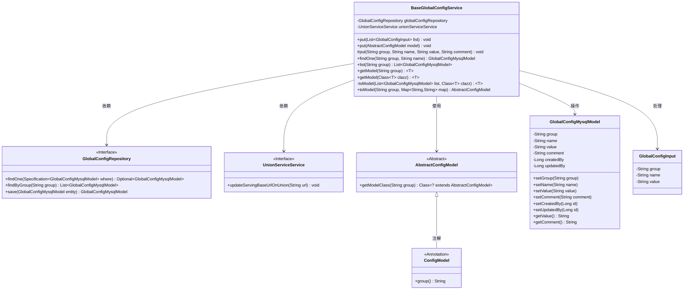
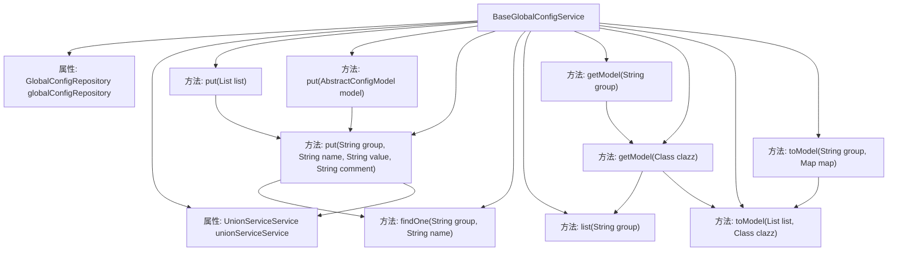

# 基础信息

|      |      |
|------|------|
| 名称 | BaseGlobalConfigService |
| 编码语言 | .java |
| 代码路径 | WeFe/serving/serving-service/src/main/java/com/welab/wefe/serving/service/service/globalconfig/BaseGlobalConfigService.java |
| 包名 | com.welab.wefe.serving.service.service.globalconfig |
| 依赖项 | ['com.alibaba.fastjson.JSON', 'com.alibaba.fastjson.JSONObject', 'com.alibaba.fastjson.PropertyNamingStrategy', 'com.alibaba.fastjson.serializer.SerializeConfig', 'com.alibaba.fastjson.serializer.SerializerFeature', 'com.welab.wefe.common.data.mysql.Where', 'com.welab.wefe.common.exception.StatusCodeWithException', 'com.welab.wefe.common.fieldvalidate.secret.Secret', 'com.welab.wefe.common.fieldvalidate.secret.SecretUtil', 'com.welab.wefe.common.util.JObject', 'com.welab.wefe.common.util.StringUtil', 'com.welab.wefe.common.web.TempRsaCache', 'com.welab.wefe.common.web.util.CurrentAccountUtil', 'com.welab.wefe.serving.service.database.entity.GlobalConfigMysqlModel', 'com.welab.wefe.serving.service.database.repository.GlobalConfigRepository', 'com.welab.wefe.serving.service.dto.globalconfig.base.AbstractConfigModel', 'com.welab.wefe.serving.service.dto.globalconfig.base.ConfigModel', 'com.welab.wefe.serving.service.dto.globalconfig.base.GlobalConfigInput', 'com.welab.wefe.serving.service.service.CacheObjects', 'com.welab.wefe.serving.service.service.UnionServiceService', 'org.apache.commons.lang3.StringUtils', 'org.springframework.beans.factory.annotation.Autowired', 'org.springframework.data.jpa.domain.Specification', 'java.util.List', 'java.util.Map', 'java.util.Objects'] |
| 概述说明 | BaseGlobalConfigService类提供全局配置管理功能，支持增删改查操作，包含批量处理、模型转换及敏感字段解密。 |

# 说明

BaseGlobalConfigService是一个用于管理全局配置的服务类，提供配置的增删改查功能。它通过GlobalConfigRepository与数据库交互，并支持批量操作和单条记录的添加或更新。类中包含多个put方法，用于处理不同形式的配置输入，包括列表、抽象配置模型等。在更新配置时，会检查是否需要更新，并对特定字段（如serving_base_url）进行格式处理。此外，该类还提供查询功能，如按组查询配置列表、将配置转换为模型对象等。其中toModel方法支持将Map还原为AbstractConfigModel，并对标记为@Secret的字段进行解密处理。整个服务类通过同步方法确保线程安全，并在更新时记录操作者ID。

# 类列表 Class Summary

| 名称   | 类型  | 说明 |
|-------|------|-------------|
| BaseGlobalConfigService | class | BaseGlobalConfigService类提供全局配置管理功能，支持增删改查操作。包含批量更新配置、单条记录更新、按组查询配置、将配置转换为模型对象等方法，并处理字段加密和URL格式化等逻辑。 |

## 类 BaseGlobalConfigService

|      |      |
|------|------|
| 访问范围 | public |
| 类型 | class |
| 名称 | BaseGlobalConfigService |
| 说明 | BaseGlobalConfigService类提供全局配置管理功能，支持增删改查操作。包含批量更新配置、单条记录更新、按组查询配置、将配置转换为模型对象等方法，并处理字段加密和URL格式化等逻辑。 |

### UML类图

类图描述：
BaseGlobalConfigService 是一个核心配置服务类，负责全局配置的增删改查操作。它依赖 GlobalConfigRepository 进行数据库操作，使用 UnionServiceService 进行联合服务更新。该类提供多种 put 方法用于配置更新，支持批量操作和模型转换，包含对 AbstractConfigModel 及其子类的处理逻辑。通过 ConfigModel 注解实现分组管理，GlobalConfigMysqlModel 作为数据库实体存储配置项。整个设计体现了配置管理的完整生命周期，包括序列化、验证、存储和转换等功能。

### 内部方法调用关系图

该流程图展示了BaseGlobalConfigService类的核心结构和主要方法调用关系。类包含两个自动注入的依赖项和7个核心方法，其中put方法有3种重载形式，分别处理不同参数类型的配置更新。关键方法put(String group, String name, String value, String comment)作为最终执行者，会被其他put方法调用，并涉及数据库查询、字段校验和特殊处理逻辑。查询相关方法形成调用链：getModel最终依赖list和toModel方法完成数据转换。整个类主要实现配置项的CRUD操作和模型转换功能。

### 字段列表 Field List

| 名称  | 类型  | 说明 |
|-------|-------|------|
| unionServiceService | UnionServiceService | 自动注入UnionServiceService实例。 |
| globalConfigRepository | GlobalConfigRepository | 自动注入全局配置仓库实例。 |

### 方法列表

| 名称  | 类型  | 说明 |
|-------|-------|------|
| getModel | T | 该方法根据传入的组名获取对应的配置模型类，并调用另一个方法返回该类的实例。 |
| findOne | GlobalConfigMysqlModel | 该方法通过条件查询从数据库获取指定分组和名称的全局配置项，若无结果则返回null。 |
| put | void | 同步方法put用于更新或创建配置项。检查是否存在同名配置，无变更则跳过。若配置名为serving_base_url或intranet_base_uri，确保值以/结尾。更新值、修改者和备注，特定情况调用unionServiceService更新。最后保存配置。 |
| put | void | 方法`put`将配置模型存入数据库：1.字段名转为下划线格式；2.保留null值。解析JSON后，跳过null值，非空值按组名和字段名存储。 |
| put | void | 该方法遍历输入列表，逐个调用put方法处理配置项，参数包括分组、名称、值和空扩展项。异常时抛出StatusCodeWithException。 |
| toModel | T | 将MySQL配置列表转为指定类型对象，空列表返回null，非空则转为JSON对象再转换。 |
| toModel | AbstractConfigModel | 将Map转换为指定组的AbstractConfigModel对象，处理加密字段解密后返回模型实例。 |
| list | List<GlobalConfigMysqlModel> | 该方法通过指定分组查询全局配置列表，返回匹配的MySQL模型集合。 |
| getModel | T | Java方法：根据类注解获取配置组数据并转换为指定模型类实例。 |

