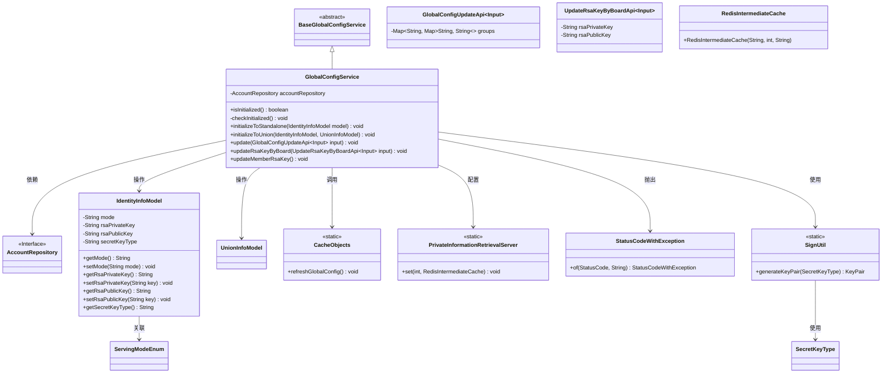
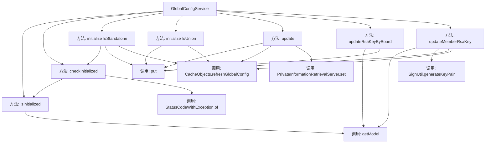
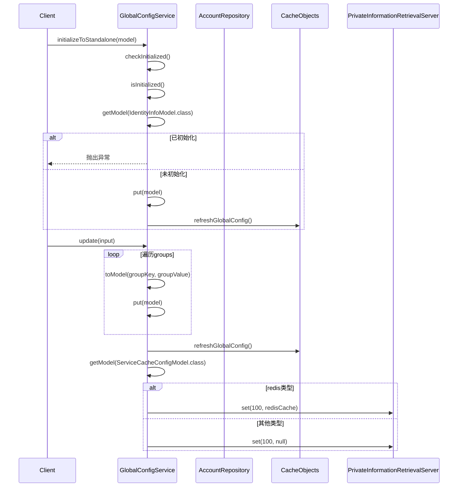

# 基础信息

|      |      |
|------|------|
| 名称 | GlobalConfigService |
| 编码语言 | .java |
| 代码路径 | WeFe/serving/serving-service/src/main/java/com/welab/wefe/serving/service/service/globalconfig/GlobalConfigService.java |
| 包名 | com.welab.wefe.serving.service.service.globalconfig |
| 依赖项 | ['com.welab.wefe.common.StatusCode', 'com.welab.wefe.common.constant.SecretKeyType', 'com.welab.wefe.common.exception.StatusCodeWithException', 'com.welab.wefe.common.util.SignUtil', 'com.welab.wefe.common.web.util.CurrentAccountUtil', 'com.welab.wefe.common.web.util.DatabaseEncryptUtil', 'com.welab.wefe.mpc.pir.server.PrivateInformationRetrievalServer', 'com.welab.wefe.serving.service.api.system.GlobalConfigUpdateApi', 'com.welab.wefe.serving.service.api.system.UpdateRsaKeyByBoardApi', 'com.welab.wefe.serving.service.database.entity.AccountMySqlModel', 'com.welab.wefe.serving.service.database.repository.AccountRepository', 'com.welab.wefe.serving.service.dto.globalconfig.IdentityInfoModel', 'com.welab.wefe.serving.service.dto.globalconfig.ServiceCacheConfigModel', 'com.welab.wefe.serving.service.dto.globalconfig.UnionInfoModel', 'com.welab.wefe.serving.service.dto.globalconfig.base.AbstractConfigModel', 'com.welab.wefe.serving.service.enums.ServingModeEnum', 'com.welab.wefe.serving.service.service.CacheObjects', 'com.welab.wefe.serving.service.utils.RedisIntermediateCache', 'org.springframework.beans.factory.annotation.Autowired', 'org.springframework.stereotype.Service', 'org.springframework.transaction.annotation.Transactional', 'java.security.NoSuchAlgorithmException', 'java.util.Map'] |
| 概述说明 | GlobalConfigService提供系统初始化、配置更新和RSA密钥管理功能，支持独立和联合模式初始化，检查系统状态，并通过缓存刷新保持配置同步。 |

# 说明

GlobalConfigService是一个继承自BaseGlobalConfigService的服务类，主要用于管理系统初始化和配置更新。它提供了检查系统是否初始化的方法isInitialized，以及初始化系统的两种方式：独立模式initializeToStandalone和联合模式initializeToUnion。类中还包含更新全局配置的update方法，处理RSA密钥更新的updateRsaKeyByBoard和updateMemberRsaKey方法。这些操作会触发全局配置缓存的刷新。服务通过注解进行依赖注入和事务管理，确保操作的原子性。部分代码被注释掉，可能涉及权限检查和管理员操作限制。

# 类列表 Class Summary

| 名称   | 类型  | 说明 |
|-------|------|-------------|
| GlobalConfigService | class | GlobalConfigService提供系统初始化、配置更新和RSA密钥管理功能。包含独立和联合初始化方法，支持配置更新和缓存刷新，以及RSA密钥的生成和同步操作。 |

## 类 GlobalConfigService

|      |      |
|------|------|
| 访问范围 | @Service;public |
| 类型 | class |
| 名称 | GlobalConfigService |
| 说明 | GlobalConfigService提供系统初始化、配置更新和RSA密钥管理功能。包含独立和联合初始化方法，支持配置更新和缓存刷新，以及RSA密钥的生成和同步操作。 |

### UML类图

该类图展示了GlobalConfigService作为核心配置服务，继承自BaseGlobalConfigService，通过AccountRepository访问数据，管理IdentityInfoModel和UnionInfoModel等配置模型。服务提供系统初始化、配置更新、密钥管理等功能，依赖CacheObjects进行缓存刷新，使用StatusCodeWithException处理异常，并与加密工具SignUtil和缓存组件PrivateInformationRetrievalServer交互。整体结构体现了配置管理的核心流程和关键依赖关系。

### 内部方法调用关系图

流程图展示了GlobalConfigService类的主要方法调用关系，包括初始化检查、系统初始化配置、更新操作和密钥管理等功能模块。时序图则详细描述了initializeToStandalone和update两个核心方法的执行流程，包括异常处理、模型操作和缓存刷新等关键步骤。该服务主要负责系统全局配置的管理，包含多种初始化方式和配置更新逻辑，并通过缓存机制保证配置的实时性。

### 字段列表 Field List

| 名称  | 类型  | 说明 |
|-------|-------|------|
| accountRepository | AccountRepository | 使用@Autowired自动注入AccountRepository实例。 |

### 方法列表

| 名称  | 类型  | 说明 |
|-------|-------|------|
| checkInitialized | void | 检查系统是否已初始化，若已初始化则抛出异常提示无法重复操作。 |
| isInitialized | boolean | 检查IdentityInfoModel类模型是否已初始化，若存在则返回true，否则false。 |
| update | void | 更新全局配置，处理输入分组并转换为模型，刷新缓存。若缓存类型为redis，则设置私有信息检索服务器使用Redis；否则设为null。 |
| updateRsaKeyByBoard | void | 该方法用于更新RSA密钥，首先检查系统是否为独立模式，若是则抛出异常。非独立模式下更新公私钥并保存。 |
| updateMemberRsaKey | void | 方法updateMemberRsaKey用于更新成员RSA密钥。生成密钥对并设置到模型，处理异常，更新模型模式为standalone，通知联合服务并刷新全局配置。 |
| initializeToUnion | void | 方法initializeToUnion合并identityInfoModel和unionInfoModel数据，并刷新全局配置。 |
| initializeToStandalone | void | 方法初始化独立模式，检查状态后存储模型并刷新全局配置。可能抛出异常。 |

