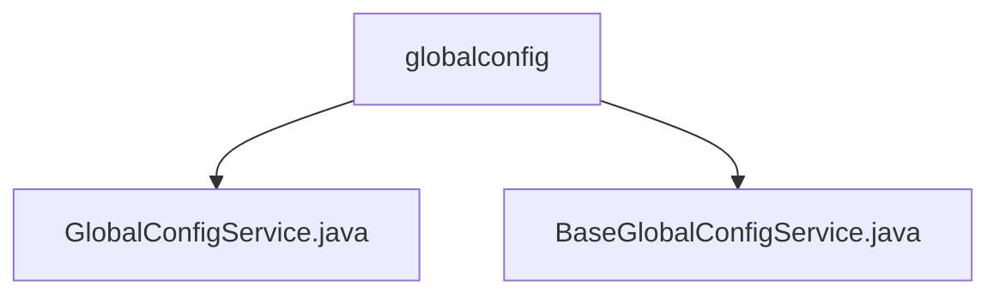

# 基础信息

|      |      |
|------|------|
| 名称 | globalconfig |
| 编码语言 | .java |
| 代码路径 | WeFe/serving/serving-service/src/main/java/com/welab/wefe/serving/service/service/globalconfig |
| 包名 | docs.serving.serving-service.src.main.java.com.welab.wefe.serving.service.service.globalconfig |
| 概述说明 | GlobalConfigService继承BaseGlobalConfigService，负责系统初始化、配置更新及RSA密钥管理，支持独立和联合模式。BaseGlobalConfigService提供全局配置的增删改查，支持批量操作、字段解密及线程安全。 |

# 说明

## 概述  
该模块核心职责是管理系统全局配置的初始化和维护，支持多模式初始化和安全更新机制。接口规范包含初始化检查(isInitialized)、独立/联合模式初始化(initializeToStandalone/ToUnion)及配置更新(update)等方法。关键数据结构涉及AbstractConfigModel基类和带@Secret注解的加密字段。外部依赖包括RSA密钥管理和数据库存储层(GlobalConfigRepository)。例如独立初始化模式适用于单节点部署，而联合模式适合分布式场景。

## 主要业务场景  
模块处理系统启动时的配置加载和运行时动态更新，类似配置中心模式。典型流程包括：首次部署时调用initialize方法，运行时通过update方法热更新配置。安全场景下，updateRsaKeyByBoard等方法实现密钥轮换。例如更新serving_base_url时会自动校验格式。所有操作通过事务注解保证原子性，且线程安全设计支持高并发访问。

### 包内部结构视图

该流程图展示了globalconfig目录下的两个服务类文件：GlobalConfigService.java和BaseGlobalConfigService.java。这两个文件都位于同一层级，直接隶属于globalconfig目录，没有更深层次的嵌套关系。图表清晰地呈现了简单的文件层级结构，符合路径信息的原始数据。

# 文件列表

| 名称   | 类型  | 说明 |
|-------|------|-------------|
| [GlobalConfigService.java](GlobalConfigService.md) | file | GlobalConfigService提供系统初始化、配置更新和RSA密钥管理功能，支持独立和联合模式初始化，检查系统状态，并通过缓存刷新保持配置同步。 |
| [BaseGlobalConfigService.java](BaseGlobalConfigService.md) | file | BaseGlobalConfigService类提供全局配置管理功能，支持增删改查操作，包含批量处理、模型转换及敏感字段解密。 |

