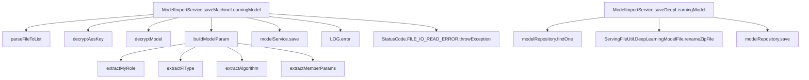
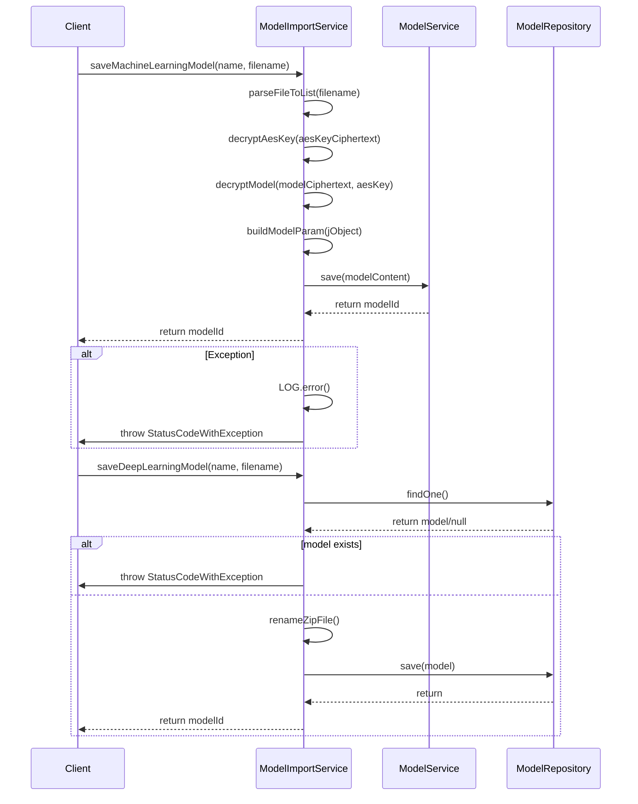

# 基础信息

|      |      |
|------|------|
| 名称 | ModelImportService |
| 编码语言 | .java |
| 代码路径 | WeFe/serving/serving-service/src/main/java/com/welab/wefe/serving/service/service/model/ModelImportService.java |
| 包名 | com.welab.wefe.serving.service.service.model |
| 依赖项 | ['com.welab.wefe.common.StatusCode', 'com.welab.wefe.common.exception.StatusCodeWithException', 'com.welab.wefe.common.util', 'com.welab.wefe.common.web.util.CurrentAccountUtil', 'com.welab.wefe.common.web.util.ModelMapper', 'com.welab.wefe.common.wefe.enums.Algorithm', 'com.welab.wefe.common.wefe.enums.FederatedLearningType', 'com.welab.wefe.common.wefe.enums.JobMemberRole', 'com.welab.wefe.serving.service.api.model.SaveModelApi', 'com.welab.wefe.serving.service.database.entity.TableModelMySqlModel', 'com.welab.wefe.serving.service.database.repository.TableModelRepository', 'com.welab.wefe.serving.service.dto.MemberParams', 'com.welab.wefe.serving.service.enums.ServiceTypeEnum', 'com.welab.wefe.serving.service.service.CacheObjects', 'com.welab.wefe.serving.service.service.ModelService', 'com.welab.wefe.serving.service.utils.ServingFileUtil', 'org.slf4j.Logger', 'org.slf4j.LoggerFactory', 'org.springframework.beans.factory.annotation.Autowired', 'org.springframework.stereotype.Service', 'org.springframework.transaction.annotation.Transactional', 'java.io.IOException', 'java.util.List'] |
| 概述说明 | ModelImportService提供保存机器学习和深度学习模型的功能。机器学习模型通过解析加密文件、解密内容并构建参数后保存；深度学习模型检查名称唯一性后保存文件信息到数据库。两者均处理异常并记录日志。 |

# 说明

该服务类实现了机器学习和深度学习模型的导入功能。机器学习模型导入流程包括：解析加密文件、解密AES密钥、解密模型数据、构建模型参数并保存。深度学习模型导入则检查名称唯一性后，处理压缩文件并保存元数据。两类模型均支持事务回滚，提供完善的错误处理和日志记录。关键操作包括文件解析、数据解密、参数提取和数据库持久化，涉及多种加密算法和类型转换。

# 类列表 Class Summary

| 名称   | 类型  | 说明 |
|-------|------|-------------|
| ModelImportService | class | ModelImportService提供模型导入功能，支持机器学习和深度学习模型。机器学习模型通过解析加密文件、解密参数并构建模型内容后保存；深度学习模型检查名称唯一性后保存文件信息到数据库。异常时记录日志并提示错误。 |


## 类 ModelImportService

|      |      |
|------|------|
| 访问范围 | @Service;public |
| 类型 | class |
| 名称 | ModelImportService |
| 说明 | ModelImportService提供模型导入功能，支持机器学习和深度学习模型。机器学习模型通过解析加密文件、解密参数并构建模型内容后保存；深度学习模型检查名称唯一性后保存文件信息到数据库。异常时记录日志并提示错误。 |


### UML类图

```mermaid
classDiagram
    class ModelImportService {
        -Logger LOG
        -ModelService modelService
        -TableModelRepository modelRepository
        +saveMachineLearningModel(String name, String filename) String
        -buildModelParam(JObject jObject) SaveModelApi$Input
        -extractMyRole(JObject jObject) JobMemberRole
        -decryptModel(String modelCiphertext, String aesKey) JObject
        -decryptAesKey(String aesKeyCiphertext) String
        -parseFileToList(String filename) List~String~
        -extractAlgorithm(JObject jobj) Algorithm
        -extractFlType(JObject jobj) FederatedLearningType
        -extractMemberParams(JObject jobj) List~MemberParams~
        +saveDeepLearningModel(String name, String filename) String
    }

    class ModelService {
        <<Interface>>
        +save(SaveModelApi$Input modelContent) String
    }

    class TableModelRepository {
        <<Interface>>
        +findOne(String field, Object value, Class~T~ clazz) T
        +save(TableModelMySqlModel model) void
    }

    class SaveModelApi$Input {
        +setServiceId(String serviceId)
        +setName(String name)
        +setMyRole(JobMemberRole myRole)
        +setFlType(FederatedLearningType flType)
        +setAlgorithm(Algorithm algorithm)
        +setModelParam(String modelParam)
        +setMemberParams(List~MemberParams~ memberParams)
        +setScoresDistribution(String scoresDistribution)
        +setScoreCardInfo(String scoreCardInfo)
    }

    class ServingFileUtil {
        <<Utility>>
        +getBaseDir(FileType type) Path
        +DeepLearningModelFile
    }

    class JObject {
        +create(String json) JObject
        +getString(String key) String
        +getJSONList(String key) List~JObject~
        +append(String key, Object value) JObject
    }

    class ModelMapper {
        <<Utility>>
        +maps(List~JObject~ source, Class~T~ targetClass) List~T~
    }

    ModelImportService --> ModelService : 依赖
    ModelImportService --> TableModelRepository : 依赖
    ModelImportService --> ServingFileUtil : 依赖
    ModelImportService --> JObject : 依赖
    ModelImportService --> ModelMapper : 依赖
    SaveModelApi$Input --> JobMemberRole : 包含
    SaveModelApi$Input --> FederatedLearningType : 包含
    SaveModelApi$Input --> Algorithm : 包含
    SaveModelApi$Input --> MemberParams : 包含
```

这段代码展示了一个模型导入服务类`ModelImportService`，它提供了保存机器学习和深度学习模型的功能。该类依赖`ModelService`和`TableModelRepository`接口进行模型存储操作，使用`ServingFileUtil`处理文件路径，通过`JObject`解析JSON数据。核心方法`saveMachineLearningModel`实现了模型文件的解析、解密和参数构建流程，而`saveDeepLearningModel`则处理深度学习模型的保存逻辑。类图中清晰地展示了这些类之间的关系和依赖。


### 内部方法调用关系图





这段代码展示了ModelImportService类的两个核心方法：saveMachineLearningModel和saveDeepLearningModel。流程图清晰地呈现了方法间的调用关系，时序图则详细描述了从客户端调用到最终返回的完整过程。saveMachineLearningModel主要处理机器学习模型的解析、解密和保存流程，而saveDeepLearningModel专注于深度学习模型的名称校验和文件重命名操作。两个方法都包含完整的异常处理机制，确保在出现错误时能够正确记录日志并返回错误信息。

### 字段列表 Field List

| 名称  | 类型  | 说明 |
|-------|-------|------|
| modelService | ModelService | 使用@Autowired自动注入ModelService实例。 |
| LOG = LoggerFactory.getLogger(this.getClass()) | Logger | 声明一个受保护的最终日志记录器实例，用于当前类的日志输出。 |
| modelRepository | TableModelRepository | 自动注入TableModelRepository实例。 |

### 方法列表

| 名称  | 类型  | 说明 |
|-------|-------|------|
| parseFileToList | List<String> | 解析文件内容为字符串列表，处理路径拼接和编码读取，返回每行文本。 |
| extractMyRole | JobMemberRole | 该方法从JSON对象中提取"myRole"字段值并转换为JobMemberRole枚举类型返回。 |
| saveMachineLearningModel | String | 方法saveMachineLearningModel用于保存机器学习模型，包含解析文件、解密AES密钥和模型、构建参数并保存。异常时回滚并记录错误，提示导入失败原因。 |
| buildModelParam | SaveModelApi.Input | 构建模型参数方法：从JObject提取数据填充SaveModelApi.Input对象，包括模型ID、名称、角色、类型、算法、参数、成员参数、分数分布和评分卡信息。 |
| decryptAesKey | String | 使用私钥解密AES密钥，调用SignUtil的decryptByPrivateKey方法，传入密文、私钥和密钥类型参数。 |
| decryptModel | JObject | 该方法使用AES密钥解密模型密文，返回解密后的JSON对象。 |
| extractAlgorithm | Algorithm | 方法从JSON对象提取算法类型，通过键"algorithm"获取字符串并转为Algorithm枚举值。 |
| extractFlType | FederatedLearningType | 提取JObject中的flType字段并转换为FederatedLearningType枚举类型。 |
| extractMemberParams | List<MemberParams> | 方法从JObject提取memberParams列表，映射为MemberParams对象列表返回。 |
| saveDeepLearningModel | String | 保存深度学习模型方法：检查名称唯一性，生成存储路径，设置模型属性（ID、路径、文件名、使用次数等），最后保存并返回模型ID。若名称重复则抛出异常。 |


