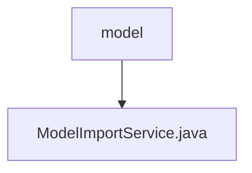

# 基础信息

|      |      |
|------|------|
| 名称 | model |
| 编码语言 | .java |
| 代码路径 | WeFe/serving/serving-service/src/main/java/com/welab/wefe/serving/service/service/model |
| 包名 | docs.serving.serving-service.src.main.java.com.welab.wefe.serving.service.service.model |
| 概述说明 | ModelImportService提供保存机器学习和深度学习模型的功能。机器学习模型通过解析加密文件、解密内容并构建参数后保存；深度学习模型检查名称唯一性后保存文件信息到数据库。两者均处理异常并记录日志。 |

# 说明

该服务类实现了机器学习和深度学习模型的导入功能。机器学习模型导入流程包括：解析加密文件、解密AES密钥、解密模型数据、构建模型参数并保存。深度学习模型导入则检查名称唯一性后，处理压缩文件并保存元数据。两类模型均支持事务回滚，提供完善的错误处理和日志记录。关键操作包括文件解析、数据解密、参数提取和数据库持久化，涉及多种加密算法和类型转换。

### 包内部结构视图

该流程图展示了WeFe项目中模型服务模块的简单层级结构。根节点"model"代表模型服务目录，其下包含一个具体的服务实现文件"ModelImportService.java"。这种结构清晰地反映了模型服务模块中核心文件与父目录的从属关系，符合典型Java项目的分层设计模式。

# 文件列表

| 名称   | 类型  | 说明 |
|-------|------|-------------|
| [ModelImportService.java](ModelImportService.md) | file | ModelImportService提供保存机器学习和深度学习模型的功能。机器学习模型通过解析加密文件、解密内容并构建参数后保存；深度学习模型检查名称唯一性后保存文件信息到数据库。两者均处理异常并记录日志。 |

