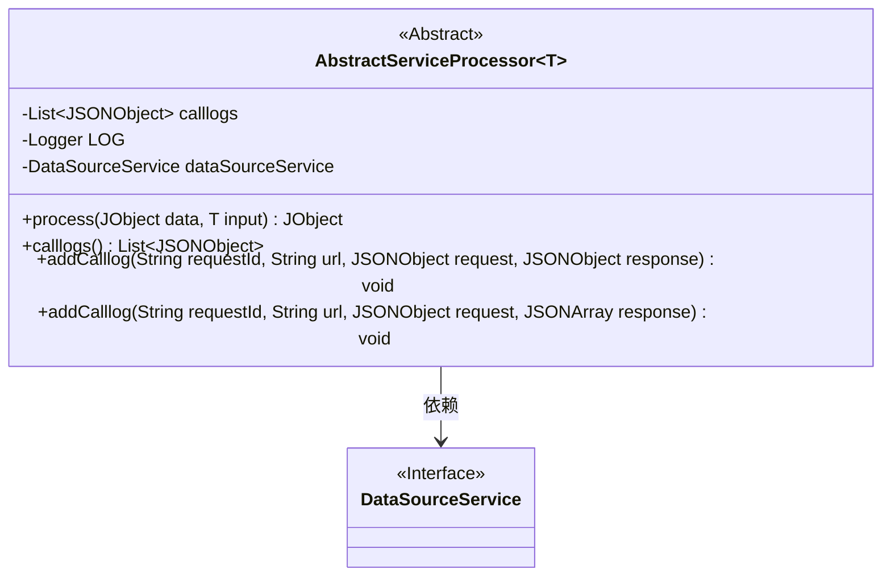
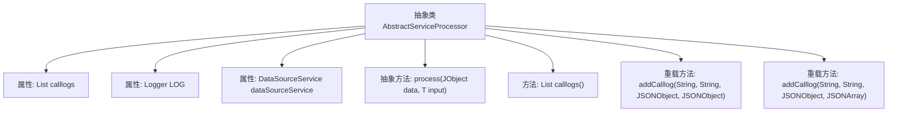

# 基础信息

|      |      |
|------|------|
| 名称 | AbstractServiceProcessor |
| 编码语言 | .java |
| 代码路径 | WeFe/serving/serving-service/src/main/java/com/welab/wefe/serving/service/service_processor/AbstractServiceProcessor.java |
| 包名 | com.welab.wefe.serving.service.service_processor |
| 依赖项 | ['java.util.ArrayList', 'java.util.List', 'org.slf4j.Logger', 'org.slf4j.LoggerFactory', 'com.alibaba.fastjson.JSONArray', 'com.alibaba.fastjson.JSONObject', 'com.welab.wefe.common.util.JObject', 'com.welab.wefe.common.web.Launcher', 'com.welab.wefe.serving.service.service.DataSourceService'] |
| 概述说明 | 抽象服务处理器类，包含日志记录、数据源服务和调用日志管理功能，支持处理泛型数据和添加两种类型的调用日志。 |

# 说明

这是一个名为AbstractServiceProcessor的抽象类，使用泛型T。它包含一个存储调用日志的列表calllogs，一个日志记录器LOG，以及一个通过Launcher获取的DataSourceService实例dataSourceService。类中定义了一个抽象方法process，用于处理输入数据并返回JObject。提供了获取调用日志的方法calllogs，以及两个重载的addCalllog方法，用于添加包含请求ID、URL、请求和响应（JSONObject或JSONArray）的调用日志到列表中。

# 类列表 Class Summary

| 名称   | 类型  | 说明 |
|-------|------|-------------|
| AbstractServiceProcessor | class | 抽象服务处理器类，提供日志记录功能，包含处理抽象方法、获取日志及添加请求响应日志的方法。 |

## 类 AbstractServiceProcessor

|      |      |
|------|------|
| 访问范围 | public abstract |
| 类型 | class |
| 名称 | AbstractServiceProcessor |
| 说明 | 抽象服务处理器类，提供日志记录功能，包含处理抽象方法、获取日志及添加请求响应日志的方法。 |

### UML类图

这段代码定义了一个泛型抽象类AbstractServiceProcessor<T>，主要用于处理服务请求并记录调用日志。该类包含一个抽象方法process()用于处理业务逻辑，两个重载的addCalllog()方法用于记录不同格式的响应日志，以及calllogs()方法获取日志列表。类中维护了一个DataSourceService实例用于数据源操作，并通过Launcher.getBean()动态获取实例。该类设计为可扩展的基类，子类需要实现具体的process()方法逻辑。

### 内部方法调用关系图

该流程图展示了AbstractServiceProcessor抽象类的核心结构，包含两个日志记录属性和一个服务属性，定义了一个抽象处理方法和三个具体方法。其中addCalllog方法通过重载支持两种不同的响应类型(JSONObject/JSONArray)，calllogs()方法提供日志列表访问，process()作为抽象方法需子类实现。所有方法围绕核心数据处理和日志记录功能展开，形成完整的服务处理框架。

### 字段列表 Field List

| 名称  | 类型  | 说明 |
|-------|-------|------|
| LOG = LoggerFactory.getLogger(getClass()) | Logger | 类中定义了一个受保护且不可变的日志记录器实例，用于记录当前类的日志信息。 |
| calllogs = new ArrayList<>() | List<JSONObject> | 声明一个受保护的JSONObject列表变量calllogs，初始化为空ArrayList。 |
| dataSourceService = Launcher.getBean(DataSourceService.class) | DataSourceService | 获取DataSourceService实例并赋值给受保护的final变量dataSourceService。 |

### 方法列表

| 名称  | 类型  | 说明 |
|-------|-------|------|
| process | JObject | 抽象方法process，接收JObject和泛型T输入，返回JObject，可能抛出异常。 |
| calllogs | List<JSONObject> | 获取通话记录列表的方法，返回类型为JSONObject的List集合。 |
| addCalllog | void | 该方法用于添加调用日志，记录请求ID、URL、请求和响应数据到JSON对象并存入列表。 |
| addCalllog | void | 该方法用于添加调用日志，记录请求ID、URL、请求参数和响应数据到日志集合中。 |

