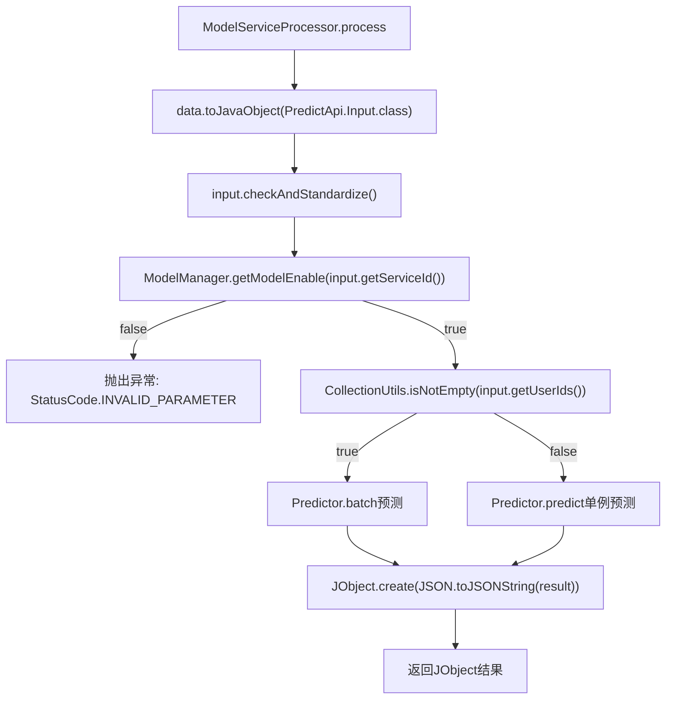

# 基础信息

|      |      |
|------|------|
| 名称 | ModelServiceProcessor |
| 编码语言 | .java |
| 代码路径 | WeFe/serving/serving-service/src/main/java/com/welab/wefe/serving/service/service_processor/ModelServiceProcessor.java |
| 包名 | com.welab.wefe.serving.service.service_processor |
| 依赖项 | ['com.alibaba.fastjson.JSON', 'com.welab.wefe.common.StatusCode', 'com.welab.wefe.common.exception.StatusCodeWithException', 'com.welab.wefe.common.util.JObject', 'com.welab.wefe.serving.sdk.dto.PredictResult', 'com.welab.wefe.serving.service.api.predict.PredictApi', 'com.welab.wefe.serving.service.database.entity.TableModelMySqlModel', 'com.welab.wefe.serving.service.manager.ModelManager', 'com.welab.wefe.serving.service.predicter.Predictor', 'com.welab.wefe.serving.service.service.CacheObjects', 'org.apache.commons.collections4.CollectionUtils'] |
| 概述说明 | ModelServiceProcessor处理模型预测请求，检查模型状态后支持批量或单条预测，返回JSON格式结果。 |

# 说明

ModelServiceProcessor类继承AbstractServiceProcessor，处理TableModelMySqlModel类型数据。其process方法接收JObject数据和模型，转换为PredictApi.Input对象后校验标准化。首先检查模型是否启用，未启用则抛出异常。支持批量预测（输入含userIds列表时调用Predictor.batch）和单条预测（调用Predictor.predict），结果均转为JObject返回。

# 类列表 Class Summary

| 名称   | 类型  | 说明 |
|-------|------|-------------|
| ModelServiceProcessor | class | ModelServiceProcessor处理预测请求，检查模型状态后执行批量或单条预测，返回JSON格式结果。 |


## 类 ModelServiceProcessor

|      |      |
|------|------|
| 访问范围 | public |
| 类型 | class |
| 名称 | ModelServiceProcessor |
| 说明 | ModelServiceProcessor处理预测请求，检查模型状态后执行批量或单条预测，返回JSON格式结果。 |


### UML类图

```mermaid
classDiagram
    class AbstractServiceProcessor~T~ {
        <<Abstract>>
        +process(JObject data, T model) JObject throws StatusCodeWithException
    }

    class ModelServiceProcessor {
        +process(JObject data, TableModelMySqlModel model) JObject throws StatusCodeWithException
    }

    class PredictApi {
        <<Interface>>
    }

    class PredictApi$Input {
        +checkAndStandardize()
        +String getServiceId()
        +List~String~ getUserIds()
        +String getRequestId()
        +String getUserId()
        +Map~String,Object~ getFeatureDataMap()
        +Object getFeatureData()
    }

    class ModelManager {
        <<Static>>
        +getModelEnable(String serviceId) boolean
    }

    class StatusCode {
        <<Enum>>
        +INVALID_PARAMETER
        +throwException(String msg) StatusCodeWithException
    }

    class CacheObjects {
        <<Static>>
        +getMemberName() String
    }

    class Predictor {
        <<Static>>
        +batch(String requestId, String serviceId, List~String~ userIds, Map~String,Object~ featureDataMap) PredictResult
        +predict(String requestId, String serviceId, String userId, Object featureData) PredictResult
    }

    class PredictResult {
        // 预测结果类
    }

    class JObject {
        +toJavaObject(Class~T~ clazz) T
        +create(String json) JObject
    }

    AbstractServiceProcessor <|-- ModelServiceProcessor
    ModelServiceProcessor --> PredictApi : 使用输入参数
    ModelServiceProcessor --> ModelManager : 检查模型状态
    ModelServiceProcessor --> StatusCode : 抛出异常
    ModelServiceProcessor --> CacheObjects : 获取成员名
    ModelServiceProcessor --> Predictor : 执行预测
    ModelServiceProcessor --> JObject : 数据转换
    PredictApi <|-- PredictApi$Input
    Predictor --> PredictResult : 生成结果
```

这段代码展示了一个模型服务处理器`ModelServiceProcessor`，它继承自泛型抽象类`AbstractServiceProcessor`，专门处理`TableModelMySqlModel`类型的数据。主要功能是通过`PredictApi.Input`接收预测请求，验证模型状态后，根据请求类型(批量或单条)调用`Predictor`进行预测，最后将结果转换为`JObject`返回。处理过程中会检查模型上线状态，未上线则抛出`StatusCode.INVALID_PARAMETER`异常，涉及多个工具类和静态方法的协作，体现了完整的数据验证、业务处理和结果转换流程。


### 内部方法调用关系图



这段代码流程图展示了ModelServiceProcessor类的核心处理逻辑。流程开始于数据转换和标准化校验，随后检查模型是否可用，不可用则抛出异常。根据输入参数判断执行批量预测或单例预测，最终将预测结果转换为JObject格式返回。整个过程包含输入校验、业务逻辑分支和结果封装三个主要阶段，体现了典型的预测服务处理流程。

### 字段列表 Field List

| 名称  | 类型  | 说明 |
|-------|-------|------|

### 方法列表

| 名称  | 类型  | 说明 |
|-------|-------|------|
| process | JObject | 处理预测请求，检查模型状态，支持批量或单用户预测，返回JSON格式结果。 |


