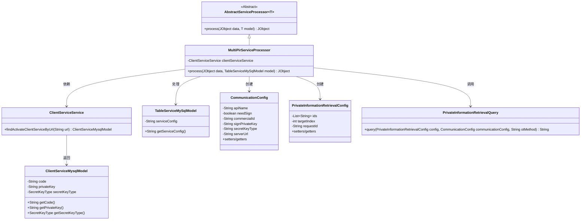
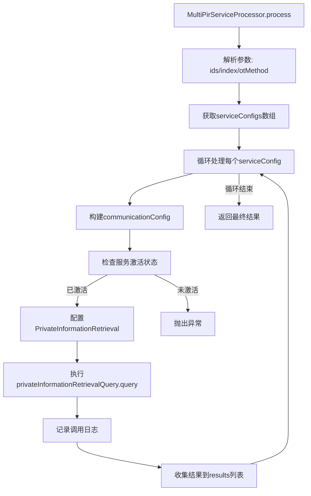

# 基础信息

|      |      |
|------|------|
| 名称 | MultiPirServiceProcessor |
| 编码语言 | .java |
| 代码路径 | WeFe/serving/serving-service/src/main/java/com/welab/wefe/serving/service/service_processor/MultiPirServiceProcessor.java |
| 包名 | com.welab.wefe.serving.service.service_processor |
| 依赖项 | ['java.util.ArrayList', 'java.util.List', 'org.apache.commons.lang3.StringUtils', 'com.alibaba.fastjson.JSONArray', 'com.alibaba.fastjson.JSONObject', 'com.welab.wefe.common.util.JObject', 'com.welab.wefe.common.web.Launcher', 'com.welab.wefe.mpc.commom.Constants', 'com.welab.wefe.mpc.config.CommunicationConfig', 'com.welab.wefe.mpc.pir.sdk.PrivateInformationRetrievalQuery', 'com.welab.wefe.mpc.pir.sdk.config.PrivateInformationRetrievalConfig', 'com.welab.wefe.serving.service.database.entity.ClientServiceMysqlModel', 'com.welab.wefe.serving.service.database.entity.TableServiceMySqlModel', 'com.welab.wefe.serving.service.service.ClientServiceService', 'cn.hutool.core.lang.UUID'] |
| 概述说明 | MultiPirServiceProcessor类处理多PIR服务请求，解析配置并调用查询，记录日志后返回结果。 |

# 说明

MultiPirServiceProcessor是一个继承自AbstractServiceProcessor的服务处理器类，主要用于处理私有信息检索（PIR）请求。它通过解析输入数据中的ID列表、索引和OT方法，遍历服务配置列表，为每个配置构建通信参数。处理器会检查服务是否激活，设置必要的签名和密钥信息，创建PIR查询配置并发起请求。每次请求会生成唯一ID，记录调用日志，并将结果与成员信息一起返回。整个过程包括异常处理和结果聚合，最终返回包含所有结果的JObject对象。

# 类列表 Class Summary

| 名称   | 类型  | 说明 |
|-------|------|-------------|
| MultiPirServiceProcessor | class | MultiPirServiceProcessor类处理多PIR服务请求，解析配置并调用私有信息检索查询，记录日志并返回结果。 |

## 类 MultiPirServiceProcessor

|      |      |
|------|------|
| 访问范围 | public |
| 类型 | class |
| 名称 | MultiPirServiceProcessor |
| 说明 | MultiPirServiceProcessor类处理多PIR服务请求，解析配置并调用私有信息检索查询，记录日志并返回结果。 |

### UML类图

该图展示了MultiPirServiceProcessor类及其相关依赖关系。MultiPirServiceProcessor继承自AbstractServiceProcessor，处理TableServiceMySqlModel数据，通过ClientServiceService获取服务信息，创建CommunicationConfig和PrivateInformationRetrievalConfig配置，并调用PrivateInformationRetrievalQuery执行查询。主要涉及多方私有信息检索流程，包含服务配置解析、通信参数设置和查询执行等关键步骤。

### 内部方法调用关系图

该流程图展示了MultiPirServiceProcessor类的process方法处理流程。方法首先解析输入参数，然后遍历服务配置数组，为每个配置构建通信参数并验证服务状态，接着设置隐私信息检索参数并执行查询，最后收集结果并返回。整个过程包含异常处理和调用日志记录，确保数据处理的完整性和可追溯性。

### 字段列表 Field List

| 名称  | 类型  | 说明 |
|-------|-------|------|
| clientServiceService = Launcher.getBean(ClientServiceService.class) | ClientServiceService | 获取ClientServiceService实例并赋值给私有常量clientServiceService。 |

### 方法列表

| 名称  | 类型  | 说明 |
|-------|-------|------|
| process | JObject | 处理JObject数据，解析ids、index和otMethod，遍历serviceConfigs构建通信配置，调用私有信息检索查询，记录日志并返回结果列表。 |

