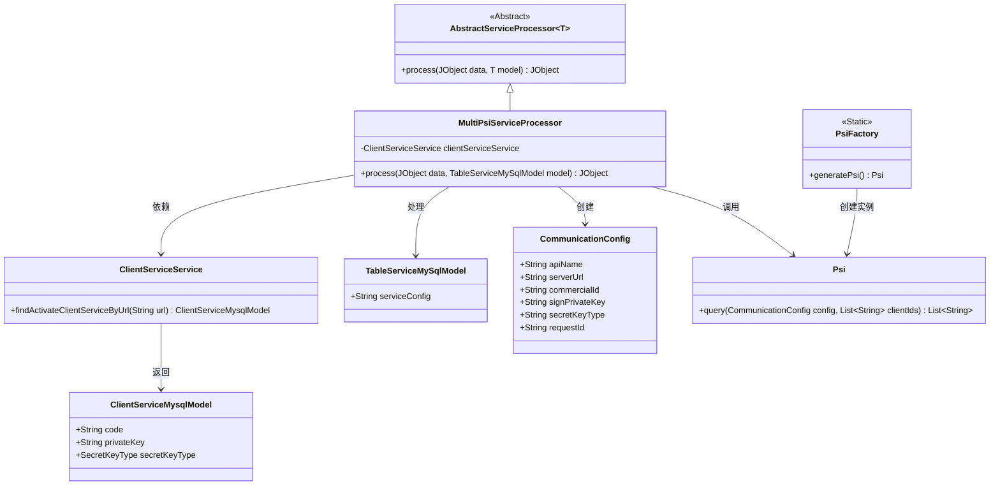

# 基础信息

|      |      |
|------|------|
| 名称 | MultiPsiServiceProcessor |
| 编码语言 | .java |
| 代码路径 | WeFe/serving/serving-service/src/main/java/com/welab/wefe/serving/service/service_processor/MultiPsiServiceProcessor.java |
| 包名 | com.welab.wefe.serving.service.service_processor |
| 依赖项 | ['java.util.ArrayList', 'java.util.LinkedList', 'java.util.List', 'java.util.stream.Collectors', 'org.apache.commons.collections.CollectionUtils', 'com.alibaba.fastjson.JSONArray', 'com.alibaba.fastjson.JSONObject', 'com.welab.wefe.common.util.JObject', 'com.welab.wefe.common.web.Launcher', 'com.welab.wefe.mpc.config.CommunicationConfig', 'com.welab.wefe.mpc.psi.sdk.Psi', 'com.welab.wefe.mpc.psi.sdk.PsiFactory', 'com.welab.wefe.serving.service.database.entity.ClientServiceMysqlModel', 'com.welab.wefe.serving.service.database.entity.TableServiceMySqlModel', 'com.welab.wefe.serving.service.service.ClientServiceService'] |
| 概述说明 | MultiPsiServiceProcessor类处理客户端ID和服务配置，验证服务激活状态并生成通信配置，通过PSI查询过滤结果并记录调用日志，最终返回匹配的客户端ID列表。 |

# 说明

MultiPsiServiceProcessor类继承AbstractServiceProcessor，处理TableServiceMySqlModel数据。通过clientServiceService获取激活的客户端服务，构建CommunicationConfig配置列表。解析输入数据中的client_ids，遍历服务配置，验证URL有效性并设置通信参数。使用PsiFactory生成Psi实例，对每个配置执行查询，逐步过滤客户端ID列表。最后记录调用日志并返回结果列表。主要涉及服务配置验证、通信参数设置和PSI查询处理。

# 类列表 Class Summary

| 名称   | 类型  | 说明 |
|-------|------|-------------|
| MultiPsiServiceProcessor | class | MultiPsiServiceProcessor类处理多PSI服务请求，解析客户端ID和服务配置，验证服务激活状态，生成通信配置并执行PSI查询，返回结果并记录调用日志。 |

## 类 MultiPsiServiceProcessor

|      |      |
|------|------|
| 访问范围 | public |
| 类型 | class |
| 名称 | MultiPsiServiceProcessor |
| 说明 | MultiPsiServiceProcessor类处理多PSI服务请求，解析客户端ID和服务配置，验证服务激活状态，生成通信配置并执行PSI查询，返回结果并记录调用日志。 |

### UML类图

这段代码展示了一个多PSI服务处理器，继承自抽象服务处理器，主要处理客户端ID和服务配置的匹配逻辑。通过ClientServiceService获取激活的客户端服务模型，构建通信配置对象，利用PSI工厂生成的PSI实例进行查询，最终返回匹配结果。涉及6个核心类和1个接口，展现了从配置解析到服务调用的完整流程。

### 内部方法调用关系图

这段代码实现了一个多PSI服务处理器，主要功能是通过配置的服务信息对客户端ID列表进行隐私集合求交(PSI)处理。流程图展示了从初始化配置、服务验证到PSI查询过滤的全过程，时序图则详细描述了类间交互。处理器会先解析输入参数，验证每个通信配置的有效性，然后使用PSI算法逐步过滤客户端ID列表，最终返回交集结果并记录调用日志。整个过程包含异常处理和服务状态验证等关键环节。

### 字段列表 Field List

| 名称  | 类型  | 说明 |
|-------|-------|------|
| clientServiceService = Launcher.getBean(ClientServiceService.class) | ClientServiceService | 从Launcher获取ClientServiceService实例并赋值给私有常量clientServiceService。 |

### 方法列表

| 名称  | 类型  | 说明 |
|-------|-------|------|
| process | JObject | 处理客户端ID和服务配置，验证服务激活状态，生成通信配置并查询PSI结果，返回过滤后的客户端ID列表。 |

