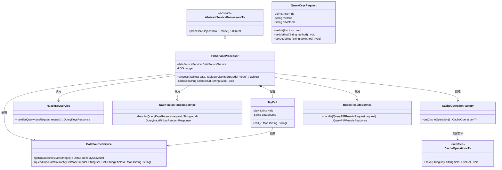
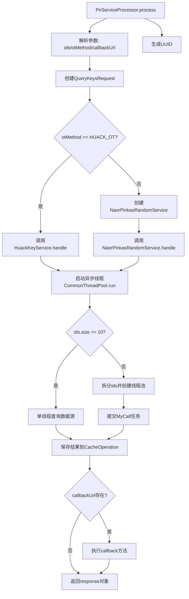

# 基础信息

|      |      |
|------|------|
| 名称 | PirServiceProcessor |
| 编码语言 | .java |
| 代码路径 | WeFe/serving/serving-service/src/main/java/com/welab/wefe/serving/service/service_processor/PirServiceProcessor.java |
| 包名 | com.welab.wefe.serving.service.service_processor |
| 依赖项 | ['java.util.Arrays', 'java.util.HashMap', 'java.util.List', 'java.util.Map', 'java.util.UUID', 'java.util.concurrent.Callable', 'java.util.concurrent.ExecutorService', 'java.util.concurrent.Executors', 'java.util.concurrent.Future', 'org.apache.commons.lang3.StringUtils', 'com.alibaba.fastjson.JSONObject', 'com.google.common.collect.Lists', 'com.welab.wefe.common.CommonThreadPool', 'com.welab.wefe.common.StatusCode', 'com.welab.wefe.common.exception.StatusCodeWithException', 'com.welab.wefe.common.util.JObject', 'com.welab.wefe.mpc.cache.intermediate.CacheOperation', 'com.welab.wefe.mpc.cache.intermediate.CacheOperationFactory', 'com.welab.wefe.mpc.commom.Constants', 'com.welab.wefe.mpc.pir.request.QueryKeysRequest', 'com.welab.wefe.mpc.pir.request.QueryKeysResponse', 'com.welab.wefe.mpc.pir.request.QueryPIRResultsRequest', 'com.welab.wefe.mpc.pir.request.QueryPIRResultsResponse', 'com.welab.wefe.mpc.pir.request.naor.QueryNaorPinkasRandomResponse', 'com.welab.wefe.mpc.pir.server.service.HuackKeyService', 'com.welab.wefe.mpc.pir.server.service.HuackResultsService', 'com.welab.wefe.mpc.pir.server.service.naor.NaorPinkasRandomService', 'com.welab.wefe.serving.service.database.entity.DataSourceMySqlModel', 'com.welab.wefe.serving.service.database.entity.TableServiceMySqlModel', 'com.welab.wefe.serving.service.utils.ServiceUtil', 'cn.hutool.http.HttpGlobalConfig', 'cn.hutool.http.HttpRequest', 'cn.hutool.http.HttpResponse'] |
| 概述说明 | PirServiceProcessor类处理PIR请求，根据OT方法选择不同服务处理，查询数据源并缓存结果，支持回调通知。 |

# 说明

PirServiceProcessor类继承AbstractServiceProcessor，处理JObject数据和TableServiceMySqlModel模型。主要功能包括解析输入数据中的ID列表和OT方法，根据OT方法选择HuackKeyService或NaorPinkasRandomService处理请求，生成响应。随后异步查询数据源，根据ID数量采用单线程或线程池分批查询，结果存入缓存。支持回调URL通知。内部类MyCall实现Callable接口，用于多线程查询数据源。整个过程包含异常处理和日志记录。

# 类列表 Class Summary

| 名称   | 类型  | 说明 |
|-------|------|-------------|
| PirServiceProcessor | class | PirServiceProcessor类处理PIR请求，根据otMethod选择HUACK_OT或NAORPINKAS_OT方式处理，查询数据源并缓存结果，支持回调通知。 |

## 类 PirServiceProcessor

|      |      |
|------|------|
| 访问范围 | public |
| 类型 | class |
| 名称 | PirServiceProcessor |
| 说明 | PirServiceProcessor类处理PIR请求，根据otMethod选择HUACK_OT或NAORPINKAS_OT方式处理，查询数据源并缓存结果，支持回调通知。 |

### UML类图

这段代码描述了一个PIR（Private Information Retrieval）服务处理器，继承自抽象服务处理器。主要功能是根据不同的OT（Oblivious Transfer）方法处理查询请求，通过多线程方式从数据源获取数据并缓存结果。类图展示了核心组件关系：PirServiceProcessor作为主控制器，协调密钥服务、数据源服务和缓存操作；MyCall作为内部类处理并发查询任务；各类服务（HuackKeyService/NaorPinkasRandomService）实现不同OT协议。系统采用工厂模式管理缓存操作，支持回调通知机制，整体设计体现了职责分离和策略模式思想。

### 内部方法调用关系图

该流程图展示了PIR服务处理器的完整执行流程。首先解析输入参数并生成请求UUID，根据OT方法类型选择不同的加密服务处理路径（HUACK_OT或NAORPINKAS_OT）。然后启动异步线程进行数据查询，根据ID数量决定采用单线程还是多线程方式查询数据源，最终将结果缓存并可选执行回调通知。整个过程包含异常处理和多线程协调机制，实现了高效安全的私有信息检索功能。

### 字段列表 Field List

| 名称  | 类型  | 说明 |
|-------|-------|------|

### 方法列表

| 名称  | 类型  | 说明 |
|-------|-------|------|
| callback | void | 该方法通过回调URL和UUID查询结果，将响应数据POST到指定URL，记录请求和响应日志，异常时记录错误，最后关闭连接。 |
| process | JObject | 方法处理数据查询请求，根据OT方法选择不同服务处理，查询数据后缓存结果并支持回调。 |

