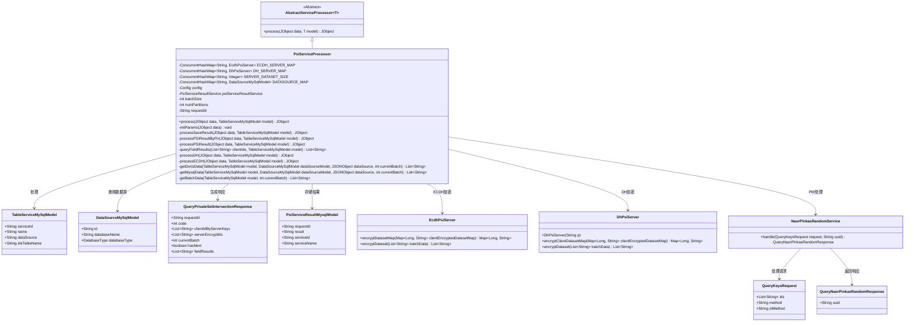
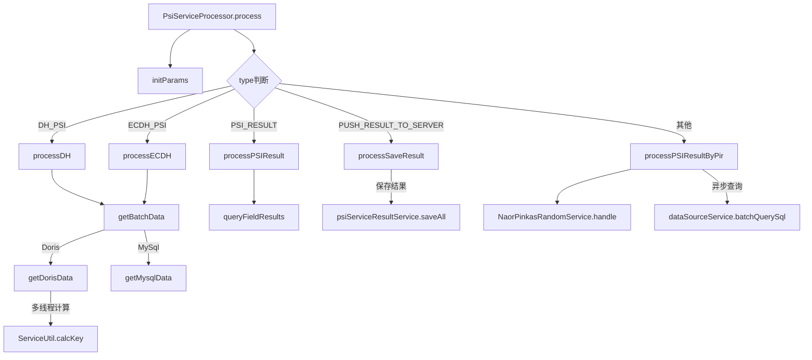
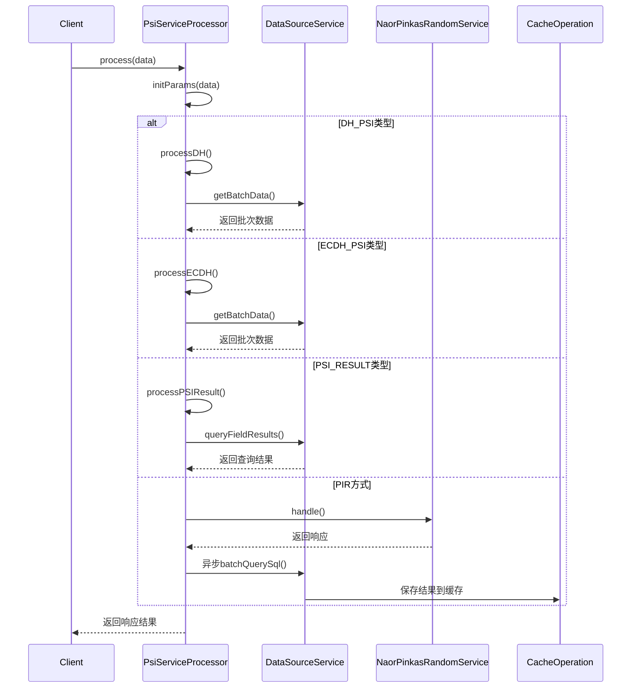

# 基础信息

|      |      |
|------|------|
| 名称 | PsiServiceProcessor |
| 编码语言 | .java |
| 代码路径 | WeFe/serving/serving-service/src/main/java/com/welab/wefe/serving/service/service_processor/PsiServiceProcessor.java |
| 包名 | com.welab.wefe.serving.service.service_processor |
| 依赖项 | ['java.util.ArrayList', 'java.util.Arrays', 'java.util.HashMap', 'java.util.LinkedHashMap', 'java.util.LinkedList', 'java.util.List', 'java.util.Map', 'java.util.Queue', 'java.util.UUID', 'java.util.concurrent.BlockingQueue', 'java.util.concurrent.ConcurrentHashMap', 'java.util.concurrent.ExecutorService', 'java.util.concurrent.Executors', 'java.util.concurrent.LinkedBlockingQueue', 'java.util.concurrent.TimeUnit', 'org.apache.commons.collections.CollectionUtils', 'org.apache.commons.lang3.StringUtils', 'com.alibaba.fastjson.JSONArray', 'com.alibaba.fastjson.JSONObject', 'com.welab.wefe.common.StatusCode', 'com.welab.wefe.common.exception.StatusCodeWithException', 'com.welab.wefe.common.jdbc.base.DatabaseType', 'com.welab.wefe.common.util.JObject', 'com.welab.wefe.common.web.Launcher', 'com.welab.wefe.mpc.cache.intermediate.CacheOperation', 'com.welab.wefe.mpc.cache.intermediate.CacheOperationFactory', 'com.welab.wefe.mpc.commom.Constants', 'com.welab.wefe.mpc.pir.request.QueryKeysRequest', 'com.welab.wefe.mpc.pir.request.naor.QueryNaorPinkasRandomResponse', 'com.welab.wefe.mpc.pir.server.service.naor.NaorPinkasRandomService', 'com.welab.wefe.mpc.psi.request.QueryPrivateSetIntersectionResponse', 'com.welab.wefe.mpc.psi.sdk.Psi', 'com.welab.wefe.mpc.psi.sdk.dh.DhPsiServer', 'com.welab.wefe.mpc.psi.sdk.ecdh.EcdhPsiServer', 'com.welab.wefe.mpc.psi.sdk.util.EcdhUtil', 'com.welab.wefe.serving.service.config.Config', 'com.welab.wefe.serving.service.database.entity.DataSourceMySqlModel', 'com.welab.wefe.serving.service.database.entity.PsiServiceResultMysqlModel', 'com.welab.wefe.serving.service.database.entity.TableServiceMySqlModel', 'com.welab.wefe.serving.service.service.PsiServiceResultService', 'com.welab.wefe.serving.service.utils.ServiceUtil'] |
| 概述说明 | PsiServiceProcessor类处理私有集交集服务，支持DH和ECDH算法，管理数据批次处理，结果保存及查询，支持MySQL和Doris数据库。 |

# 说明

PsiServiceProcessor是一个处理私有集合交集（PSI）服务的Java类，继承自AbstractServiceProcessor。它支持DH和ECDH两种加密协议，通过ConcurrentHashMap存储服务器实例和数据集。类中包含多个处理方法，如processSaveResult保存结果到数据库，processPSIResultByPir通过PIR方式返回标签字段，processDH和processECDH分别处理对应协议的加密逻辑。还包含数据分批获取方法getBatchData，支持MySQL和Doris数据库。整体实现了PSI服务的核心功能，包括数据加密、结果查询和存储等。

# 类列表 Class Summary

| 名称   | 类型  | 说明 |
|-------|------|-------------|
| PsiServiceProcessor | class | PsiServiceProcessor类处理私有集合交集（PSI）服务请求，支持DH和ECDH加密协议，管理数据批次处理，保存结果并通过PIR方式返回标签字段。包含初始化参数、数据处理和结果存储功能。 |

## 类 PsiServiceProcessor

|      |      |
|------|------|
| 访问范围 | public |
| 类型 | class |
| 名称 | PsiServiceProcessor |
| 说明 | PsiServiceProcessor类处理私有集合交集（PSI）服务请求，支持DH和ECDH加密协议，管理数据批次处理，保存结果并通过PIR方式返回标签字段。包含初始化参数、数据处理和结果存储功能。 |

### UML类图

该代码实现了一个隐私集合求交(PSI)服务处理器，支持DH和ECDH两种加密协议，通过批处理方式处理大规模数据集。类图展示了核心组件关系：PsiServiceProcessor继承自抽象处理器，依赖多种加密服务（EcdhPsiServer/DhPsiServer）和数据库模型（TableServiceMySqlModel/DataSourceMySqlModel），通过并发哈希表管理会话状态，并支持结果存储（PsiServiceResultMysqlModel）和PIR（NaorPinkasRandomService）两种结果返回方式，体现了多协议支持、批处理优化和线程安全的设计特点。

### 内部方法调用关系图

该流程图展示了PsiServiceProcessor类的核心处理逻辑，主要包含5种PSI协议处理分支。时序图详细描述了客户端请求在不同协议类型下的处理流程，包括参数初始化、数据批次获取、加密计算、数据库查询和结果缓存等关键步骤。类内部通过ConcurrentHashMap维护服务器状态，并采用多线程优化Doris数据计算性能。整个流程支持DH、ECDH两种加密协议，以及直接结果返回和PIR隐私查询两种结果获取方式。

### 字段列表 Field List

| 名称  | 类型  | 说明 |
|-------|-------|------|
| SERVER_DATASET_SIZE = new ConcurrentHashMap<>() | ConcurrentHashMap<String, Integer> | 定义线程安全的全局哈希表，键为字符串，值为整数，用于存储服务器数据集大小。 |
| requestId | String | 私有字符串变量requestId，用于标识请求。 |
| numPartitions | int | 私有整型变量，用于存储分区数量。 |
| batchSize | int | 私有整型变量batchSize，用于定义批量大小。 |
| ECDH_SERVER_MAP = new ConcurrentHashMap<>() | ConcurrentHashMap<String, EcdhPsiServer> | 线程安全的全局ECDH密钥协商服务器映射表，键为字符串，值为EcdhPsiServer对象。 |
| psiServiceResultService = Launcher.getBean(PsiServiceResultService.class) | PsiServiceResultService | 代码中通过Launcher获取PsiServiceResultService实例并赋值给受保护的final变量psiServiceResultService。 |
| DATASOURCE_MAP = new ConcurrentHashMap<>() | ConcurrentHashMap<String, DataSourceMySqlModel> | 私有静态最终并发哈希映射，键为字符串，值为MySQL数据源模型。 |
| DH_SERVER_MAP = new ConcurrentHashMap<>() | ConcurrentHashMap<String, DhPsiServer> | 线程安全的哈希映射，键为字符串，值为DhPsiServer对象。 |
| config = Launcher.getBean(Config.class) | Config | 获取Config类的单例实例并赋值给受保护的final变量config。 |

### 方法列表

| 名称  | 类型  | 说明 |
|-------|-------|------|
| getBatchData | List<String> | 获取批量数据方法：根据数据源类型（MySQL或Doris）查询数据，若数据源不存在或类型不支持则抛出异常。 |
| queryFieldResults | List<String> | 该方法根据clientIds查询数据库字段结果。若clientId为JSON，解析字段构建条件查询；若为单个值，直接构建IN查询。处理异常并返回结果列表。 |
| processECDH | JObject | 处理ECDH加密数据，检查批次，初始化服务器，处理客户端ID，加密数据集并返回响应。 |
| getDorisData | List<String> | 方法从Doris数据库获取数据，解析字段规则生成SQL查询，多线程处理结果集并计算键值，最后返回处理后的数据列表。 |
| processDH | JObject | 处理数据加密与交集查询：检查批次，初始化服务器，加密客户端数据，处理批次数据并返回响应。 |
| getMysqlData | List<String> | 从MySQL表中分批获取ID数据，计算数据集大小和分区数，返回当前批次数据列表。 |
| processSaveResult | JObject | 处理保存结果：验证结果ID非空后，将请求ID、结果ID等信息存入模型并批量保存，最后返回响应对象。 |
| processPSIResultByPir | JObject | 处理PSI结果：生成UUID，调用NaorPinkas服务，异步查询数据源并缓存结果，返回响应。 |
| initParams | void | 方法initParams从JObject data中提取requestId和batchSize参数，若batchSize大于0则覆盖配置值。 |
| processPSIResult | JObject | 废弃方法processPSIResult：处理PSI结果，提取clientIds，查询字段结果并返回响应对象。 |
| process | JObject | 该方法根据输入数据中的type字段选择不同的处理逻辑：DH类型调用processDH，ECDH类型调用processECDH，PSI结果类型调用processPSIResult，推送结果类型调用processSaveResult，其他情况通过PIR方式返回标签字段。 |

