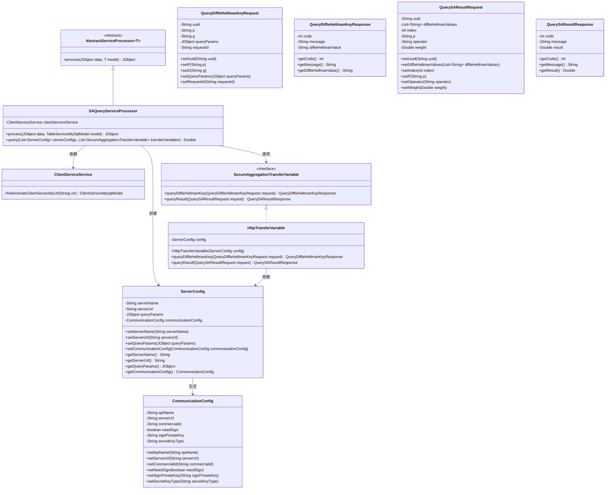
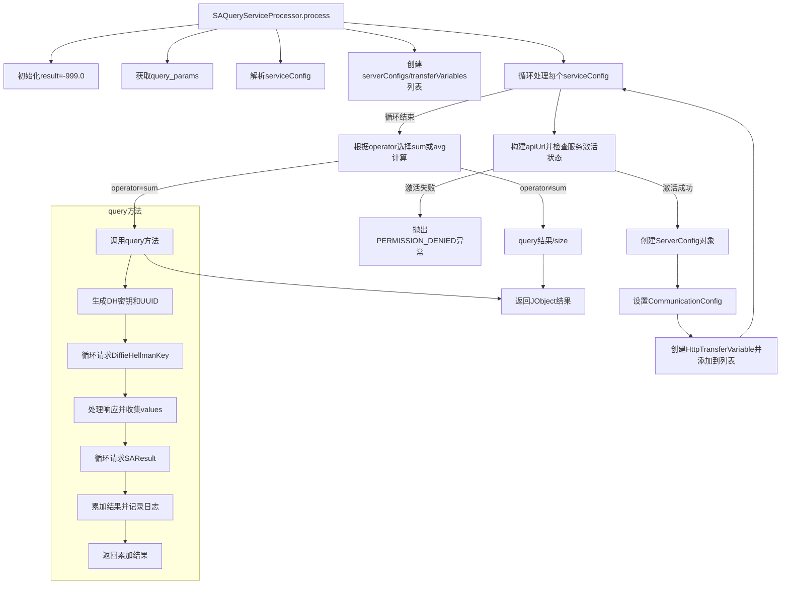

# 基础信息

|      |      |
|------|------|
| 名称 | SAQueryServiceProcessor |
| 编码语言 | .java |
| 代码路径 | WeFe/serving/serving-service/src/main/java/com/welab/wefe/serving/service/service_processor/SAQueryServiceProcessor.java |
| 包名 | com.welab.wefe.serving.service.service_processor |
| 依赖项 | ['com.alibaba.fastjson.JSONArray', 'com.alibaba.fastjson.JSONObject', 'com.welab.wefe.common.StatusCode', 'com.welab.wefe.common.exception.StatusCodeWithException', 'com.welab.wefe.common.util.JObject', 'com.welab.wefe.common.web.Launcher', 'com.welab.wefe.mpc.config.CommunicationConfig', 'com.welab.wefe.mpc.key.DiffieHellmanKey', 'com.welab.wefe.mpc.sa.request.QueryDiffieHellmanKeyRequest', 'com.welab.wefe.mpc.sa.request.QueryDiffieHellmanKeyResponse', 'com.welab.wefe.mpc.sa.request.QuerySAResultRequest', 'com.welab.wefe.mpc.sa.request.QuerySAResultResponse', 'com.welab.wefe.mpc.sa.sdk.config.ServerConfig', 'com.welab.wefe.mpc.sa.sdk.transfer.SecureAggregationTransferVariable', 'com.welab.wefe.mpc.sa.sdk.transfer.impl.HttpTransferVariable', 'com.welab.wefe.mpc.util.DiffieHellmanUtil', 'com.welab.wefe.serving.service.database.entity.ClientServiceMysqlModel', 'com.welab.wefe.serving.service.database.entity.TableServiceMySqlModel', 'com.welab.wefe.serving.service.service.ClientServiceService', 'java.util.ArrayList', 'java.util.LinkedList', 'java.util.List', 'java.util.UUID'] |
| 概述说明 | SAQueryServiceProcessor类处理安全聚合查询，验证服务配置后调用多个服务端API，使用Diffie-Hellman密钥交换确保安全，最终返回聚合结果（求和或平均值）。 |

# 说明

SAQueryServiceProcessor类继承自AbstractServiceProcessor，处理基于TableServiceMySqlModel的服务请求。它通过clientServiceService获取激活的客户端服务配置，构建ServerConfig和SecureAggregationTransferVariable列表。根据操作符sum或平均值计算查询结果，使用DiffieHellman密钥交换确保安全通信。query方法执行具体查询逻辑，包括密钥交换、结果请求和汇总，最终返回计算结果。整个过程包含错误处理和日志记录。

# 类列表 Class Summary

| 名称   | 类型  | 说明 |
|-------|------|-------------|
| SAQueryServiceProcessor | class | SAQueryServiceProcessor类处理安全聚合查询，验证服务配置并调用多个服务器进行数据查询和聚合，支持求和或平均值操作。使用Diffie-Hellman密钥交换确保通信安全。 |

## 类 SAQueryServiceProcessor

|      |      |
|------|------|
| 访问范围 | public |
| 类型 | class |
| 名称 | SAQueryServiceProcessor |
| 说明 | SAQueryServiceProcessor类处理安全聚合查询，验证服务配置并调用多个服务器进行数据查询和聚合，支持求和或平均值操作。使用Diffie-Hellman密钥交换确保通信安全。 |

### UML类图

这段代码实现了一个安全聚合查询服务处理器，主要功能是通过多个服务配置进行分布式查询，支持Diffie-Hellman密钥交换和安全聚合计算。类图展示了核心类之间的关系，包括抽象处理器、服务配置、通信协议和传输变量等组件，形成了一个完整的分布式安全查询处理体系。

### 内部方法调用关系图

该流程图描述了SAQueryServiceProcessor类的核心处理逻辑。process方法首先解析输入参数和服务配置，然后为每个服务端点创建通信配置和安全传输对象。根据操作符类型(sum/avg)选择不同的聚合计算方式，最终返回包含结果的JObject。query方法实现了安全聚合查询的核心流程，包括Diffie-Hellman密钥交换和分布式结果聚合两个阶段，确保数据传输的安全性。整个过程严格处理服务激活状态检查、参数验证和错误处理。

### 字段列表 Field List

| 名称  | 类型  | 说明 |
|-------|-------|------|
| clientServiceService = Launcher.getBean(ClientServiceService.class) | ClientServiceService | 代码通过Launcher获取ClientServiceService实例并赋值给私有常量clientServiceService。 |

### 方法列表

| 名称  | 类型  | 说明 |
|-------|-------|------|
| process | JObject | 处理JObject数据，验证服务配置并构建通信参数，根据操作符计算查询结果（求和或平均值），返回结果。 |
| query | Double | 方法query通过Diffie-Hellman密钥交换与多个服务器安全交互，汇总查询结果。首先生成DH密钥和UUID，向各服务器请求DH值，验证响应后再次请求计算结果，最终累加返回总和。 |

