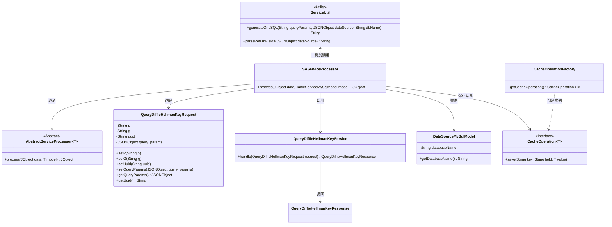
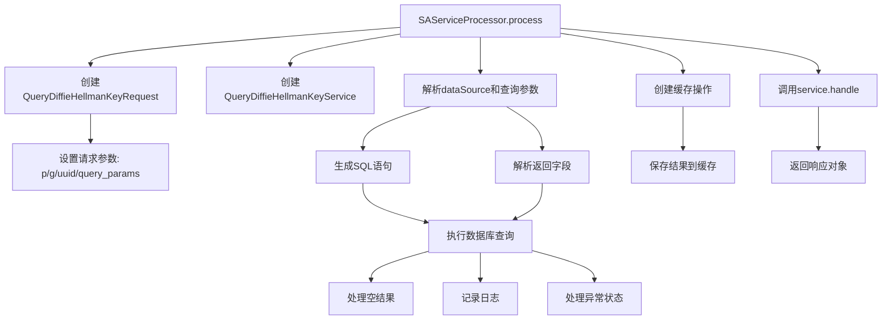

# 基础信息

|      |      |
|------|------|
| 名称 | SAServiceProcessor |
| 编码语言 | .java |
| 代码路径 | WeFe/serving/serving-service/src/main/java/com/welab/wefe/serving/service/service_processor/SAServiceProcessor.java |
| 包名 | com.welab.wefe.serving.service.service_processor |
| 依赖项 | ['java.util.Arrays', 'java.util.HashMap', 'java.util.Map', 'com.alibaba.fastjson.JSONObject', 'com.welab.wefe.common.exception.StatusCodeWithException', 'com.welab.wefe.common.util.JObject', 'com.welab.wefe.mpc.cache.intermediate.CacheOperation', 'com.welab.wefe.mpc.cache.intermediate.CacheOperationFactory', 'com.welab.wefe.mpc.commom.Constants', 'com.welab.wefe.mpc.sa.request.QueryDiffieHellmanKeyRequest', 'com.welab.wefe.mpc.sa.request.QueryDiffieHellmanKeyResponse', 'com.welab.wefe.mpc.sa.server.service.QueryDiffieHellmanKeyService', 'com.welab.wefe.serving.service.database.entity.DataSourceMySqlModel', 'com.welab.wefe.serving.service.database.entity.TableServiceMySqlModel', 'com.welab.wefe.serving.service.utils.ServiceUtil'] |
| 概述说明 | SAServiceProcessor类处理Diffie-Hellman密钥查询请求，通过数据源执行SQL并返回结果，结果存入缓存后返回响应。 |

# 说明

SAServiceProcessor类继承AbstractServiceProcessor，处理TableServiceMySqlModel类型数据。主要流程包括解析请求参数，生成SQL查询语句，执行数据源查询并处理结果。查询结果转换为Double类型后存入缓存，最后返回响应对象。过程中涉及异常处理和日志记录，确保数据查询与缓存操作的完整性。

# 类列表 Class Summary

| 名称   | 类型  | 说明 |
|-------|------|-------------|
| SAServiceProcessor | class | SAServiceProcessor类处理Diffie-Hellman密钥查询请求，从数据源获取SQL查询结果并缓存。 |

## 类 SAServiceProcessor

|      |      |
|------|------|
| 访问范围 | public |
| 类型 | class |
| 名称 | SAServiceProcessor |
| 说明 | SAServiceProcessor类处理Diffie-Hellman密钥查询请求，从数据源获取SQL查询结果并缓存。 |

### UML类图

这段代码描述了一个服务处理器SAServiceProcessor，它继承自AbstractServiceProcessor，主要处理Diffie-Hellman密钥查询请求。流程包括：解析请求参数、查询数据源、处理查询结果、缓存操作和返回响应。类图展示了处理器与请求/响应对象、数据源模型、缓存接口和工具类之间的关系，体现了完整的查询处理流程和组件协作方式。关键点在于数据源查询、结果缓存和异常处理机制的设计。

### 内部方法调用关系图

这段代码是SAServiceProcessor类的核心处理方法，主要完成Diffie-Hellman密钥查询服务的处理流程。首先构建请求对象并设置参数，然后通过数据源服务执行SQL查询，处理查询结果后将数据存入缓存，最后返回服务响应。整个过程包含参数解析、SQL生成、数据库操作、异常处理和缓存管理等关键步骤，实现了从请求到响应的完整业务逻辑处理链。

### 字段列表 Field List

| 名称  | 类型  | 说明 |
|-------|-------|------|

### 方法列表

| 名称  | 类型  | 说明 |
|-------|-------|------|
| process | JObject | 处理Diffie-Hellman密钥查询请求，设置参数并执行SQL查询，保存结果到缓存后返回响应。 |

