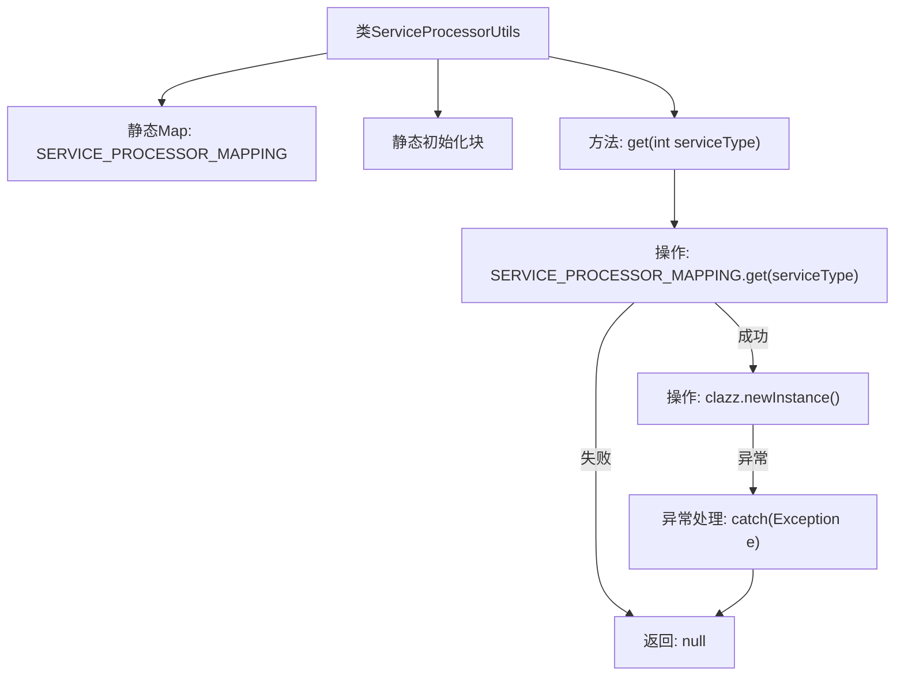

# 基础信息

|      |      |
|------|------|
| 名称 | ServiceProcessorUtils |
| 编码语言 | .java |
| 代码路径 | WeFe/serving/serving-service/src/main/java/com/welab/wefe/serving/service/service_processor/ServiceProcessorUtils.java |
| 包名 | com.welab.wefe.serving.service.service_processor |
| 依赖项 | ['com.welab.wefe.serving.service.enums.ServiceTypeEnum', 'java.util.HashMap', 'java.util.Map'] |
| 概述说明 | ServiceProcessorUtils类通过静态映射表关联服务类型与处理器类，提供根据类型获取对应处理器实例的方法。 |

# 说明

ServiceProcessorUtils类维护一个静态映射表SERVICE_PROCESSOR_MAPPING，将不同服务类型枚举值映射到对应的AbstractServiceProcessor子类。该映射表在静态初始化块中填充了7种服务类型与处理器类的对应关系，包括PSI、PIR、SA及其多版本变体。类提供了get方法，根据输入的服务类型代码返回对应的处理器实例，若实例化失败则返回null并打印异常。

# 类列表 Class Summary

| 名称   | 类型  | 说明 |
|-------|------|-------------|
| ServiceProcessorUtils | class | ServiceProcessorUtils类通过静态映射表将服务类型枚举与对应处理器类关联，提供根据类型获取处理器实例的方法。 |


## 类 ServiceProcessorUtils

|      |      |
|------|------|
| 访问范围 | public |
| 类型 | class |
| 名称 | ServiceProcessorUtils |
| 说明 | ServiceProcessorUtils类通过静态映射表将服务类型枚举与对应处理器类关联，提供根据类型获取处理器实例的方法。 |


### UML类图

```mermaid
classDiagram
    class ServiceProcessorUtils {
        -Map~Integer, Class~AbstractServiceProcessor~~ SERVICE_PROCESSOR_MAPPING
        +get(int serviceType) AbstractServiceProcessor
    }

    <<Interface>> ServiceTypeEnum {
        +PSI
        +PIR
        +SA
        +MULTI_SA
        +MULTI_PSI
        +MULTI_PIR
        +MachineLearning
    }

    class AbstractServiceProcessor {
        <<abstract>>
    }

    class PsiServiceProcessor
    class PirServiceProcessor
    class SAServiceProcessor
    class SAQueryServiceProcessor
    class MultiPsiServiceProcessor
    class MultiPirServiceProcessor
    class ModelServiceProcessor

    ServiceProcessorUtils --> ServiceTypeEnum : 依赖
    ServiceProcessorUtils --> AbstractServiceProcessor : 创建实例
    PsiServiceProcessor --|> AbstractServiceProcessor
    PirServiceProcessor --|> AbstractServiceProcessor
    SAServiceProcessor --|> AbstractServiceProcessor
    SAQueryServiceProcessor --|> AbstractServiceProcessor
    MultiPsiServiceProcessor --|> AbstractServiceProcessor
    MultiPirServiceProcessor --|> AbstractServiceProcessor
    ModelServiceProcessor --|> AbstractServiceProcessor
```

这段代码展示了一个服务处理器工具类`ServiceProcessorUtils`，它通过静态映射表将不同的服务类型枚举值映射到对应的处理器类。该工具类提供了根据服务类型获取相应处理器实例的功能，处理器类都继承自抽象基类`AbstractServiceProcessor`。类图清晰地展示了工具类与枚举、抽象处理器以及各具体处理器实现类之间的关系，体现了工厂模式的设计思想。


### 内部方法调用关系图



这段代码展示了一个服务处理器工具类，通过静态Map维护服务类型与处理器类的映射关系。静态初始化块预加载7种服务类型枚举对应的处理器类，get方法根据输入的服务类型动态实例化对应的处理器。流程图清晰呈现了类结构、初始化过程以及方法调用链，特别突出了异常处理路径和空返回情况。

### 字段列表 Field List

| 名称  | 类型  | 说明 |
|-------|-------|------|
| SERVICE_PROCESSOR_MAPPING = new HashMap<>() | Map<Integer, Class<? extends AbstractServiceProcessor>> | 静态Map映射整数键与服务处理器类。 |

### 方法列表

| 名称  | 类型  | 说明 |
|-------|-------|------|
| get | AbstractServiceProcessor | 静态方法根据serviceType获取对应的AbstractServiceProcessor实例，若失败返回null并打印异常。 |


