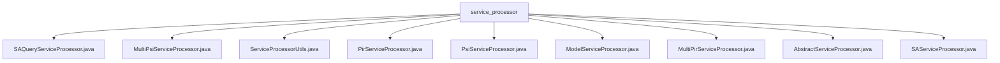

# 基础信息

|      |      |
|------|------|
| 名称 | service_processor |
| 编码语言 | .java |
| 代码路径 | WeFe/serving/serving-service/src/main/java/com/welab/wefe/serving/service/service_processor |
| 包名 | docs.serving.serving-service.src.main.java.com.welab.wefe.serving.service.service_processor |
| 概述说明 | SAQueryServiceProcessor处理安全聚合查询，使用DH密钥交换；MultiPsiServiceProcessor处理多客户端PSI查询；ServiceProcessorUtils维护服务类型映射；PirServiceProcessor处理私有信息检索；PsiServiceProcessor实现PSI服务核心功能；ModelServiceProcessor处理模型预测；MultiPirServiceProcessor处理多PIR请求；AbstractServiceProcessor是抽象基类；SAServiceProcessor执行SQL查询并缓存结果。 |

# 说明

## 概述  
该模块是面向隐私计算的服务处理框架，核心职责为统一处理多种安全计算请求（如PSI/PIR/SA），通过抽象处理器基类派生子类实现差异化逻辑。接口规范遵循AbstractServiceProcessor定义的process方法，输入JObject数据，返回JObject结果。关键数据结构包括ServerConfig（服务配置）、SecureAggregationTransferVariable（安全聚合变量）和CommunicationConfig（通信参数）。外部依赖涉及DiffieHellman密钥交换、HuackKeyService加密服务及MySQL/Doris数据库。例如SAQueryServiceProcessor实现安全求和计算，MultiPsiServiceProcessor支持多节点PSI查询。

## 主要业务场景  
模块支持三类典型场景：1）隐私集合求交（PSI），类似数据比对中间件，例如PsiServiceProcessor支持DH/ECDH协议；2）私有信息检索（PIR），如PirServiceProcessor通过OT协议实现ID匹配查询；3）安全聚合（SA），类似分布式计算框架，例如SAQueryServiceProcessor完成跨节点加密汇总。交互模式均采用"配置验证-参数构建-异步执行-结果聚合"流程，如MultiPirServiceProcessor遍历服务配置后合并结果。API集成案例包含批量预测（ModelServiceProcessor）和回调通知（PirServiceProcessor内部类MyCall）。

### 包内部结构视图

该流程图展示了service_processor目录下的9个Java文件，包括SAQueryServiceProcessor、MultiPsiServiceProcessor等处理器类文件，以及AbstractServiceProcessor抽象基类和ServiceProcessorUtils工具类。所有文件都直接隶属于service_processor目录，没有更深层级的子目录结构。

# 文件列表

| 名称   | 类型  | 说明 |
|-------|------|-------------|
| [SAQueryServiceProcessor.java](SAQueryServiceProcessor.md) | file | SAQueryServiceProcessor类处理安全聚合查询，验证服务配置后调用多个服务端API，使用Diffie-Hellman密钥交换确保安全，最终返回聚合结果（求和或平均值）。 |
| [MultiPsiServiceProcessor.java](MultiPsiServiceProcessor.md) | file | MultiPsiServiceProcessor类处理客户端ID和服务配置，验证服务激活状态并生成通信配置，通过PSI查询过滤结果并记录调用日志，最终返回匹配的客户端ID列表。 |
| [ServiceProcessorUtils.java](ServiceProcessorUtils.md) | file | ServiceProcessorUtils类通过静态映射表关联服务类型与处理器类，提供根据类型获取对应处理器实例的方法。 |
| [PirServiceProcessor.java](PirServiceProcessor.md) | file | PirServiceProcessor类处理PIR请求，根据OT方法选择不同服务处理，查询数据源并缓存结果，支持回调通知。 |
| [PsiServiceProcessor.java](PsiServiceProcessor.md) | file | PsiServiceProcessor类处理私有集交集服务，支持DH和ECDH算法，管理数据批次处理，结果保存及查询，支持MySQL和Doris数据库。 |
| [ModelServiceProcessor.java](ModelServiceProcessor.md) | file | ModelServiceProcessor处理模型预测请求，检查模型状态后支持批量或单条预测，返回JSON格式结果。 |
| [MultiPirServiceProcessor.java](MultiPirServiceProcessor.md) | file | MultiPirServiceProcessor类处理多PIR服务请求，解析配置并调用查询，记录日志后返回结果。 |
| [AbstractServiceProcessor.java](AbstractServiceProcessor.md) | file | 抽象服务处理器类，包含日志记录、数据源服务和调用日志管理功能，支持处理泛型数据和添加两种类型的调用日志。 |
| [SAServiceProcessor.java](SAServiceProcessor.md) | file | SAServiceProcessor类处理Diffie-Hellman密钥查询请求，通过数据源执行SQL并返回结果，结果存入缓存后返回响应。 |

