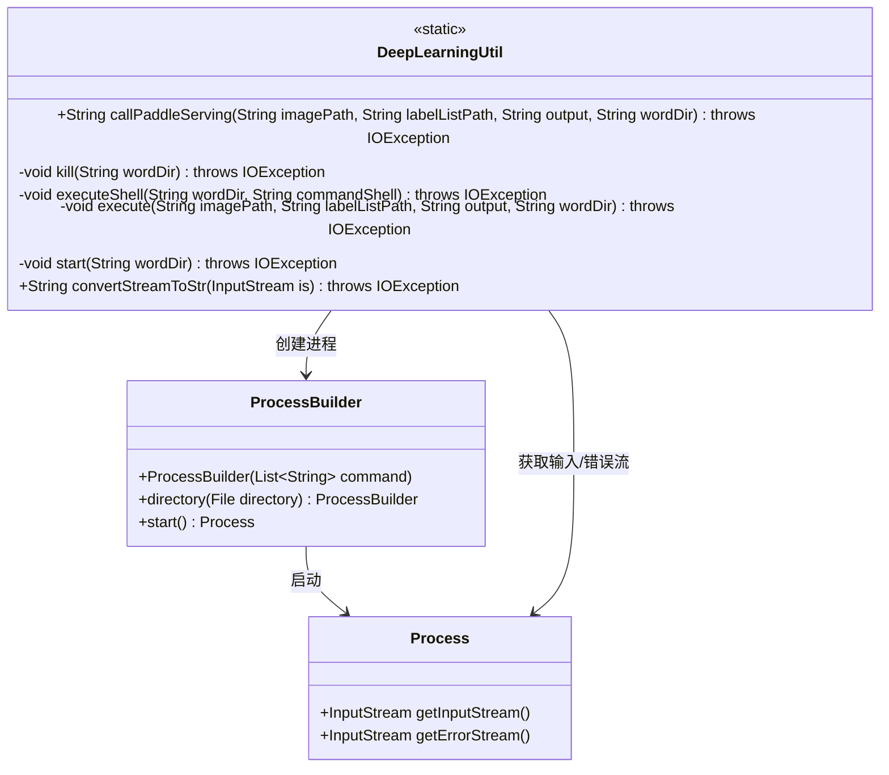
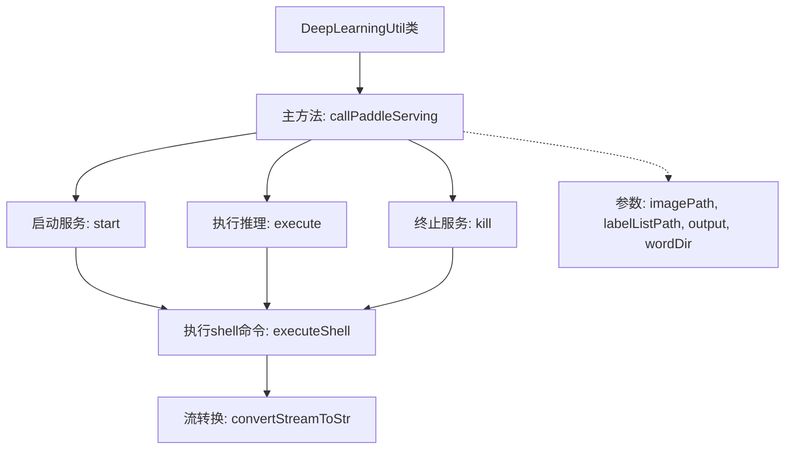

# 基础信息

|      |      |
|------|------|
| 名称 | DeepLearningUtil |
| 编码语言 | .java |
| 代码路径 | WeFe/serving/serving-service/src/main/java/com/welab/wefe/serving/service/utils/DeepLearningUtil.java |
| 包名 | com.welab.wefe.serving.service.utils |
| 依赖项 | ['org.apache.commons.compress.utils.Lists', 'java.io', 'java.util.List'] |
| 概述说明 | DeepLearningUtil类提供调用PaddleServing的方法，包含启动服务、执行命令和终止服务的功能，通过shell脚本操作并处理输入输出流。 |

# 说明

DeepLearningUtil类提供了调用PaddleServing服务的功能。主要方法callPaddleServing依次执行启动服务、处理请求和终止服务三个步骤。通过executeShell方法执行shell命令，使用ProcessBuilder启动进程并处理输出流。convertStreamToStr方法将输入流转换为字符串。整个过程涉及服务器启动脚本、客户端执行脚本和终止脚本的调用，并支持指定工作目录和参数传递。

# 类列表 Class Summary

| 名称   | 类型  | 说明 |
|-------|------|-------------|
| DeepLearningUtil | class | DeepLearningUtil类提供调用PaddleServing的方法，包含启动服务、执行命令和关闭服务功能，通过shell脚本操作并处理输入输出流。 |

## 类 DeepLearningUtil

|      |      |
|------|------|
| 访问范围 | public |
| 类型 | class |
| 名称 | DeepLearningUtil |
| 说明 | DeepLearningUtil类提供调用PaddleServing的方法，包含启动服务、执行命令和关闭服务功能，通过shell脚本操作并处理输入输出流。 |

### UML类图

类图描述：
DeepLearningUtil 是一个工具类，提供了调用 Paddle Serving 深度学习服务的静态方法。核心功能包括启动服务进程(callPaddleServing)、执行命令(executeShell)和流数据转换(convertStreamToStr)。该类通过 ProcessBuilder 创建操作系统进程，并与 Process 类交互获取进程的输入/错误流。私有方法实现了服务生命周期管理（start/execute/kill），所有方法都可能抛出 IOException。整个设计采用分层调用结构，上层方法依赖底层 shell 命令执行能力。

### 内部方法调用关系图

这段代码流程图展示了DeepLearningUtil类的工作流程，主要描述了调用PaddleServing服务的完整生命周期。从启动服务(start)开始，通过执行推理任务(execute)，最后终止服务(kill)，所有步骤都通过executeShell方法执行具体的shell命令，并将进程输出流通过convertStreamToStr方法转换为字符串。整个流程严格遵循服务调用顺序，并处理了命令执行和流转换的细节。

### 字段列表 Field List

| 名称  | 类型  | 说明 |
|-------|-------|------|

### 方法列表

| 名称  | 类型  | 说明 |
|-------|-------|------|
| kill | void | 该方法通过执行shell脚本终止服务，需传入工作目录路径，可能抛出IO异常。 |
| executeShell | void | Java方法通过ProcessBuilder执行Shell命令，设置工作目录并处理输出流。 |
| start | void | 私有静态方法start，接收wordDir参数，调用executeShell执行start_server.sh脚本，可能抛出IOException。 |
| execute | void | 该方法执行一个shell脚本，传入图片路径、标签列表路径和输出路径作为参数，并在指定工作目录下运行。 |
| callPaddleServing | String | 调用PaddleServing服务，启动后执行处理并返回空字符串。包含启动、执行和终止操作。 |
| convertStreamToStr | String | 将输入流转换为UTF-8字符串，使用缓冲区读取数据，异常处理并确保流关闭，空流返回空字符串。 |

