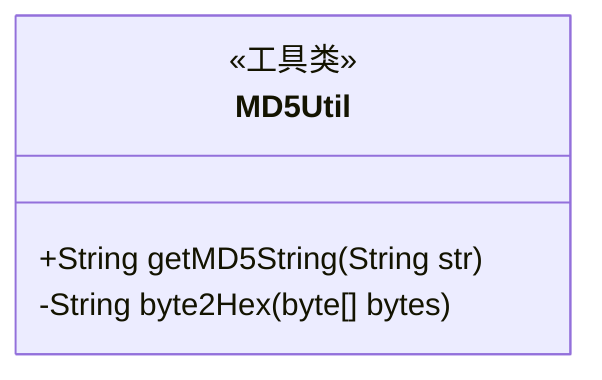
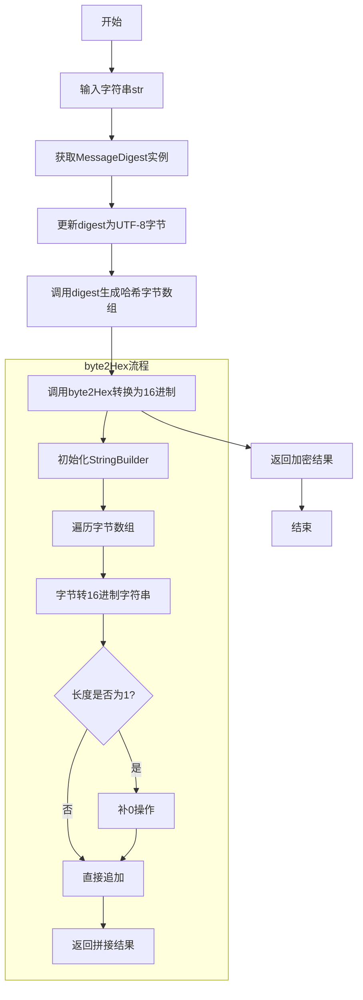
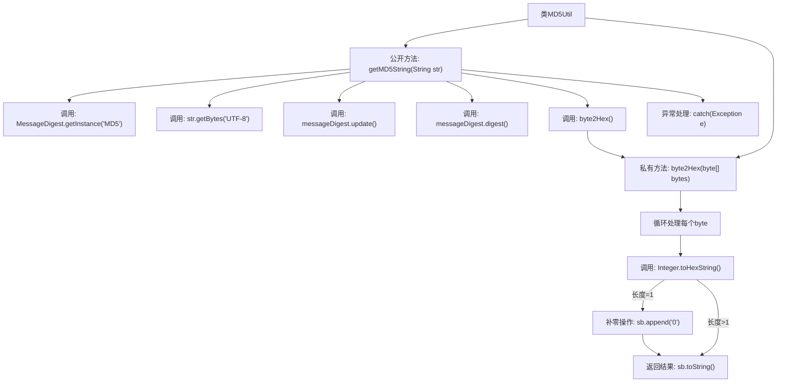

# 基础信息

|      |      |
|------|------|
| 名称 | MD5Util |
| 编码语言 | .java |
| 代码路径 | WeFe/serving/serving-service/src/main/java/com/welab/wefe/serving/service/utils/MD5Util.java |
| 包名 | com.welab.wefe.serving.service.utils |
| 依赖项 | ['java.security.MessageDigest'] |
| 概述说明 | MD5Util类提供MD5加密功能，包含getMD5String方法进行字符串加密和byte2Hex方法将字节转为16进制字符串。 |

# 说明

这是一个名为MD5Util的Java工具类，提供MD5加密功能。类中包含两个方法：getMD5String方法接收字符串参数，使用Java原生MessageDigest类实现MD5加密，处理过程中指定UTF-8编码，并通过byte2Hex方法将结果转为16进制字符串返回；byte2Hex是私有方法，将字节数组转换为16进制字符串表示，确保每个字节转换为两位16进制数，不足位时补零。异常情况下会打印堆栈信息但不会中断程序执行。

# 类列表 Class Summary

| 名称   | 类型  | 说明 |
|-------|------|-------------|
| MD5Util | class | MD5Util类提供MD5加密功能，包含getMD5String方法进行UTF-8编码的MD5加密，以及byte2Hex私有方法将byte数组转为16进制字符串。 |

## 类 MD5Util

|      |      |
|------|------|
| 访问范围 | public |
| 类型 | class |
| 名称 | MD5Util |
| 说明 | MD5Util类提供MD5加密功能，包含getMD5String方法进行UTF-8编码的MD5加密，以及byte2Hex私有方法将byte数组转为16进制字符串。 |

### UML类图

该代码实现了一个MD5加密工具类，核心功能是将输入字符串通过MessageDigest进行MD5哈希计算，再将生成的字节数组转换为16进制字符串表示。类图显示这是一个无状态的工具类，包含公开的加密方法和私有的字节转换方法。流程图详细描述了主加密流程和字节转换子流程，其中特别注意了单字符十六进制值的补零处理，确保输出格式的统一性。整个设计符合工具类的典型特征，具有单一职责和静态方法调用特性。

### 内部方法调用关系图

这段代码流程图展示了MD5Util工具类的核心逻辑。主流程从getMD5String方法开始，通过MessageDigest实现MD5加密，将输入字符串转为字节数组后生成哈希值，再调用byte2Hex方法将字节数组转换为16进制字符串。byte2Hex方法内部通过循环处理每个字节，使用位运算和补零操作确保输出标准的32位MD5字符串。整个过程包含异常处理机制，确保在加密失败时打印错误信息。

### 字段列表 Field List

| 名称  | 类型  | 说明 |
|-------|-------|------|

### 方法列表

| 名称  | 类型  | 说明 |
|-------|-------|------|
| byte2Hex | String | 将字节数组转换为十六进制字符串，单字节补零后拼接返回。 |
| getMD5String | String | 静态方法getMD5String接收字符串参数，使用MD5算法生成哈希值并返回十六进制字符串，异常时打印堆栈。 |

