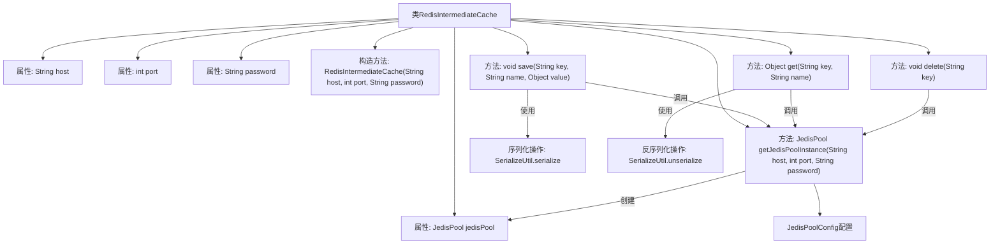

# 基础信息

|      |      |
|------|------|
| 名称 | RedisIntermediateCache |
| 编码语言 | .java |
| 代码路径 | WeFe/serving/serving-service/src/main/java/com/welab/wefe/serving/service/utils/RedisIntermediateCache.java |
| 包名 | com.welab.wefe.serving.service.utils |
| 依赖项 | ['org.apache.commons.lang3.StringUtils', 'org.slf4j.Logger', 'org.slf4j.LoggerFactory', 'com.welab.wefe.mpc.cache.intermediate.CacheOperation', 'redis.clients.jedis.Jedis', 'redis.clients.jedis.JedisPool', 'redis.clients.jedis.JedisPoolConfig'] |
| 概述说明 | Redis缓存操作类，使用JedisPool管理连接，支持保存、获取和删除数据，线程安全且带日志记录。 |

# 说明

RedisIntermediateCache类实现了CacheOperation接口，用于操作Redis缓存。该类通过JedisPool管理Redis连接，支持主机、端口和密码配置。使用双重检查锁定确保线程安全的JedisPool单例初始化，并配置连接池参数如最大空闲连接数等。提供了save、get和delete方法，分别用于序列化存储对象、反序列化获取对象和删除键值，所有操作均通过Jedis连接池获取资源并记录日志。异常处理完善，错误信息通过日志记录并抛出。

# 类列表 Class Summary

| 名称   | 类型  | 说明 |
|-------|------|-------------|
| RedisIntermediateCache | class | RedisIntermediateCache类实现缓存操作，通过JedisPool管理Redis连接，支持保存、获取和删除数据，包含连接池配置和异常处理。 |


## 类 RedisIntermediateCache

|      |      |
|------|------|
| 访问范围 | public |
| 类型 | class |
| 名称 | RedisIntermediateCache |
| 说明 | RedisIntermediateCache类实现缓存操作，通过JedisPool管理Redis连接，支持保存、获取和删除数据，包含连接池配置和异常处理。 |


### UML类图

```mermaid
classDiagram
    class RedisIntermediateCache {
        -JedisPool jedisPool
        -String host
        -int port
        -String password
        +RedisIntermediateCache(String host, int port, String password)
        +JedisPool getJedisPoolInstance(String host, int port, String password)
        +void save(String key, String name, Object value)
        +Object get(String key, String name)
        +void delete(String key)
    }

    <<Interface>> CacheOperation {
        +void save(String key, String name, Object value)
        +Object get(String key, String name)
        +void delete(String key)
    }

    class JedisPool {
        +Jedis getResource()
        +void close()
    }

    class Jedis {
        +void set(byte[] key, byte[] value)
        +byte[] get(byte[] key)
        +void del(byte[] key)
    }

    class SerializeUtil {
        +byte[] serialize(Object obj)
        +Object unserialize(byte[] bytes)
    }

    RedisIntermediateCache ..|> CacheOperation : 实现
    RedisIntermediateCache --> JedisPool : 使用
    JedisPool --> Jedis : 创建
    RedisIntermediateCache --> SerializeUtil : 使用
```

这段代码展示了一个基于Redis的中间缓存实现类RedisIntermediateCache，它实现了CacheOperation接口，提供了保存、获取和删除缓存数据的功能。该类通过JedisPool管理Redis连接，使用双重检查锁定确保线程安全的连接池初始化，并通过SerializeUtil进行对象的序列化和反序列化操作。整个设计体现了对连接资源的高效管理和异常处理机制。


### 内部方法调用关系图



这段代码实现了一个基于Redis的中间缓存类，通过Jedis连接池管理Redis连接。流程图展示了类结构和核心方法调用关系，包括构造方法初始化连接参数、双重检查锁实现连接池单例创建、以及save/get/delete三个核心缓存操作方法。所有操作都通过连接池获取资源，并包含异常处理和日志记录功能，其中save/get方法涉及对象的序列化和反序列化操作。

### 字段列表 Field List

| 名称  | 类型  | 说明 |
|-------|-------|------|
| LOG = LoggerFactory.getLogger(RedisIntermediateCache.class) | Logger | RedisIntermediateCache类中定义了一个受保护的静态final日志对象LOG。 |
| host | String | 私有字符串变量host，用于存储主机信息。 |
| jedisPool = null | JedisPool | 声明一个私有JedisPool变量jedisPool，初始值为null。 |
| port | int | 私有整型变量port，用于存储端口号。 |
| password | String | 私有字符串类型变量password。 |

### 方法列表

| 名称  | 类型  | 说明 |
|-------|-------|------|
| get | Object | 方法get从Redis获取数据。若连接池为空则初始化。通过连接池获取Jedis实例，拼接键名查询数据。若数据为空返回null，否则反序列化返回。异常时记录日志并抛出。 |
| getJedisPoolInstance | JedisPool | 这是一个单例模式实现的JedisPool获取方法，通过双重检查锁确保线程安全，支持带密码和不带密码两种初始化方式，配置了连接池参数如最大空闲数、最大连接数等。 |
| save | void | 该方法用于将对象序列化后存入Redis。若连接池未初始化则创建，获取连接后序列化value并存储为字节数组，键名为name和key的组合。异常时记录日志并抛出，成功时记录操作信息。 |
| delete | void | 该方法用于删除Redis中的指定键。若连接池未初始化则先创建。从连接池获取连接并执行删除操作，捕获异常并记录日志，最后记录删除操作信息。 |


