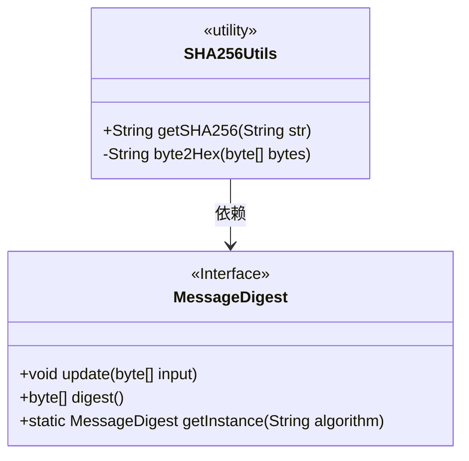
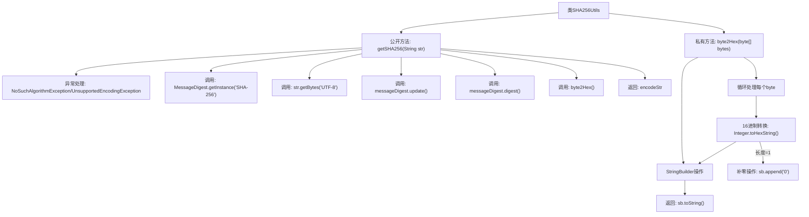

# 基础信息

|      |      |
|------|------|
| 名称 | SHA256Utils |
| 编码语言 | .java |
| 代码路径 | WeFe/serving/serving-service/src/main/java/com/welab/wefe/serving/service/utils/SHA256Utils.java |
| 包名 | com.welab.wefe.serving.service.utils |
| 依赖项 | ['java.io.UnsupportedEncodingException', 'java.security.MessageDigest', 'java.security.NoSuchAlgorithmException'] |
| 概述说明 | SHA256Utils类提供SHA256加密功能，通过MessageDigest实现字符串加密，并将结果转为16进制字符串。 |

# 说明

该内容描述了一个名为SHA256Utils的Java工具类，主要用于实现SHA-256加密功能。类中包含两个方法：getSHA256方法接收字符串参数，使用Java原生MessageDigest类进行SHA-256加密处理，并将结果转换为16进制字符串返回；byte2Hex私有方法用于将字节数组转换为16进制字符串表示形式，确保每个字节都以两位16进制数显示。该工具类处理了可能的异常情况，如不支持的算法或编码格式。

# 类列表 Class Summary

| 名称   | 类型  | 说明 |
|-------|------|-------------|
| SHA256Utils | class | SHA256Utils类提供SHA256加密功能，通过MessageDigest实现字符串加密，并将结果转为16进制字符串。 |

## 类 SHA256Utils

|      |      |
|------|------|
| 访问范围 | public |
| 类型 | class |
| 名称 | SHA256Utils |
| 说明 | SHA256Utils类提供SHA256加密功能，通过MessageDigest实现字符串加密，并将结果转为16进制字符串。 |

### UML类图

类图描述：SHA256Utils是一个工具类，提供SHA-256加密功能。它依赖于Java原生接口MessageDigest来实现加密操作。主要包含两个方法：公有方法getSHA256用于对外提供加密服务，私有方法byte2Hex用于内部字节到十六进制的转换。MessageDigest接口提供了基础的加密操作功能。

### 内部方法调用关系图

这段代码流程图展示了SHA256Utils工具类的完整加密流程。主要包含两个核心方法：getSHA256负责主加密流程，通过MessageDigest实现SHA-256算法；byte2Hex将字节数组转换为16进制字符串，处理过程中会对单字符进行补零操作。流程图清晰呈现了从算法初始化、数据更新、摘要计算到格式转换的完整调用链，以及异常处理路径，体现了加密过程中各环节的严格数据转换逻辑。

### 字段列表 Field List

| 名称  | 类型  | 说明 |
|-------|-------|------|

### 方法列表

| 名称  | 类型  | 说明 |
|-------|-------|------|
| byte2Hex | String | 将字节数组转换为十六进制字符串，单字节补零后拼接返回。 |
| getSHA256 | String | Java方法：使用SHA-256算法对输入字符串进行加密，返回十六进制格式的哈希值。异常时打印错误并返回空字符串。 |

