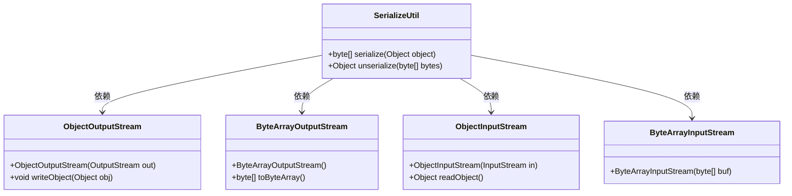

# 基础信息

|      |      |
|------|------|
| 名称 | SerializeUtil |
| 编码语言 | .java |
| 代码路径 | WeFe/serving/serving-service/src/main/java/com/welab/wefe/serving/service/utils/SerializeUtil.java |
| 包名 | com.welab.wefe.serving.service.utils |
| 依赖项 | ['java.io.ByteArrayInputStream', 'java.io.ByteArrayOutputStream', 'java.io.ObjectInputStream', 'java.io.ObjectOutputStream'] |
| 概述说明 | SerializeUtil类提供序列化和反序列化方法，将对象转为字节数组或反之，异常时返回null。 |

# 说明

SerializeUtil是一个提供对象序列化与反序列化功能的工具类。它包含两个静态方法：serialize方法将任意对象序列化为字节数组，通过ObjectOutputStream和ByteArrayOutputStream实现；unserialize方法将字节数组反序列化为原始对象，使用ByteArrayInputStream和ObjectInputStream完成。两个方法均捕获异常但不处理，出错时返回null。该类实现了Java对象与二进制数据的相互转换功能。

# 类列表 Class Summary

| 名称   | 类型  | 说明 |
|-------|------|-------------|
| SerializeUtil | class | SerializeUtil类提供序列化和反序列化方法，将对象转为字节数组或反向转换，异常时返回null。 |

## 类 SerializeUtil

|      |      |
|------|------|
| 访问范围 | public |
| 类型 | class |
| 名称 | SerializeUtil |
| 说明 | SerializeUtil类提供序列化和反序列化方法，将对象转为字节数组或反向转换，异常时返回null。 |

### UML类图

该代码展示了一个序列化工具类`SerializeUtil`，包含`serialize`和`unserialize`两个静态方法，分别用于对象序列化和反序列化。序列化过程依赖`ObjectOutputStream`和`ByteArrayOutputStream`将对象转换为字节数组，反序列化则通过`ObjectInputStream`和`ByteArrayInputStream`将字节数组还原为对象。类图清晰地展示了工具类与Java IO流类之间的依赖关系，体现了对象序列化的核心流程。

### 内部方法调用关系图

这段代码展示了一个用于对象序列化和反序列化的工具类。流程图清晰地描述了两个核心方法的工作流程：serialize方法通过字节数组输出流和对象输出流将对象转换为字节数组，unserialize方法则通过字节数组输入流和对象输入流将字节数组恢复为原始对象。两个方法都包含异常处理逻辑（图中未展开），但遇到异常时会返回null。整个流程体现了Java标准序列化机制的核心操作步骤。

### 字段列表 Field List

| 名称  | 类型  | 说明 |
|-------|-------|------|

### 方法列表

| 名称  | 类型  | 说明 |
|-------|-------|------|
| unserialize | Object | Java反序列化方法，将字节数组转为对象，异常时返回null。 |
| serialize | byte[] | 将对象序列化为字节数组，使用ObjectOutputStream和ByteArrayOutputStream实现，异常时返回null。 |

