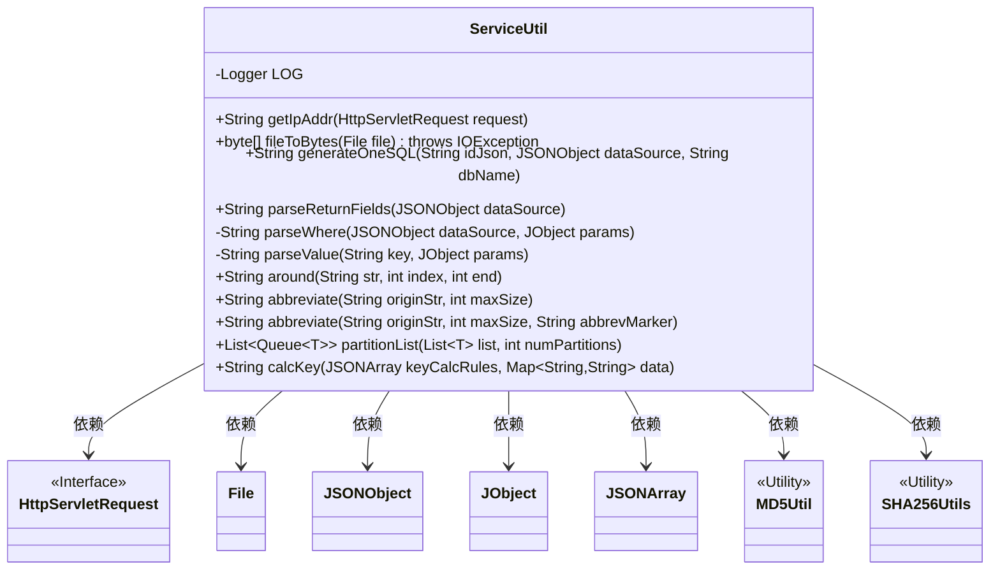
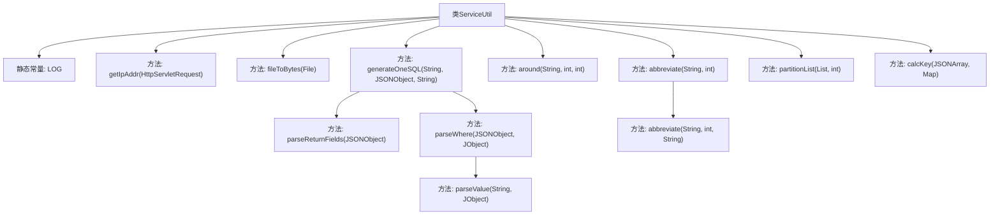
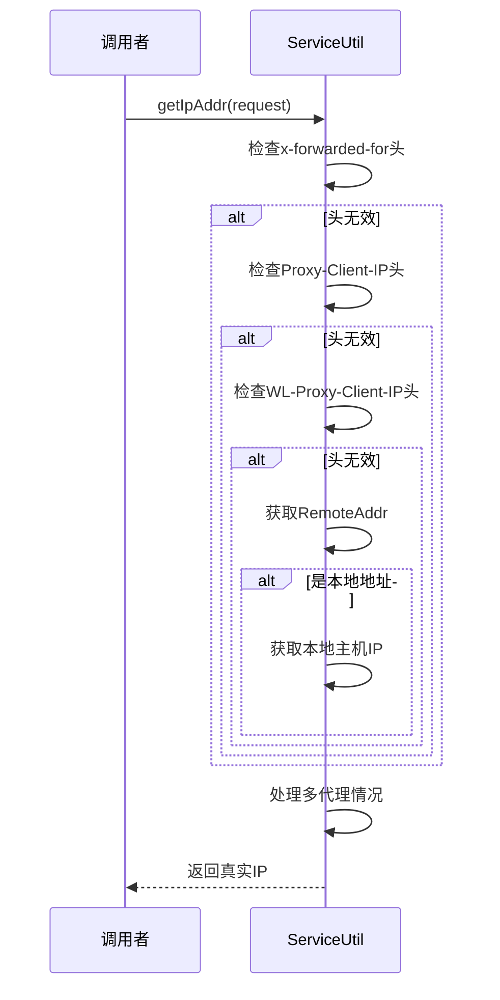

# 基础信息

|      |      |
|------|------|
| 名称 | ServiceUtil |
| 编码语言 | .java |
| 代码路径 | WeFe/serving/serving-service/src/main/java/com/welab/wefe/serving/service/utils/ServiceUtil.java |
| 包名 | com.welab.wefe.serving.service.utils |
| 依赖项 | ['java.io.ByteArrayOutputStream', 'java.io.File', 'java.io.FileInputStream', 'java.io.IOException', 'java.net.InetAddress', 'java.net.UnknownHostException', 'java.util.ArrayDeque', 'java.util.ArrayList', 'java.util.Iterator', 'java.util.List', 'java.util.Map', 'java.util.Queue', 'javax.servlet.http.HttpServletRequest', 'org.apache.commons.lang3.StringUtils', 'org.slf4j.Logger', 'org.slf4j.LoggerFactory', 'com.alibaba.fastjson.JSONArray', 'com.alibaba.fastjson.JSONObject', 'com.google.common.base.Preconditions', 'com.welab.wefe.common.util.JObject'] |
| 概述说明 | ServiceUtil工具类提供多种功能：获取客户端IP、文件转字节数组、生成SQL查询、字段解析、字符串脱敏处理、分片列表及密钥计算。 |

# 说明

ServiceUtil是一个工具类，提供多种实用方法。主要功能包括：获取客户端IP地址，处理代理和本地地址；将文件转换为字节数组；生成SQL查询语句，解析返回字段和条件；字符串处理，如部分隐藏、截断省略；列表分片；基于规则计算键值，支持MD5和SHA256加密。类中包含详细的异常处理和资源管理。

# 类列表 Class Summary

| 名称   | 类型  | 说明 |
|-------|------|-------------|
| ServiceUtil | class | ServiceUtil类提供多种工具方法：获取客户端IP、文件转字节数组、生成SQL查询、字符串脱敏处理、列表分片及键值计算等实用功能。 |

## 类 ServiceUtil

|      |      |
|------|------|
| 访问范围 | public |
| 类型 | class |
| 名称 | ServiceUtil |
| 说明 | ServiceUtil类提供多种工具方法：获取客户端IP、文件转字节数组、生成SQL查询、字符串脱敏处理、列表分片及键值计算等实用功能。 |

### UML类图

这段类图展示了ServiceUtil工具类的结构及其依赖关系。ServiceUtil是一个包含多种实用方法的工具类，主要功能包括：获取客户端IP地址、文件转字节数组、SQL语句生成、字符串处理（脱敏/截断）、集合分片以及密钥计算等。该类依赖于HttpServletRequest接口处理网络请求，使用JSONObject/JObject/JSONArray处理JSON数据，并调用MD5Util/SHA256Utils进行加密运算。所有方法均为静态方法，体现了工具类的无状态特性。

### 内部方法调用关系图

流程图展示了ServiceUtil类的结构，包含日志记录器和多个实用方法，如IP地址获取、文件转字节数组、SQL生成、字符串处理等。时序图详细描述了getIpAddr方法的调用流程，通过检查多个HTTP头逐步确定客户端真实IP地址，最后处理多代理情况并返回结果。

### 字段列表 Field List

| 名称  | 类型  | 说明 |
|-------|-------|------|
| LOG = LoggerFactory.getLogger(ServiceUtil.class) | Logger | 声明ServiceUtil类的静态常量LOG，用于日志记录。 |

### 方法列表

| 名称  | 类型  | 说明 |
|-------|-------|------|
| abbreviate | String | 静态方法abbreviate接收字符串originStr和整数maxSize，调用同名方法并传入null作为第三个参数。 |
| around | String | 方法around处理字符串：若str为空返回空；否则取str前index字符，拼接后end字符（不足用*填充并移除开头三个*）。 |
| generateOneSQL | String | 该方法根据输入参数生成SQL查询语句，从指定数据库表中查询单条记录。它拼接表名、返回字段和条件，最终返回格式为"SELECT 字段 FROM 表名 WHERE 条件 LIMIT 1"的SQL字符串。 |
| parseReturnFields | String | 解析JSON数据中的返回字段，若无字段则返回"*"，否则拼接字段名以逗号分隔。 |
| getIpAddr | String | Java方法获取客户端IP地址，依次检查x-forwarded-for、Proxy-Client-IP、WL-Proxy-Client-IP等请求头，若为空则取remoteAddr，处理本地地址和多代理情况。 |
| fileToBytes | byte[] | 将文件内容读取为字节数组，使用文件输入流和字节数组输出流处理数据，确保资源关闭，异常时抛出IO异常。 |
| parseValue | String | 解析键值：若参数为空返回带#的键，否则返回键对应的字符串值。 |
| parseWhere | String | 解析JSON条件生成SQL WHERE子句。若无条件返回1=1，否则遍历条件字段，拼接字段名、运算符和参数值，最后添加逻辑运算符。 |
| abbreviate | String | 该方法用于截断字符串，若超长则在末尾添加省略标记。参数为原字符串、最大长度和省略标记（默认"..."）。空字符串直接返回，不足长度则返回原串。 |
| partitionList | List<Queue<T>> | 将列表按分区数均分到多个队列，空列表或非正分区数抛出异常。 |
| calcKey | String | 该方法根据规则计算键值：遍历规则数组，拼接指定字段值，按操作符进行MD5、SHA256或原样处理，最终返回拼接结果。 |

