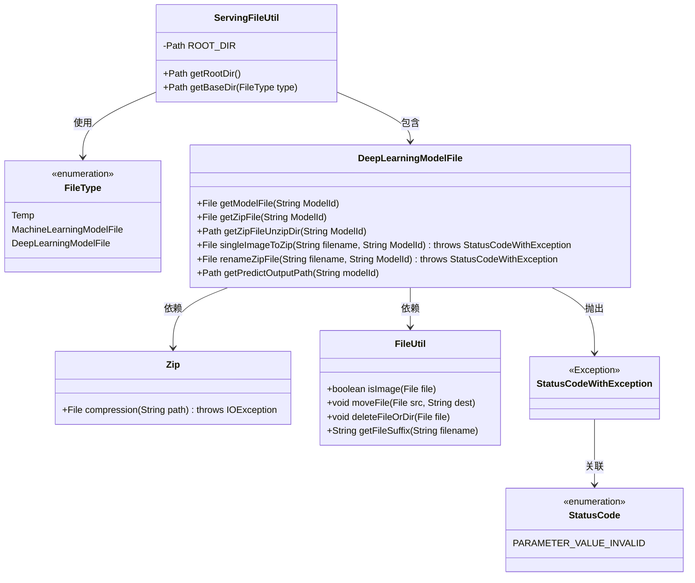
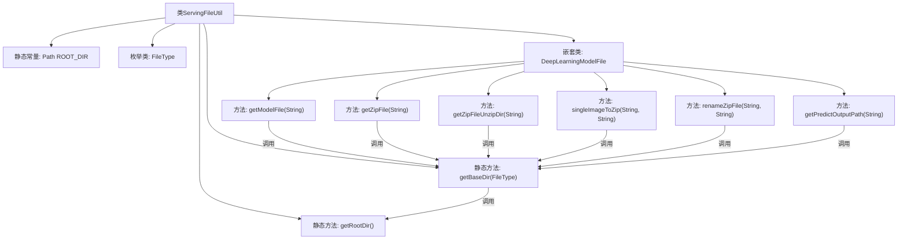

# 基础信息

|      |      |
|------|------|
| 名称 | ServingFileUtil |
| 编码语言 | .java |
| 代码路径 | WeFe/serving/serving-service/src/main/java/com/welab/wefe/serving/service/utils/ServingFileUtil.java |
| 包名 | com.welab.wefe.serving.service.utils |
| 依赖项 | ['com.welab.wefe.common.StatusCode', 'com.welab.wefe.common.exception.StatusCodeWithException', 'com.welab.wefe.common.file.compression.impl.Zip', 'com.welab.wefe.common.util.FileUtil', 'com.welab.wefe.common.util.StringUtil', 'com.welab.wefe.common.web.Launcher', 'com.welab.wefe.serving.service.config.Config', 'java.io.File', 'java.io.IOException', 'java.nio.file.Path', 'java.nio.file.Paths'] |
| 概述说明 | ServingFileUtil类提供文件路径管理功能，包括获取根目录、按类型分类目录（临时、机器学习模型、深度学习模型），支持深度学习模型文件的压缩、解压、重命名及预测结果输出路径处理。 |

# 说明

ServingFileUtil是一个文件服务工具类，提供文件路径管理和操作功能。它定义了根目录ROOT_DIR，通过getRootDir方法获取。getBaseDir方法根据FileType枚举（Temp、MachineLearningModelFile、DeepLearningModelFile）生成对应子目录路径。DeepLearningModelFile嵌套类专门处理深度学习模型文件，包括获取模型文件路径、ZIP文件路径、解压目录路径，以及单图片转ZIP、重命名ZIP文件、预测结果输出路径等功能。其中包含文件类型检查、异常处理和文件操作逻辑。

# 类列表 Class Summary

| 名称   | 类型  | 说明 |
|-------|------|-------------|
| ServingFileUtil | class | ServingFileUtil类提供文件管理功能，包括获取根目录、按类型分类路径、处理深度学习模型文件（如压缩、重命名、预测输出路径）等。支持临时文件、机器学习和深度学习模型文件类型。 |

## 类 ServingFileUtil

|      |      |
|------|------|
| 访问范围 | public |
| 类型 | class |
| 名称 | ServingFileUtil |
| 说明 | ServingFileUtil类提供文件管理功能，包括获取根目录、按类型分类路径、处理深度学习模型文件（如压缩、重命名、预测输出路径）等。支持临时文件、机器学习和深度学习模型文件类型。 |

### UML类图

该代码实现了一个文件服务工具类，主要功能包括获取文件存储根目录、按类型分类存储路径、深度学习模型文件处理等。核心类ServingFileUtil通过FileType枚举管理不同文件类型，其内部类DeepLearningModelFile提供了模型文件压缩、重命名、预测输出路径等具体操作。代码依赖FileUtil进行文件操作，使用Zip类进行压缩，并通过StatusCodeWithException处理异常情况。整体设计采用静态工具类模式，便于直接调用文件操作方法。

### 内部方法调用关系图

这段代码定义了一个文件服务工具类ServingFileUtil，主要用于管理不同类型文件的存储路径和操作。核心功能包括获取根目录路径(ROOT_DIR)、根据文件类型生成基础路径(getBaseDir)，以及针对深度学习模型文件的专门处理方法。嵌套类DeepLearningModelFile提供了模型文件获取、压缩包处理、重命名和预测结果路径生成等功能，所有方法都基于getBaseDir构建具体路径。代码通过枚举FileType区分文件存储类型，确保不同类型文件存放在不同目录下，同时包含严格的文件格式校验和异常处理机制。

### 字段列表 Field List

| 名称  | 类型  | 说明 |
|-------|-------|------|
| ROOT_DIR = Paths.get(Launcher.getBean(Config.class).getFileUploadDir()) | Path | 代码定义ROOT_DIR为文件上传目录路径，通过Config类配置获取。 |

### 方法列表

| 名称  | 类型  | 说明 |
|-------|-------|------|
| getRootDir | Path | 获取根目录路径的静态方法，直接返回ROOT_DIR常量。 |
| getBaseDir | Path | 静态方法getBaseDir根据文件类型返回基础路径，将类型名转为下划线小写格式后拼接至根目录路径。 |

