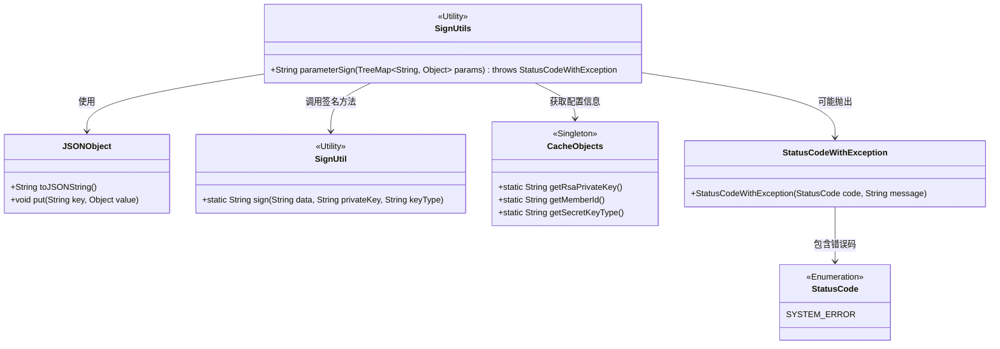
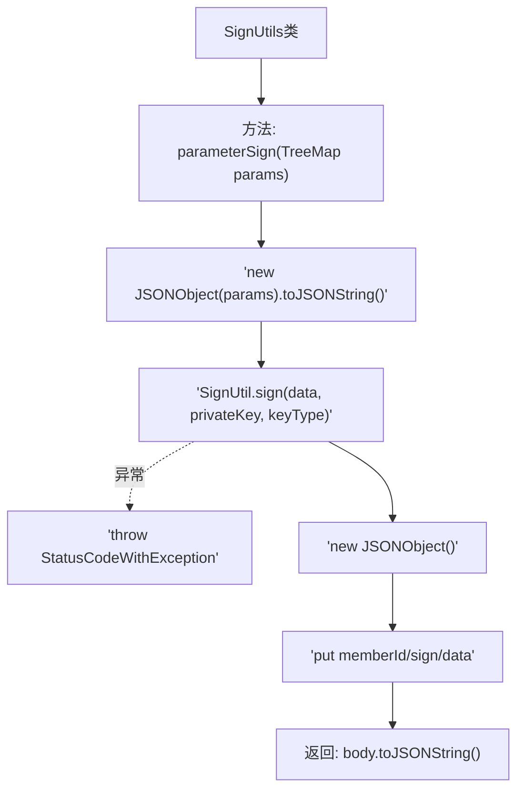

# 基础信息

|      |      |
|------|------|
| 名称 | SignUtils |
| 编码语言 | .java |
| 代码路径 | WeFe/serving/serving-service/src/main/java/com/welab/wefe/serving/service/utils/SignUtils.java |
| 包名 | com.welab.wefe.serving.service.utils |
| 依赖项 | ['com.alibaba.fastjson.JSONObject', 'com.welab.wefe.common.StatusCode', 'com.welab.wefe.common.exception.StatusCodeWithException', 'com.welab.wefe.common.util.RSAUtil', 'com.welab.wefe.common.util.SignUtil', 'com.welab.wefe.serving.service.service.CacheObjects', 'java.util.TreeMap'] |
| 概述说明 | SignUtils类提供参数签名方法，将TreeMap转为JSON字符串并用RSA私钥签名，返回包含memberId、签名和数据的JSON字符串。异常时抛出StatusCodeWithException。 |

# 说明

SignUtils类中的parameterSign方法用于生成请求体签名。该方法接收TreeMap参数确保键值有序，防止签名验证失败。将参数转为JSON字符串后，使用SignUtil进行RSA签名。若签名失败则抛出系统错误异常。最终返回包含会员ID、签名和数据内容的JSON字符串。

# 类列表 Class Summary

| 名称   | 类型  | 说明 |
|-------|------|-------------|
| SignUtils | class | SignUtils类提供parameterSign方法，使用TreeMap有序参数生成JSON，RSA签名后返回包含memberId、签名和数据的JSON字符串。异常时抛出StatusCodeWithException。 |

## 类 SignUtils

|      |      |
|------|------|
| 访问范围 | public |
| 类型 | class |
| 名称 | SignUtils |
| 说明 | SignUtils类提供parameterSign方法，使用TreeMap有序参数生成JSON，RSA签名后返回包含memberId、签名和数据的JSON字符串。异常时抛出StatusCodeWithException。 |

### UML类图

该类图展示了签名工具类SignUtils的核心结构及其依赖关系。SignUtils通过TreeMap接收参数，使用JSONObject进行数据格式化，调用SignUtil进行签名操作，并依赖CacheObjects获取密钥配置。异常处理通过StatusCodeWithException实现，其中包含枚举类型的错误码StatusCode。整体设计体现了参数签名、异常处理和配置管理的职责分离。

### 内部方法调用关系图

流程图描述：该流程图展示了SignUtils类的签名生成过程。首先将输入的TreeMap参数转换为JSON字符串，然后使用SignUtil进行数字签名。若签名失败则抛出StatusCodeWithException异常，成功则构建包含memberId、签名和数据的三元组JSON对象，最终返回该对象的JSON字符串形式。整个过程严格保证参数顺序和异常处理，用于实现安全的API请求签名机制。

### 字段列表 Field List

| 名称  | 类型  | 说明 |
|-------|-------|------|

### 方法列表

| 名称  | 类型  | 说明 |
|-------|-------|------|
| parameterSign | String | 该方法将TreeMap参数转为JSON字符串，使用私钥签名后，组合memberId、签名和数据返回JSON字符串。异常时抛出系统错误。 |

