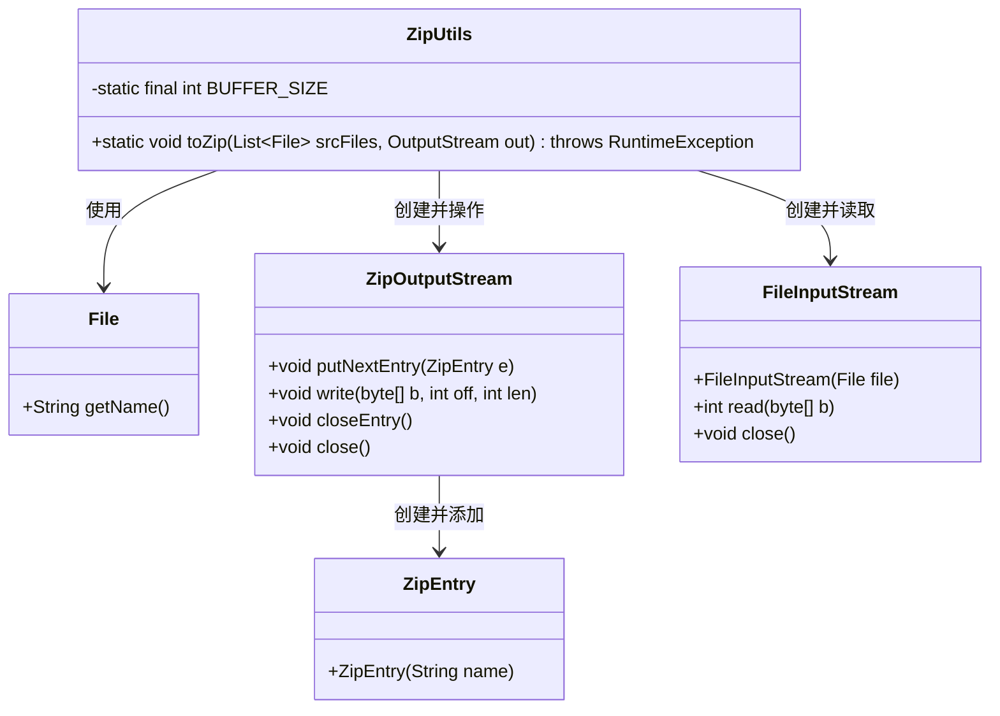
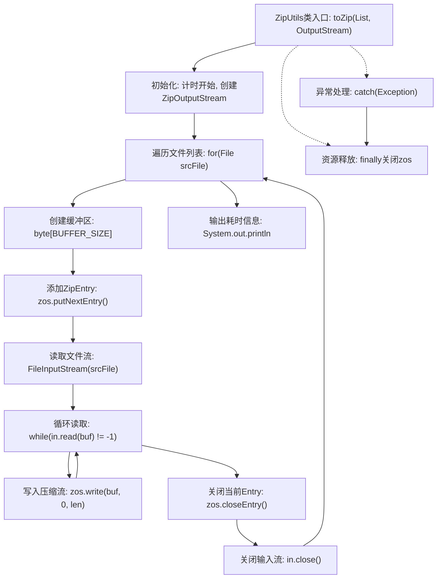

# 基础信息

|      |      |
|------|------|
| 名称 | ZipUtils |
| 编码语言 | .java |
| 代码路径 | WeFe/serving/serving-service/src/main/java/com/welab/wefe/serving/service/utils/ZipUtils.java |
| 包名 | com.welab.wefe.serving.service.utils |
| 依赖项 | ['java.io.File', 'java.io.FileInputStream', 'java.io.IOException', 'java.io.OutputStream', 'java.util.List', 'java.util.zip.ZipEntry', 'java.util.zip.ZipOutputStream'] |
| 概述说明 | ZipUtils类提供文件压缩功能，将多个文件打包成ZIP格式输出流，使用2KB缓冲区提升效率，记录耗时并处理异常。 |

# 说明

ZipUtils类提供将文件列表压缩为ZIP的功能。它使用固定缓冲区大小2KB，通过ZipOutputStream逐个处理输入文件，将每个文件的数据读入缓冲区并写入ZIP条目。方法记录压缩耗时，并在异常时抛出RuntimeException。最后确保资源正确关闭，包括ZipOutputStream和FileInputStream。

# 类列表 Class Summary

| 名称   | 类型  | 说明 |
|-------|------|-------------|
| ZipUtils | class | ZipUtils类提供文件压缩功能，将多个文件打包成ZIP格式输出流，使用2KB缓冲区提升效率，并记录耗时。异常时抛出RuntimeException。 |

## 类 ZipUtils

|      |      |
|------|------|
| 访问范围 | public |
| 类型 | class |
| 名称 | ZipUtils |
| 说明 | ZipUtils类提供文件压缩功能，将多个文件打包成ZIP格式输出流，使用2KB缓冲区提升效率，并记录耗时。异常时抛出RuntimeException。 |

### UML类图

类图描述：ZipUtils是一个提供文件压缩功能的工具类，主要方法toZip接收文件列表和输出流，使用ZipOutputStream进行压缩处理。它依赖于File获取文件名，通过FileInputStream读取文件内容，利用ZipEntry创建压缩条目，最终将压缩数据写入输出流。整个过程包含异常处理和资源清理，确保操作安全可靠。

### 内部方法调用关系图

该流程图展示了ZipUtils压缩工具的核心流程：从初始化压缩流开始，遍历每个文件进行分块读取、压缩写入操作，最终释放资源并输出耗时。流程包含异常处理路径和必须的资源释放环节，特别强调了循环读取文件内容并写入压缩流的核心操作，以及严格的流关闭顺序保障资源安全。

### 字段列表 Field List

| 名称  | 类型  | 说明 |
|-------|-------|------|
| BUFFER_SIZE = 2 * 1024 | int | 定义静态常量BUFFER_SIZE，值为2048字节。 |

### 方法列表

| 名称  | 类型  | 说明 |
|-------|-------|------|
| toZip | void | 将多个文件压缩为ZIP输出流，记录耗时并处理异常。 |

