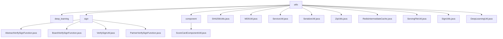

# 基础信息

|      |      |
|------|------|
| 名称 | utils |
| 编码语言 | .java |
| 代码路径 | WeFe/serving/serving-service/src/main/java/com/welab/wefe/serving/service/utils |
| 包名 | docs.serving.serving-service.src.main.java.com.welab.wefe.serving.service.utils |
| 概述说明 | 可扩展签名验证框架，支持多种策略模式，涵盖RSA验签、身份核验等功能。包含加密工具类（SHA256、MD5）、序列化、Redis缓存操作、文件处理及深度学习服务调用等实用工具。 |

# 说明

## 概述  
该模块是服务端工具集，核心职责包括签名验证框架和通用数据处理。采用策略模式实现多场景签名校验，例如`BoardVerifySignFunction`校验memberId。关键数据结构含`SignedApiInput`和策略映射表。加密工具提供SHA256/MD5实现，类似标准加密库。依赖项涵盖Redis、ZIP压缩、文件操作等，例如`RedisIntermediateCache`管理缓存连接池。序列化工具支持对象二进制转换。

## 主要业务场景  
签名验证流程根据调用方类型路由策略，如`PartnerVerifySignFunction`处理RSA验签。评分卡处理流程解析TableModel数据计算特征输出。文件服务管理模型存储路径，深度学习工具链调用PaddleServing执行预测。典型交互通过工具类封装，例如`SignUtils`生成有序参数签名，`DeepLearningUtil`通过Shell命令管理服务生命周期。异常处理统一捕获加密失败、反序列化错误等场景。

### 包内部结构视图

该流程图展示了WeFe服务模块中utils目录的完整结构，包含3个子目录(deep_learning/sign/component)和10个工具类文件。其中sign目录下包含4个签名相关实现类，component目录包含1个评分卡工具类，其余为独立工具类文件，涵盖加密、序列化、缓存等多种功能组件。

# 文件列表

| 名称   | 类型  | 说明 |
|-------|------|-------------|
| [SHA256Utils.java](SHA256Utils.md) | file | SHA256Utils类提供SHA256加密功能，通过MessageDigest实现字符串加密，并将结果转为16进制字符串。 |
| [MD5Util.java](MD5Util.md) | file | MD5Util类提供MD5加密功能，包含getMD5String方法进行字符串加密和byte2Hex方法将字节转为16进制字符串。 |
| [ServiceUtil.java](ServiceUtil.md) | file | ServiceUtil工具类提供多种功能：获取客户端IP、文件转字节数组、生成SQL查询、字段解析、字符串脱敏处理、分片列表及密钥计算。 |
| [SerializeUtil.java](SerializeUtil.md) | file | SerializeUtil类提供序列化和反序列化方法，将对象转为字节数组或反之，异常时返回null。 |
| [ZipUtils.java](ZipUtils.md) | file | ZipUtils类提供文件压缩功能，将多个文件打包成ZIP格式输出流，使用2KB缓冲区提升效率，记录耗时并处理异常。 |
| [RedisIntermediateCache.java](RedisIntermediateCache.md) | file | Redis缓存操作类，使用JedisPool管理连接，支持保存、获取和删除数据，线程安全且带日志记录。 |
| [ServingFileUtil.java](ServingFileUtil.md) | file | ServingFileUtil类提供文件路径管理功能，包括获取根目录、按类型分类目录（临时、机器学习模型、深度学习模型），支持深度学习模型文件的压缩、解压、重命名及预测结果输出路径处理。 |
| [SignUtils.java](SignUtils.md) | file | SignUtils类提供参数签名方法，将TreeMap转为JSON字符串并用RSA私钥签名，返回包含memberId、签名和数据的JSON字符串。异常时抛出StatusCodeWithException。 |
| [DeepLearningUtil.java](DeepLearningUtil.md) | file | DeepLearningUtil类提供调用PaddleServing的方法，包含启动服务、执行命令和终止服务的功能，通过shell脚本操作并处理输入输出流。 |
| [component](component/_module.md) | package | ScoreCardComponentUtil类处理评分卡信息，提取bScore、分箱数据及模型权重，计算每个分箱的woe和得分，最终返回包含分箱、woe、得分和权重的结果。 |
| [sign](sign/_module.md) | package | AbstractVerifySignFunction是签名验证抽象类，含rsaVerify方法需子类实现。BoardVerifySignFunction继承它，校验成员ID和签名。VerifySignUtil是工具类，管理不同调用者的验证函数。PartnerVerifySignFunction用于验证合作伙伴签名，支持多种服务类型。 |
| [deep_learning](deep_learning/_module.md) | package |  |

