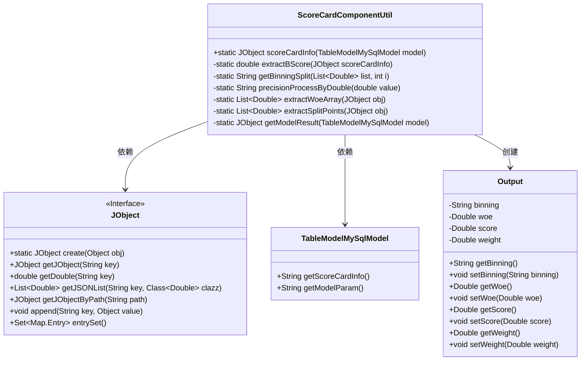
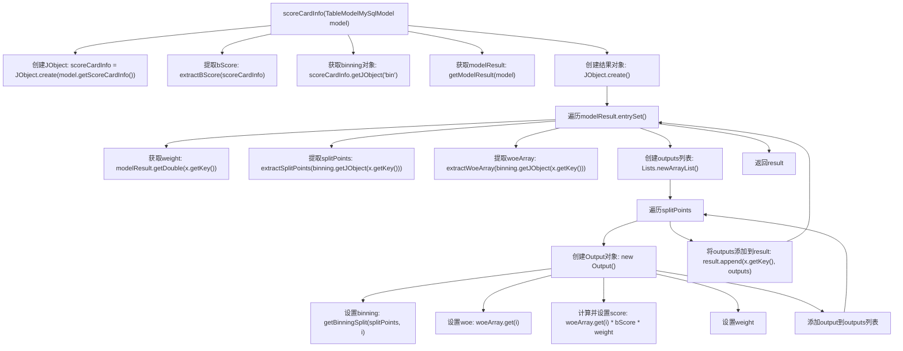

# 基础信息

|      |      |
|------|------|
| 名称 | ScoreCardComponentUtil |
| 编码语言 | .java |
| 代码路径 | WeFe/serving/serving-service/src/main/java/com/welab/wefe/serving/service/utils/component/ScoreCardComponentUtil.java |
| 包名 | com.welab.wefe.serving.service.utils.component |
| 依赖项 | ['com.welab.wefe.common.util.JObject', 'com.welab.wefe.serving.service.database.entity.TableModelMySqlModel', 'org.apache.commons.compress.utils.Lists', 'java.math.BigDecimal', 'java.util.List'] |
| 概述说明 | ScoreCardComponentUtil类处理评分卡信息，提取bScore、分箱数据及模型权重，计算每个分箱的woe和得分，最终返回包含分箱、woe、得分和权重的结果。 |

# 说明

ScoreCardComponentUtil类用于处理评分卡信息，包含scoreCardInfo方法，该方法接收TableModelMySqlModel对象并返回JObject结果。主要流程包括提取bScore、binning数据和模型权重，遍历模型结果计算每个特征的输出。输出包含分箱区间、woe值、得分和权重。辅助方法包括提取bScore、处理分箱分割点、格式化数值精度、提取woe数组和分割点数组，以及获取模型权重。内部类Output用于封装输出结果。

# 类列表 Class Summary

| 名称   | 类型  | 说明 |
|-------|------|-------------|
| ScoreCardComponentUtil | class | ScoreCardComponentUtil类处理评分卡信息，提取B分数、分箱数据和模型权重，计算每个分箱的得分并返回结果。 |

## 类 ScoreCardComponentUtil

|      |      |
|------|------|
| 访问范围 | public |
| 类型 | class |
| 名称 | ScoreCardComponentUtil |
| 说明 | ScoreCardComponentUtil类处理评分卡信息，提取B分数、分箱数据和模型权重，计算每个分箱的得分并返回结果。 |

### UML类图

这段代码描述了一个评分卡工具类`ScoreCardComponentUtil`，主要用于处理评分卡模型的计算逻辑。它通过`TableModelMySqlModel`获取模型参数，使用`JObject`处理JSON数据，最终生成包含分箱、WOE值、权重和得分的输出结果。内部类`Output`用于封装计算结果，包含分箱区间、WOE值、得分和权重等属性。整个流程涉及数据提取、计算和结果组装，最终返回一个结构化的JSON对象。

### 内部方法调用关系图

这段代码实现了一个评分卡信息处理工具类，主要功能是从MySQL模型数据中提取评分卡信息，计算每个特征的分箱得分。流程包括：初始化评分卡信息对象、提取基础分数(bScore)、获取分箱数据和模型权重参数，然后遍历每个特征计算分箱得分(score=woe*bScore*weight)，最终返回包含所有特征分箱得分结果的对象。内部使用了Output类来封装每个分箱的边界、WOE值、得分和权重信息。

### 字段列表 Field List

| 名称  | 类型  | 说明 |
|-------|-------|------|

### 方法列表

| 名称  | 类型  | 说明 |
|-------|-------|------|
| scoreCardInfo | JObject | 该方法从模型提取评分卡信息，计算每个特征的得分，包括分箱、WOE值和权重，最终返回特征得分结果。 |
| precisionProcessByDouble | String | 该方法将双精度浮点数转为BigDecimal并保留两位小数，采用四舍五入规则处理。 |
| extractWoeArray | List<Double> | 提取JSON对象中的woeArray字段并转为Double列表。 |
| getModelResult | JObject | 方法getModelResult接收TableModelMySqlModel对象，提取其modelParam属性并转为JObject，返回其中model_param.weight路径下的JObject对象。 |
| getBinningSplit | String | 方法getBinningSplit生成分箱区间字符串，输入列表和索引i，返回格式为"下限,上限"。i为0时下限为-∞，否则取列表前一位值。上限取列表当前值。数值经precisionProcessByDouble处理。 |
| extractSplitPoints | List<Double> | 该方法从JSON对象中提取名为"splitPoints"的列表，并转换为Double类型列表返回。 |
| extractBScore | double | 提取JSON对象中的b_score值并返回。 |

