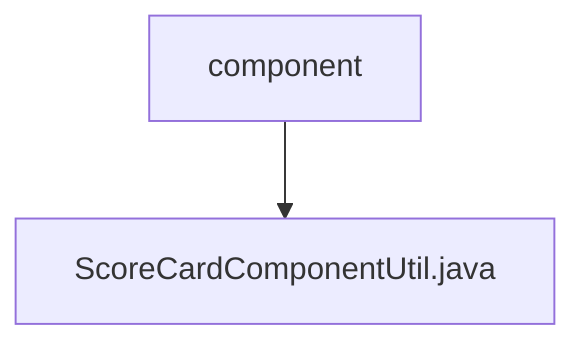

# 基础信息

|      |      |
|------|------|
| 名称 | component |
| 编码语言 | .java |
| 代码路径 | WeFe/serving/serving-service/src/main/java/com/welab/wefe/serving/service/utils/component |
| 包名 | docs.serving.serving-service.src.main.java.com.welab.wefe.serving.service.utils.component |
| 概述说明 | ScoreCardComponentUtil类处理评分卡信息，提取bScore、分箱数据及模型权重，计算每个分箱的woe和得分，最终返回包含分箱、woe、得分和权重的结果。 |

# 说明

ScoreCardComponentUtil类用于处理评分卡信息，包含scoreCardInfo方法，该方法接收TableModelMySqlModel对象并返回JObject结果。主要流程包括提取bScore、binning数据和模型权重，遍历模型结果计算每个特征的输出。输出包含分箱区间、woe值、得分和权重。辅助方法包括提取bScore、处理分箱分割点、格式化数值精度、提取woe数组和分割点数组，以及获取模型权重。内部类Output用于封装输出结果。

### 包内部结构视图

该流程图展示了WeFe项目中serving-service模块下utils/component目录的层级结构。顶层节点为component文件夹，其下包含一个Java工具类文件ScoreCardComponentUtil.java。该结构清晰地反映了组件工具类的单一文件存储位置，符合典型Java项目的工具类组织方式。

# 文件列表

| 名称   | 类型  | 说明 |
|-------|------|-------------|
| [ScoreCardComponentUtil.java](ScoreCardComponentUtil.md) | file | ScoreCardComponentUtil类处理评分卡信息，提取bScore、分箱数据及模型权重，计算每个分箱的woe和得分，最终返回包含分箱、woe、得分和权重的结果。 |

