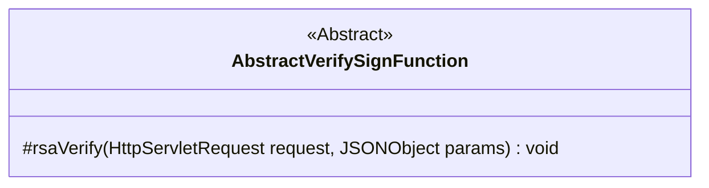
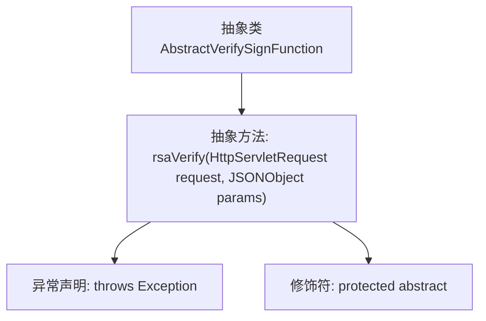

# 基础信息

|      |      |
|------|------|
| 名称 | AbstractVerifySignFunction |
| 编码语言 | .java |
| 代码路径 | WeFe/serving/serving-service/src/main/java/com/welab/wefe/serving/service/utils/sign/AbstractVerifySignFunction.java |
| 包名 | com.welab.wefe.serving.service.utils.sign |
| 依赖项 | ['com.alibaba.fastjson.JSONObject', 'javax.servlet.http.HttpServletRequest'] |
| 概述说明 | 抽象类AbstractVerifySignFunction定义受保护的rsaVerify方法，用于验证RSA签名，接收请求和JSON参数，可能抛出异常。 |

# 说明

这是一个名为AbstractVerifySignFunction的抽象类，定义了一个受保护的抽象方法rsaVerify。该方法接收HttpServletRequest和JSONObject两个参数，可能抛出Exception异常。该类主要用于签名验证功能，要求子类实现具体的RSA验证逻辑。由于是抽象类，无法直接实例化，必须由子类继承并实现其抽象方法才能使用。

# 类列表 Class Summary

| 名称   | 类型  | 说明 |
|-------|------|-------------|
| AbstractVerifySignFunction | class | 抽象类AbstractVerifySignFunction定义受保护抽象方法rsaVerify，用于RSA验签，接收请求和JSON参数，可能抛出异常。 |

## 类 AbstractVerifySignFunction

|      |      |
|------|------|
| 访问范围 | public abstract |
| 类型 | class |
| 名称 | AbstractVerifySignFunction |
| 说明 | 抽象类AbstractVerifySignFunction定义受保护抽象方法rsaVerify，用于RSA验签，接收请求和JSON参数，可能抛出异常。 |

### UML类图

这段类图展示了一个名为AbstractVerifySignFunction的抽象类，其中定义了一个受保护的抽象方法rsaVerify。该方法接收HttpServletRequest和JSONObject作为参数，可能抛出异常，用于实现RSA签名验证功能。抽象类通过<<Abstract>>标记明确标识，体现了该类的设计意图是作为需要具体实现的基类。类图清晰地表达了该类的核心结构和抽象性质，为后续具体验证类的实现提供了基础框架。

### 内部方法调用关系图

这段流程图描述了一个名为AbstractVerifySignFunction的抽象类结构。该类包含一个受保护的抽象方法rsaVerify，该方法接收HttpServletRequest和JSONObject两个参数，并声明可能抛出Exception异常。图中清晰展示了类与方法之间的从属关系，以及方法本身的修饰符和异常声明特性，完整呈现了该抽象类的核心契约功能。

### 字段列表 Field List

| 名称  | 类型  | 说明 |
|-------|-------|------|

### 方法列表

| 名称  | 类型  | 说明 |
|-------|-------|------|
| rsaVerify | void | 抽象方法rsaVerify用于验证RSA签名，接收HttpServletRequest和JSONObject参数，可能抛出异常。 |

